== Elenco Esercizi

=== Corpo libero

[[air_squat]]
((air squat)):: 
     +
    _Sinomimi_: ((accosciata)), ((squat)) + 
    _Esecuzione_: Esercizio che prevede il passaggio dalla posizione eretta a quella accosciata: gambe flesse oltre i 90°, schiena eretta, peso sulla pianata del piede. Le braccia possono essere parallele al terreno o più sollevate. +
    _Effetti_: migliora la flessibilità, e la muscolatura. 

((air squat, varianti))::
	** ((squat jump)): Esercizio adatto al rafforzamento delle gambe 
	** Squat press
	** Squat side to side
		1.  Scendo in squat con una delle due gambe in affondo laterale
		2.  Salto nella direzione opposta alla gamba in affondo
		3.  Atterro specularmente al punto 1

[[bastard_burpee]]
((bastard burpee)):: 
     +
    _Sinomimi_: ((burpee bastardo)). +
    _Esecuzione_: Come il <<burpee, burpee>>, ma con 2 flessioni. +
    _Effetti_: Phisico!.

[[burpee]]
((burpee)):: 
     +
    _Sinomimi_: ((burpeee)). +
    _Esecuzione_: Il burpee è un esercizio full bodyfootnote:[https://it.wikipedia.org/wiki/Burpee]. Il movimento base si divide in 4 passaggi: +
    0 Partenza in posizione eretta. +
    1 Si passa in posizione di squat con le mani a terra. +
    2 Si lanciano i piedi indietro tenendo le mani a terra. +
    3 Subito si riportano i piedi in posizione di Squat. +
    4 Si salta dalla posizione di squat verso l'alto +
    _Effetti_: Effetti dell'esercizio.

[[burpee_with_dumbbells]]
((burpee with dumbbells)):: 
    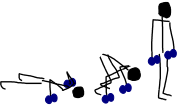 +
    _Sinomimi_: ((burpee with dumbbells)), + 
    _Esecuzione_: Eseguire un burpee_with_dumbbells. +
    _Strumenti_ : dumbbell x 2
    _Effetti_: fa bene.

[[clean]]
((clean)):: 
    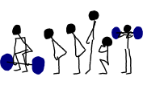 +
    _Sinomimi_: ((clean)). +
    _Effetti_: Esercizio in 4 step. +
    _Esecuzione_: Istruzioni per l'esecuzione. Eventuali riferimenti. +
    . Partenza 
        ** chinati con le mani che afferrano il bilancere 
        ** schiena leggermente inarcata.
        ** peso bilanciato sotto i piedi.
        ** sguardo in alto
        ** testa allineata ala schiena
        ** bilanciere a contatto con gli stinchi
    . Stacco
        ** Spingi i piedi contro il terreno, tira indietro le ginocchia perchè il bilanciere muovendosi solo verso l'alto passi, sempre stando vicino al corpo..
        ** Lo stacco avviene lentamente e culmina in un movimento esplosivo con la piena estensione della schiena.
        ** Come la barra passa sopra le ginocchia, tieni il peso sui talloniil più possibile e comincia ad estendere le anche avanti
        ** Quando la barra arriva a mezza altezza, velocemente e con potenza estendi le anche, le ginocchia, le anche, i talloni. +
        Quando la barra prende inerzia solleva anche le spalle più velocemente possibile.
        La barra dovrebbe raggiungere la parte alta dei fianchi o del torace.
    . Atterraggio
        ** Appena cìè la completa estensione delle anche, porta il corpo sotto la sbarra, atterrando solidamente in front squat con lo sguardo in avanti. +
        Mentre lo fai ruota i gomiti avanti e sotto la barra, mollando la presa e permettendo ai polsi di girarsi verso l'alto. Fai posare la barra di fronte alle spalle, tra il picco dei deltoidi e la gola
    . Finale
        ** una volta che la barra è stabile, lentamente alzati fino alla posizione eretta. Se il peso è molto forte può essere più facile "rimbalzare" dalla posizione di squat senza pausa nella posizione bassa
    . Abbassate o Mollate il peso in sicurezza

((clean varianti)):: 
    * _((clean press))_: come il clean ma si completa con un push press

[[crunch]]
((crunch)):: 
     +
    _Sinomimi_: ((addominali)). + 
    _Esecuzione_: Da supini flettere leggermente le gambe, portare le mani dietro la nuca e contrarre gli addominali,     senza che le mani spingano sulla testa. +
    _Effetti_: 6 pack.

    
[[crunch_with_weight]]
((crunch with weight)):: 
    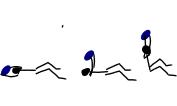 +
    _Sinomimi_: ((addominali con peso)). + 
    _Esecuzione_: Da supini flettere leggermente le gambe, stendersi supini ocn il peso afferrato con entrambe le mani allineato alla testa, sollevare il peso ed alzarsi. +
    _Effetti_: 6 pack.

    

[[criss_cross]]
((criss_cross)):: 
    image:figures/exercises/criss_cross.svg[role=right, align=right,  pdfwidth=5cm] +
    _Sinomimi_: ((posizione del criss cross)). +
    _Esecuzione_: <<crunch, addominali>> fatti a ginocchia alte con le gambe a 90 gradi. Portare mani dietro la nuca. Si portano le ginocchia alternate al petto ruotando il busto per toccare le ginocchia con il gomito opposto. +
    _Effetti_: Rinforzo Core.

    ** _((Criss Cross to Teaser))_: 3 movimenti di criss cross e si sta per un secondo in posizione <<teaser, teaser>>

[[downdog_to_bridge]]
((downdog to bridge)):: 
     +
    _Sinomimi_: ((movimento da cane a faccia in giù a ponte)). +
    _Esecuzione_: Da Cane faccia in giù fino a ponte faccia all'aria. +
    _Effetti_: Esercizio che coinvolge più fasce.

 
[[double_dumbbell]]
((double_dumbbell)):: 
    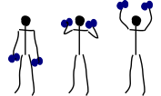 +
    _Sinomimi_: ((double dumbbell)), + 
    _Esecuzione_: Eseguire un double dumbbell. +
    _Strumenti_ : dumbell x 2 +
    _Effetti_: fa bene.

[[dumbbell_biceps_curl]]
((dumbbell_biceps_curl)):: 
    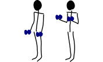 +
    _Sinomimi_: ((dumbbell_biceps_curl)), + 
    _Esecuzione_: Eseguire un dumbbell_biceps_curl. +
    _Strumenti_ : nessuno
    _Effetti_: fa bene.

[[dumbbell_front_raise]]
((dumbbell_front_raise)):: 
    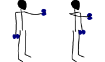 +
    _Sinomimi_: ((dumbbell_front_raise)), + 
    _Esecuzione_: Eseguire un dumbbell_front_raise. +
    _Strumenti_ : nessuno
    _Effetti_: fa bene.

[[front_squat]]
((front squat)):: 
    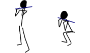 +
    _Sinomimi_: ((accosciata con il bilancere appoggiato al petto)), + 
    _Esecuzione_: Accosciata con il bilanciere appoggiato al petto. +
    _Effetti_: Effetti dell'asana.

[[geko]]
((geko)):: 
     +
	_Sinonimi_: ((posizione del geko)) +
	_Esecuzione_: Quadrupedia, le ginocchia non toccano terra. Estendi braccio sinistro e gamba destra e viceversa. +
	_Effetti_: Effetti dell'esercizio.

[[high_knees]]
((high_knees)):: 
     +
    _Sinomimi_: ((high_knees)), + 
    _Esecuzione_: Eseguire una corsa sul posto con le ginocchia alte. +
    _Strumenti_ : nessuno
    _Effetti_: fa bene.

[[hip_escape]]
((hip escape)):: 
     +
    _Sinomimi_: ((anche in fuga)). +
    _Esecuzione_: Quattro zampe, ginocchia vicine a terra. Far uscire la gamba sx dal lato destro vicina al terreno tenendo le ginocchia del dx vicine a terra. +
    _Effetti_: benefici al core e alla mobilitazione dell'anca.

[[jumping_jack]]
((jumping jack)):: 
     +
    _Sinomimi_: ((posizione del ................)), + 
    ((posizione del .........)). +
    _Esecuzione_: Esercizio che coinvolge gambe e un pò tutto il resto. +
    _Effetti_: Effetti dell'esercizio.

[[lunge]]
((lunge)):: 
     +
    _Sinomimi_: ((affondo)). +
    _Esecuzione_: Eseguire un affondo. +
    _Effetti_: Effetti dell'esercizio.

    
[[mountain_climber]]
((mountain climber)):: 
     +
    _Sinomimi_: ((arrampicatore)). +
    _Strumenti_ : nessuno +
    _Esecuzione_: dalla posizione di <<plank, plank>> portare alternativamente le ginocchia al petto. +
    _Effetti_: rinforzo del core.

[[plank]]
((plank))::
     +
    _Sinomimi_: ((posizione a V)). +
    _Esecuzione_: Posizione della <<push_up, flessione>> con le braccia tese. +
    _Strumenti_ : nessuno
    _Effetti_: ottimo esercizio per il core.
    varianti:::
	*** ((plank walk))
        . Partenza in posizione plank
        . Piego il braccio destro e appoggio il gomito destro al terreno
        . Piego nello stesso modo il sinistro.
        . Fletto il braccio sinistro e lo riporto in appoggio sulla mano
        . Fletto come nel punto 4 anche il destro
        . Ricomincio dal punto 1 ma inverto il braccio che per primo scende.
    *** ((side plank)): Come il plank ma con il busto perpendicolare al terreno sorreggendosi su un braccio od un gomito.

    
[[plank_to_teaser]]
((plank to teaser)):: 
     +
    _Sinomimi_: ((posizione a V)). +
    _Esecuzione_: Esercizio dinamico che si fa passando dalla posizione di <<plank, plank sui gomiti>> a quella di <<teaser, posizione a V>> +
    _Strumenti_ : nessuno
    _Effetti_: Fa benissimo.

[[prisoner_squat]]
((prisoner_squat)):: 
     +
    _Sinomimi_: ((prisoner_squat)), + 
    _Esecuzione_: Eseguire un prisoner_squat. +
    _Strumenti_ : nessuno
    _Effetti_: fa bene.

    
[[power_clean]]
((power_clean)):: 
     +
    _Sinomimi_: ((power_clean)), + 
    _Esecuzione_: Eseguire un <<clean>>, ma con variazione del punto 3. ferma la barra a mezzo squat. Questa versione necessita che la barra sia lanciata più in alto. +
    _Strumenti_ : bilanciere
    _Effetti_: fa bene.

[[power_cobra]]
((power cobra)):: 
     +
    _Sinomimi_: ((posizione del cobra dinamico. +
    _Esecuzione_: Esercizio dinamico che comporta il passare in maniera alternata dalla posizione del cobra a quella accosciata. +
    _Effetti_: Rinforza Core e Spalle.
    

	
[[pull_up]]
((pull up)):: 
    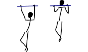 +
    _Sinomimi_: ((trazioni)). +
    _Esecuzione_: Esercizio di trazioni alla sbarra. Nel crossfit ha un'esecuzione con slancio che permette la realizzazione di più serie. +
    _Effetti_: Riforzo spalle, resistenza alla presa, core.

[[push_up]]
((push up)):: 
     +
	_Sinonimi_: ((flessione)) +
	_Esecuzione_: Esercizio che si esegue partendo dalla posizione di <<plank, plank>>, flettendo e distendendo le braccia +
	_Effetti_: Pettorali.

	Varianti:::
	** *((Around the clock push up))*
	** *((HandStand push up))*: Forget shoulder presses. If you want a killer shoulder workout, look no further than the handstand push-up. To perform the handstand push-up, assume a handstand position. Slowly bend your elbows and lower your inverted body towards the ground. In order to maintain balance, you’re going to have to call on your core and other smaller stabilizing muscles. If you can’t do a stand-alone handstand, use a wall to assist you.
	** *((Hindu push up))*: footnote:[http://www.artofmanliness.com/2015/08/05/the-prisoner-workout/] This is a dynamic full-body movement that will build strength and flexibility in your chest, shoulders, back, hips, and triceps. +
	Get in position by standing with your feet slightly wider than shoulder-width apart. Bend down and place your hands on the floor while keeping your arms and legs straight. You should look like an upside down human "v" with your butt being the point of the "v" and your head pointing down to the ground. + 
	To perform the Hindu push-up, you’re going to make sort of a swooping motion with your body. Bring your head down and forward by bending your elbows. When your head gets close to the ground, continue moving your torso forward by arching your back and lowering your hips. Your hips will now be near your hands. Make sure to get a good stretch in your back. Return to the starting position and repeat. +
	** *((Cobra Push up))*: dalla posizione bassa della flessione portare il busto tutto a destra e tutto a sinistra e riflettere le braccia.
	** *((Push up and rotation))*
	** *((Spiderman push up))*: Push up con apertura alternata della gamba destra e della gamba sinistra nella fase di discesa. Il ginocchio della gamba divaricata cerca il gomito.
	** *((Stella marina))*: Dalla posizione di push up bassa a mani strette passare a quella a mani e piedi larghe con tre o quattro balzelli
    

[[renegade]]
((renegade))::
    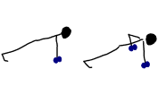 +
	_Sinonimi_: ((remata in plank)) +
    _Esecuzione_: <<plank, plank>> remando con due pesi +
    _Strumenti_ : dumbbells
    _Effetti_: Muscoli.

[[reverse_crunch]]
((reverse crunch)):: 
     +
    _Sinomimi_: ((addominale inverso)). +
    _Esecuzione_: Eseguire un addominale inverso. +
    _Effetti_: Resistenza, core. 

((rollata))::
	_Sinonimi_: Roll up
	
	Varianti:::
	
	*** Rollata e jump: Rollata su tappetino e jump

((rollè alto)):: Quadrupedia, le ginocchia non toccano terra. Rolle su braccio sinistro e gamba destra. Ruotare fino ad avere il torso in alto e toccare il piede in alto con la mano libera.

    
[[run_in_place]]
((run in place)):: 
     +
    _Sinomimi_: ((corsa sul posto)). +
    _Esecuzione_: Eseguire una corsa sul posto. +
    _Effetti_: Resistenza.

	
[[single_up]]
((single up)):: 
     +
    _Sinomimi_: ((salto della corda)) +
    _Strumenti_ : corda
    _Esecuzione_: Saltare la corda. +
    _Effetti_: agilità, polpacci.

[[sit_up]]
((sit up)):: 
     +
    _Sinomimi_: ((addominale da steso a seduto)). + 
    _Esecuzione_: Si parte dalla posizione base dell'addominale con le braccia alzate e gambe stese (parallele al terreno) e si esegue raccogliendo le gambe e le braccia, portandosi in posizione seduta. +
    _Effetti_: 6 pack.

[[squat_and_press_with_dumbbells]]
((squat and press with dumbbells)):: 
    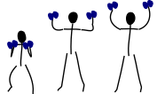 +
    _Sinomimi_: ((squat_and_press_with_dumbbells)), + 
    _Esecuzione_: Eseguire un squat_and_press_with_dumbbells. +
    _Strumenti_ : dumbbells
    _Effetti_: fa bene.

[[switch]]
((switch)):: Esercizio adatto al rafforzamento delle gambe. Si parte dalla posizione dell'affondo e con un balzo ci si porta nella posizione opposta.

	Varianti:::
		* _((Switch Jump))_: Come lo switch ma ogni 3 switch un jump.
		* _((Switch Squat))_ Come lo switch ma ogni 3 switch uno squat.

[[step_up_onto_chair]]
((step up onto chair)):: 
    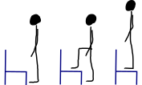 +
    _Sinomimi_: ((salita e discesa da una sedia)). +
    _Esecuzione_: salire e scendere da una sedia. +
    _Strumenti_ : sedia  +
    _Effetti_: Effetti dell'esercizio.

[[superman]]
((superman)):: 
     +
    _Sinomimi_: ((posizione di superman)). +
    _Esecuzione_: Da stesi pancia in giù, contrarre braccia e gambe per ottenere la posizione tipica di superman.  +
    _Strumenti_ : nessuno  +
    _Effetti_: Rinforza core e dorsali.

[[teaser]]
((teaser)):: 
     +
    _Sinomimi_: ((posizione a V)). +
    _Esecuzione_: da seduti, rimanere in equilibrio sul sedere tenendo la posine a 'V'. +
    _Effetti_: Effetti dell'esercizio.

[[triceps_dip_on_chair]]
((triceps dip on chair)):: 
    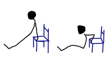 +
    _Sinomimi_: ((flessioni sui tricipiti con una sedia)). +
    _Esecuzione_: fare i tricipiti appoggiandosi ad una sedia. +
    _Strumenti_ : sedia +
    _Effetti_: Rinforza i tricipiti.

[[triceps_press]]
((triceps_press)):: 
    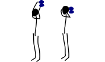 +
    _Sinomimi_: ((triceps_press)), + 
    _Esecuzione_: Eseguire un triceps_press. +
    _Strumenti_ : nessuno +
    _Effetti_: fa bene.

[[tuck_jump]]
((tuck jump)):: 
     +
    _Sinomimi_: ((tuck jump)), + 
    _Esecuzione_: Eseguire un tuck jump. +
    _Strumenti_ : nessuno +
    _Effetti_: fa bene.

[[wall_sit]]
((wall sit)):: 
     +
    _Sinomimi_: ((seduta con schiena al muro)) + 
    _Esecuzione_: schiena appoggiata al muro, femori paralleli al terreno. +
    _Strumenti_ : muro +
    _Effetti_: benefici quadricipiti.

    
  

Mancano ToDo	
 jumping jack x 10, tuck jumps x 10)
(prisoner squat x 10, squat and press with dumbbells x 10, triceps press x 10, dumbbel front raise x 10, dumbbell buceps curl x 10)
1 minute stop
AMRAP(spideman plank x 20, abdominal sping up x 10, bycicle crunches x 10, hip thrust x 10, side plank thrusts x 10)

.modello esercizio
[[nome]]
((nome)):: 
     +
    _Sinomimi_: ((nome)), + 
    _Esecuzione_: Eseguire un nome. +
    _Strumenti_ : nessuno
    _Effetti_: fa bene.

=== Sequenze

=== Circuito MMA 

    Durata: 30'
    Necessari: barra, corda, dumbbell x 2 

    PAUSE 30
    AMRAP 300(push ups x 20, dips X 10, pullups x 5, single up x 50)
    PAUSE 60
    AMRAP 300(double dumbbell x 10, burpees with dumbbell x 10, burpees, x 10)
    PAUSE 60
    AMRAP 300(high knees x 10, mountain climber x 10, jumping jack x 10, tuck jumps x 10)
    PAUSE 60
    AMRAP(prisoner squat x 10, squat and press with dumbbells x 10, triceps press x 10, dumbbel front raise x 10, dumbbell buceps curl x 10)
    PAUSE 60
    AMRAP 300(spideman plank x 20, abdominal sping up x 10, bycicle crunches x 10, hip thrust x 10, side plank thrusts x 10)

