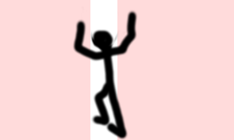
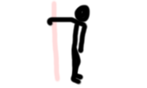

=== Esercizi stretching

==== Esercizi

[[arco_plantare]]
((arco plantare)):: 
    image:figures/stretching/arco_plantare.png[role=right]
    _Esecuzione_: Vedere figura. +
    _Effetti_: Fa bene.    

[[gambe_posteriore]]
((gambe_posteriore)):: 
    
    _Esecuzione_: Vedere figura. +
    _Effetti_: Fa bene.    

[[popliteo]]
((popliteo)):: 
    
    _Esecuzione_: Vedere figura. +
    _Effetti_: Fa bene.    

[[adduttori]]
((adduttori)):: 
    image:figures/stretching/adduttori.svg[role=right, align=right,  pdfwidth=5cm]
    _Esecuzione_: Vedere figura. +
    _Effetti_: Fa bene.    

[[quadricipiti]]
((quadricipiti)):: 
    
    _Esecuzione_: Vedere figura. +
    _Effetti_: Fa bene.    

[[anche]]
((anche)):: 
    
    _Esecuzione_: Vedere figura. +
    _Effetti_: Fa bene.    

[[base_tronco_e_glutei]]
((base_tronco_e_glutei)):: 
    
    _Esecuzione_: Vedere figura. +
    _Effetti_: Fa bene.    

[[dorso]]
((dorso)):: 
    image:figures/stretching/dorso.png[role=right]
    _Esecuzione_: Vedere figura. +
    _Effetti_: Fa bene.    

[[collo]]
((collo)):: 
    
    _Esecuzione_: Vedere figura. +
    _Effetti_: Fa bene.    

[[pettorali]]
((pettorali)):: 
    
    _Esecuzione_: Vedere figura. +
    _Effetti_: Fa bene.    

[[spalle]]
((spalle)):: 
    
    _Esecuzione_: Vedere figura. +
    _Effetti_: Fa bene.    

[[braccia]]
((braccia)):: 
    
    _Esecuzione_: Vedere figura. +
    _Effetti_: Fa bene.    

==== Localizzazioni

===== Testa

-   inclina a destra e sinistra
-   circonvoluzione a destra e sinistra
-   ruota a destra e sinistra

===== Spalle

-   rotazione ed estensione dell'omero per ogni braccio

==== Sequenze

.Post Running footnote:[arco_plantare 20x2, gambe_posteriore 20x2, popliteo 20x2, adduttori 20x2, quadricipiti 20x2, anche 20x2, base_tronco_e_glutei 20, dorso 20, collo 20, pettorali 20x2, spalle 20x2, braccia 20x2]
[header=yes, cols="^1,2,1"]
|===
| Posizione | Descrizione | Secondi
| image:figures/stretching/arco_plantare.png[role=right, pdfwidth=5cm] | arco plantare | 20 
| image:figures/stretching/arco_plantare.png[role=right, pdfwidth=5cm] | altro lato | 20 
|  | gambe posteriore | 20 
|  | altro lato | 20 
|  | popliteo | 20 
|  | altro lato | 20 
|  | adduttori | 20 
|  | altro lato | 20 
|  | quadricipiti | 20 
|  | altro lato | 20 
|  | anche | 20 
|  | altro lato | 20 
|  | base tronco e glutei | 20 
| image:figures/stretching/dorso.png[role=right, pdfwidth=5cm] | dorso | 20 
|  | collo | 20 
|  | pettorali | 20 
|  | altro lato | 20 
|  | spalle | 20 
|  | altro lato | 20 
|  | braccia | 20 
|  | altro lato | 20 
|===

Full video su https://youtu.be/mwR5B9FBL8s[YouTube]

