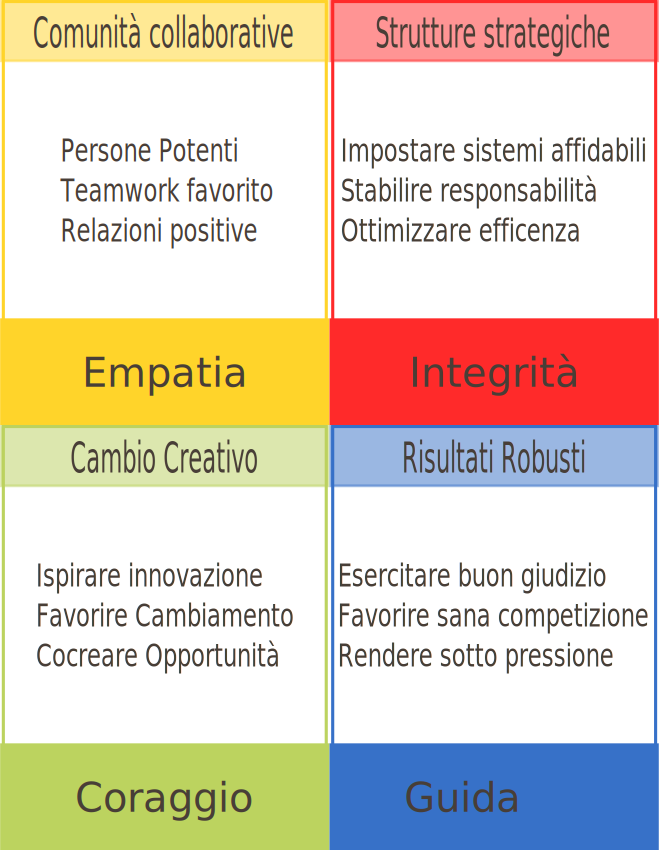

== Carisma

I presenti esercizi sono stati tutti estratti dal manuale di Olivia Fox Cabane footnoteref:[ofox, Fox Cabane, O. , & Mazza, A. *"Il segreto del carisma : impara l'arte e la scienza del magnetismo personale"*. Sperling & Kupfer, 2013.]

=== Presenza

Per un minuto chiudi gli occhi e concentrati su uno dei seguenti: footnoteref:[ToDoMen,da realizzare anche con Mentor]

-   Rumori
-   Dita dei piedi
-   Respirazione

=== Trasferimento di responsabilita

Ogni volta che ti fissi sulle conseguenze di una situazione: footnoteref:[ToDoMen]

-   Siediti in una posizione comoda o sdraiati, rilassati e chiudi gli
    occhi
-   Fai 3 respiri profondi. Inspirando immagina di far affluire aria
    pura alla testa. Espirando, lascia che l'aria porti con se tutte le
    preoccupazioni
-   Immagina ora di sollevare ciò che ti opprime dalle tue spalle e di
    metterlo sulle spalle di un'entità benevola. Ora tocca a lei.

Ora che tutto è stato delegato rimani comodo, rilassati e goditi ciò che
può capitarti.

=== Destigmatizzare il disagio

Quando un'emozione sgradevole si fa strada in te: footnoteref:[ToDoMen]

-   Ricorda che le emozioni sgradevoli sono normali e che tutti le
    provano, prima o poi
-   Pensa che altri ci sono già passati, spesso persone molto
    carismatiche
-   Ricorda che in questo preciso istante molti altri stanno facendo la
    tua stessa esperienza

=== Neutralizzare la negativita

Ogni volta che hai pensieri negativi persistenti: footnoteref:[ToDoMen]

-   Non dare per scontato che corrispondano a verità
-   Immagina i tuoi stessi pensieri come graffiti sul muro
-   Spersonalizza questo sentimento. Osservalo come uno scienziato
    osserva un fenomeno.
-   Immagina di osservarti dall'esterno. Allontana l'obiettivo al punto
    da poter vedere la terra sospesa nello spazio. Quindi zooma fino a
    scorgere il tuo piccolo io intento a vivere, in questo preciso
    istante, un'esperienza particolare.
-   Immagina il flusso di dialogo nel tuo cervello come se provenisse da
    una radio. Abbassa il volume o sposta la radiolina altrove

=== Riscrivere la realta

Ogni volta che un pensiero fastidioso non ti molla chiediti: footnoteref:[ToDoMen]

-   E se questa situazione fosse una cosa positiva?

Nei casi gravi siediti e scrivi di tuo pugno cosa succederà al presente
o, ancor meglio, al passato.

=== Ottenere soddisfazione

Quando qualcuno che ti ha fatto un torto pensa a lui: footnoteref:[ToDoMen]

-   Scrivigli una lettera in cui gli dici tutto quel che avresti
    voluto dirgli.
-   Una volta scritto tutto metti via la lettera
-   Prendi un altro foglio intonso e scrivi una lettera in cui
    l'indirizzario della tua lettera si assuma le sue responsabilità,
    ammetta e si scusi per tutto il male che ti ha fatto.
-   Durante la settimana leggi la lettera di scuse più volte.

=== Soffermarsi sulle sensazioni

Per allenare le situazioni di disagio.

-   cercate un amico o collega di fiducia e impostate il timer a 30
    secondi
-   guardatevi negli occhi
-   quando senti il disagio cerca di individuare la localizzazione
    fisica della sensazione.
-   soffermati su ogni sensazione il più a lungo possibile, tentando di
    sentirne la consistenza e descrivendola come uno chef decanta i
    propri manicotti.
-   lasciate che il disagio cresca e date un nome alle sensazioni che
    osservate: caldo, freddo, rigidità, nodi allo stomaco.
-   se ti vien voglia di ridere o di interrompere il disagio parlando o
    in altro modo, resisti.
-   riprova, riprova, riprova

=== Allargare la zona di conforto

Attacca bottone con un perfetto sconosciuto.

=== La visualizzazione

Chiudi gli occhi e rilassati. Ora concentrati su un'esperienza positiva
in cui ti sei sentito trionfante: footnoteref:[ToDoMen]

-   Senti i rumori circostanti, mormorii d'approvazione e scrosci.
-   Guarda i sorrisi e le espressioni di calore e ammirazione su di te.
-   Percepisci i tuoi piedi ben piantati per terra e le strette di mano.
-   Vivi l'emozione della calda ondata di fiducia che cresce in te.

=== La gratitudine

Individua tre cose di cui essere grato. footnoteref:[ToDoMen]

.Scrivile
-------------------

A.  _______________________________
B.  _______________________________
C.  _______________________________

-------------------

=== La compassione

Pensate ad una persona che conoscete:

-   Immagina il passato di questa persona: cos'avrebbe significato
    crescere nella sua stessa situazione famigliare e fare le sue
    stesse esperienze.
-   Ora immaginatene il presente. Mettiti nei suoi panni e guarda il
    mondo attraverso i suoi occhi. Immagina cosa stia provando in
    questo momento.
-   Immagina di dover tenere un piccolo discorso di commemorazione al
    suo funerale.

=== La compassione di sé

Verga un piccolo prontuario sulla compassione di te stesso. footnoteref:[ToDoMen]

Elenca cinque modi in cui ti prendi cura di te quando ti trovi in
difficoltà.

Dieci se hai un momento favorevole.

Inizia dai più efficaci.

-------------------

1.  _______________________________________________________
2.  _______________________________________________________
3.  _______________________________________________________
4.  _______________________________________________________
5.  _______________________________________________________

6.  _______________________________________________________
7.  _______________________________________________________
8.  _______________________________________________________
9.  _______________________________________________________
10. _______________________________________________________

-------------------

=== La Metta

Coccola per l'anima. footnoteref:[ToDoMen]

-   Siediti in una posizione comoda, chiudi gli occhi e trai un paio di
    respiri profondi, spazzando via le preoccupazioni.
-   Pensa ad un'occasione della vita i cui hai compiuto una buona
    azione, grande o piccola che sia.
-   Pensa ora ad una figura del presente o del passato, mitica o
    realmente esistita che potrebbe nutrire grande affetto per voi.
-   Raffiguratela nella mente, immaginandone il calore, la bontà d'animo
    e la compassione. Senti quel calore giungere fino a te e avvolgerti
    nel suo abbraccio.
-   Senti il suo completo perdono per tutto ciò che la tua voce
    interiore giudica sbagliato.
-   Senti ora come questa figura ti accetti fino in fondo. Ti accetta
    così come sei, oggi, in questo punto dell'esistenza, con le tue
    imperfezioni e tutto il resto.

=== Usare il linguaggio del corpo per cambiare atteggiamento

Assumi il linguaggio posturale dei depressi. Lascia cadere spalle e capo
e metti il muso. Ora, senza muovere un muscolo, cerca di sentirti
entusiasta.

Or fai il contrario. Assumi l'atteggiamento fisico di chi è pieno di
eccitazione. Mettiti a saltare, stampati in faccia il sorriso più largo
che puoi, nuovi le braccia in aria e, nel frattempo, cerca di sentirti
depresso.

=== La stretta di mano perfetta

Ecco come eseguirla footnoteref:[ToDoMen]

1.  Assicurati di avere la mano destra libera.
2.  Guarda negli occhi l'interlocutore e sorridi con calore ma non
    troppo a lungo.
3.  Tieni la testa dritta e stai proprio davanti all'interlocutore.
4.  La mano deve essere perpendicolare al suolo, il pollice verso
    il soffitto.
5.  Per consentire il pieno contatto, avvicina il palmo a quello
    dell'interlocutore, diagonalmente.
6.  Avvolgi le dita attorno alla sua mano.
7.  A contatto avvenuto, stringi il pollice con la stessa pressione
    esercitata dall'altra persona.
8.  Muovi l'intero avambraccio, fai un passo indietro e quindi ritrai
    la mano.

=== La fluttuazione vocale

Utilizzare un registratore e provare a ripetere la stessa frase con la
gamma di emozioni più ampia possibile:footnoteref:[ToDoMen]

-   Autorevolezza
-   Rabbia
-   Dolore
-   Empatia
-   Preoccupazione
-   Calore
-   Entusiasmo

=== Il potere della voce

Elementi fondamentali: footnoteref:[ToDoMen]

1.  Parla lentamente.
2.  Fai delle pause.
3.  Fai calare l'intonazione.
4.  Respira con l'addome

=== Disposizione dei posti carismatica

Esercizio. Conversa con un'altra persona. Ogni 5 minuti varia la
posizione e nota come cambia l'atteggiamento.

-   seduti uno accanto all'altro
-   mettiti di fronte all'altro
-   mettiti in posizione angolare
-   recupera la posizione originaria

=== Essere il gorilla dominante

Da eseguire prima di un momento in cui c'è la presenza di qualcuno che
intimorisce o prima di un colloquio di lavoro. footnoteref:[ToDoMen]

1.  Assicurati di respirare bene. Allenta ogni indumento troppo stretto.
2.  Alzati in piedi e datti una scrollata.
3.  Stai dritto con i piedi ben piantati a terra. Adotta una postura
    ampia e stabile.
4.  Allunga le braccia verso il soffitto.
5.  Tendi le braccia verso le pareti opposte.
6.  Inspira. Occupa il massimo spazio possibile.
7.  Alza e abbassa le spalle
8.  Immagina di essere un generale che passa in rassegna le truppe.
    Spalle larghe, petto in fuori, mani dietro la schiena.

=== Correggere il tiro

Da eseguire ogni volta che ci si sente a disagio.footnoteref:[ToDoMen]

1.  Assicurati di respirare bene.
2.  Assicurati che, a livello fisico, una postura troppo tesa non
    peggiori ulteriormente lo stato d'animo.
3.  Fai un respiro profondo e rilassa il corpo.
4.  Destigmatizza e sdrammatizza. Ricorda che capita a tutti, e
    che passa.
5.  In caso di pensieri negativi, ricorda che si tratta solo dipensieri,
    non necessariamente giusti.
6.  Trova piccole cose di cui sentirti riconoscente: riesci a respirare,
    e comunque anche dopo quest'esperienza la vita continua.
7.  Immaginati abbracciato a qualcuno di cui ti fidi per 20 secondi (se
    non avete tento tempo, pazienza)

Ora dovresti aver recuperato la fiducia in te.

=== Mostrare vulnerabilita

Da esercitare

-   Individua una piccola vulnerabilità da mettere a nudo
-   Preparati con un trasferimento di responsabilità sull'esito
    dell'operazione
-   Durante la conversazione accedi gradatamente a questa forma di
    condivisioni con frasi del tipo *"Mi tremano un pò le mani a dirlo
    ma...."*
-   Chiedi riservatezza
-   Opera un trasferimento di responsabilità dopo aver mostrato
    vulnerabilità

=== Altre Olivias

==== Mind over matter footnote:[http://askolivia.com/pdfs/Mind.pdf]

By Olivia Fox Cabane

“Imagination is more important than science,” said Albert Einstein. As
usual, Al knew what he was talking about — the mind can do amazing feats
when it truly believes something. Some schizophrenic patients so firmly
believe they are two different people that they actually change eye
color and make birthmarks appear and disappear on their skin as they
switch personalities. Pure mind power can make many things come true.
No, it won’t make you win the lottery, but it can certainly be
all-powerful on one person’s behavior — you. One interesting fact about
the mind is that, per se, the brain has absolutely no actual connection
to reality. It relies on chemical signals from other organs to decide
what’s happening out there. Picture this — if one interrupted the input
of the other organs, the brain would be so thoroughly oblivious to
everything, that one could be opening the skull and working on the brain
itself, and it would have no way of knowing it, remaining blissfully
unaware of the proceedings (this is exactly what general anesthesia
does). The fact that the brain is ignorant of reality is precisely what
makes it so susceptible to suggestion. Have you ever felt your heart
pounding and your blood curdling during a scary movie? Consciously, you
know it’s just a movie — the actors you’re seeing on screen are probably
delighted to look like they’re having their heads chopped off in
exchange for a couple million dollars. Yet your brain sees blood and
guts on the screen, and it sends you straight into fight-or-flight mode,
adrenaline rushing through your system. On a physical level, Harvard’s
Pr. Cohen showed that imagining performing an activity, and even just
seeing someone perform it, fires the same neurotransmitters and the same
pathways as actually performing the activity! Since it has no connection
to reality, the brain cannot distinguish between reality and
imagination. This is the reason techniques such as visualization (also
called “guided imagery”), auto-persuasion and positive thinking
(popularized by Dr. Norman Vincent Peale) work so well. In sports,
visualization has been considered an essential tool for decades. In a
1984 survey of the 235 Canadian Olympic athletes preparing for the
Games, 99% of them were using imagery. “There’s no one who doesn’t use
imagery,” says Rebecca Smith, a clinical research assistant in sports
psychology at the U.S.

Olympic Training center in Colorado. Professional athletes will spend
hours visualizing their victory, telling their mind just what they want
their body to achieve. Jack Nicklaus said that he never hit a shot, even
during practice, without visualizing it first. In medicine,
visualization has proven through clinical studies to aid in a dazzling
array of ailments, from arthritis to cancer to open heart surgery.
Recently, the Director of the University of San Diego Neuroscience
Institute used imagery to cure “phantom limb pain” in amputated
patients. Insurance companies such as Blue Cross Blue Shield, not
particularly known for their new-age tendencies or altruism, are
starting to cover visualization therapy. So, what does all this mean for
you? Well, visualization can help speed the process of learning a new
skill — *networking*, for instance. My coaching clients’ main priority
is often increasing their level of confidence and comfort in networking.
They want to feel absolutely confident when walking into a room full of
strangers at a cocktail party, or when going on stage to face a sea of
people at a conference. They want to feel perfectly at ease, and perform
at their best, when meeting a new client, or current clients —
especially someone who they know to be difficult. Visualization is a
perfect tool for this: through guided imagery, you can ensure that
whatever you’re feeling is exactly those feelings you want; and that
you’re performing at the top of your abilities. Visualized behaviors can
be practiced more easily, quickly and frequently than actual behaviors,
so they’re an ideal complement to actual, practice. Let’s say you want
to feel perfectly at ease, comfortable, relaxed and confident when
meeting new people at a cocktail party—as if you were meeting old
friends. This is exactly what you’re going to visualize: that the room
is full of old friends. First, *relax*. You need your full powers of
concentration. Second, make it real: to make your imagery most
effective, involve all five senses. Hear the laughter you shared
together, taste the hot toddies you drank, smell the wood fire burning,
feel the snowballs you threw at each other. Above all, feel all the warm
emotions rising. Guided imagery must be precise, vivid and detailed to
be effective, says Harvard-trained imagery specialist Stephen Krauss.
Envisioning vague or broad goals like “being a people person” may
temporarily boost your motivation, but won’t work as well. For instance,
says Krauss, when visualization was used with the 1976 Olympic ski team,
precision and detail were crucial to the process: Skiers visualized
themselves careening through the entire course, experiencing each bump
and turn in their minds. That team went on to an unexpectedly strong
performance, and precise visualization has since become a standard
training tool for Olympic athletes. Third, do it often — you’re
literally creating new pathways, new connections in your brain. Krauss
recommends that visualization exercises be distributed, rather than
bunched together in fewer sessions, even if they’re longer. When you do
this visualization exercise, even for just a minute, a remarkable chain
reaction, from the softening of your eyebrows to the dilatation of your
pupils, will broadcast a message of trust and liking. These are long
lost friends, and you are so happy to see them again! You’ll
instinctively smile, and there’s a good chance it’ll be a “Duquesne”
smile, a specific kind of smile we produce only when with friends, and
which can melt even the worst curmudgeon. You’ll feel instantly at ease
— after all, you’re going to meet old friends — relaxed, and confident.
And you’ll go on to the stage, client meeting, or cocktail party with
utter confidence. Now, if it would only work for the lottery...

=== Influenzare le persone footnote:[https://www.coursera.org/learn/influencing-people]

Origini del potere:

- Personale
    * Esperto
    * Referente, carismatico
    * Informato
- Cognitivo
    * Imprinting: come rafforzarlo
    . Esercita posture di potere
    . Scrivere un paragrafo dei momenti in cui ci si è stati potenti verso qualcuno, descrivendo la situazione e indicando come ci si è sentiti
    * Credenza: come destrutturarla
    . Sfida le credenze e gli stereotipi.
- Strutturale
    * Legittimato
    * Premiante
    * Coercitivo

.Schema tipologie potere

==== Autorità

- citare titoli di studio
- vestirsi a modo
- mostrare esperienza

==== Social proof

Elementi che aiutano l influenza in momento in cui non si possono o devono utilizzare altre vie
Gli ((Stiky messages)) sono caratterizzati dall'essere:

- *Semplice* per facilitare la memoria
- *Inaspettato* per catturare l'attenzione
- *Concreto* per facilitare comprensione e memoria
- *Credibile* Perché la gente si fidi
- *Emozionale* perché la gente si interessi
- *Storie* Perché le informazioni siano personalizzate, memorabili, utilizzabili Footnote:[Actionable]

Ritmo delle parole:: Tra 190 e 195 ppm. Risultano più convincenti
Power poses:: se mantenute per 20 min aumentano del 20% il testosterone e riducono del 25% il cortisolo
Guardare negli occhi:: si é più credibili e apprezzati
Mirroring:: porta ad essere percepiti come più degni di fiducia e persuasivi
Faccia rilassata:: accresce la percezione del potere
Gesti Mani:: porta sembrare più competenti efficaci e persuasivi.
  - illustrativi: indicando o facendo gesti esplicativi
  - positivi: palmi verso l'alto o perpendicolari al terreno
((Stretta di mano)) decisa:: aumenta la probabilità d'essere assunti
Spazio d influenza:: area di'influenza personale.
  - min 60 cm. 
  - ottimale tra i 60cm e i 90cm
  - crollo oltre il metro e mezzo
Tempi migliori per presentazioni:: orario di merenda e orario di pranzo. Col glucosio nel sangue siano più portati a analizzare cose nuove. Negli altri casi si tende al rifiutò.

.((Toolkit dell'influenza)) non strutturale
- *Prova sociale*: altri lo stanno facendo
- *Autorità*: usa simboli d'autorità
- *((Disponibilità)), ((Inquadramento)), ((Ancoraggio))*
- *((Similarità)), ((scarsità)) e ((reciprocità))*
- *Influenza non verbale*: pose potenti e gesti
- *Orari del giorno*

.Costruire relazioni
- Connetti differenti gruppi
- Offri valore agli altri e gestisci le dipendenze
- Considera le differenti valute (anche sociali, di posizioni) da poter utilizzare
- Costruisciti una reputazione
- Diventa un energizzatore
 * Introduci relazioni nel quotidiano
 * Mostra interesse
 * Connettiti con persone oltre al loro ruolo
 * Discutendo il lavoro concentrati sulle possibilità, non sulle limitazioni o vincoli
 * Nei meeting alto livello di linguaggio fisico del corpo

==== Strategie per proteggersi

* Minimizza i preconcetti che permettono agli altri di influenzare
 ** Ricorda a tutti i membri di preparare la loro opinione da soli prima della discussione di gruppo
 ** Assicurati non essere la sola minoranza (trova l'avvocato del diavolo)
 ** Disponibilità: supportati di dati o fatti che mostrino dati vividi e credibili
* Ribalta le tattiche di influena sull'altra persona
* Rimodella la relazione di potere

=== ((Scienza della persuasione)) footnote:[https://www.youtube.com/watch?v=cFdCzN7RYbw]

Reciprocità:: Obbligo a dare ciò che riceviamo. Sii il primo a dare qualcosa *personalizzato* e *inaspettato*

Scarsità:: In caso di risorsa scarsa le persone lo vogliono. E' importante quando si vende che siano chiari i *benefici*, che è *unico*, e che cosa *perderebbero* se non acquistassero.

Autorità:: Le persone seguono le opinioni di *esperti con conoscenze credibili*

Consistenza:: Cercare o chiedere per un *impegno* che *può* essere preso. Poi aumentarlo.

Similiarità:: parlare prima di far business è un buon inizio, le persone preferiscono dire sì a chi:
    . ci *assomiglia*
    . ci fa *complimenti*
    . *coopera* con noi
    
Consenso:: Le persone tendono a valutare le azioni degli altri per decidere le proprie.

.Flashcard su Persuasione
[format="csv", cols="^1,1", options="header"]
|===
Concetto, definizione
include::flashcards/persuasione.txt[]
|===

