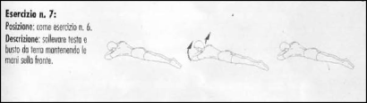
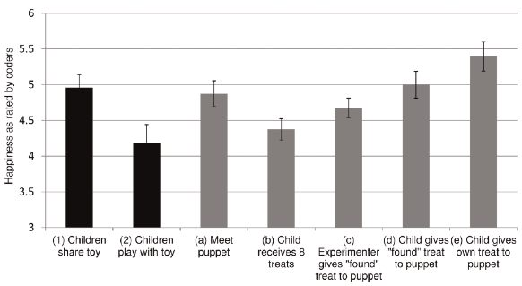

= Appunti
Maurizio Stagni <comeunbalconeATgmail.com>
v1.0, 160426

:doctype: book
:description: vari appunti interessanti
:keywords: Esercizi, Mindfulness
:lang: it
:pdf-page-size: A4
:author: Maurizio Stagni
:toc: left
:toclevels: 4
:page-layout: docs
:page-description: {description}
:page-keywords: {keywords}
:toc: left
:icons: font
:idprefix:
:idseparator: -
:sectanchors:
endif::[]
:experimental:
:mdash: &#8212;
:language: asciidoc
:source-language: {language}
:table-caption!:
:example-caption!:
:figure-caption!:
:imagesdir: ../images
:includedir: _includes

Questa è l'intestazione del libro vero e proprio

Parte lasciata intenzionalmente bianca

toc::[]

== Elenco Esercizi

=== Corpo libero

((Accosciata))::
    _Sinonimi_: ((air squat)), ((squat)) +
    Esercizio che prevede il passaggio dalla posizione eretta a quella accosciata: gambe flesse oltre i 90°, schiena eretta, peso sulla pianata del piede. Le braccia possono essere parallele al terreno o più sollevate. riferimento <<esercizi1, figura 1a>>

	varianti:::

	*** ((squat jump)): Esercizio adatto al rafforzamento delle gambe
	*** Squat press
	*** Squat side to side
		1.  Scendo in squat con una delle due gambe in affondo laterale
		2.  Salto nella direzione opposta alla gamba in affondo
		3.  Atterro specularmente al punto 1

[[addominali]]
((addominali)):: Da supini flettere leggermente le gambe, portare le mani dietro la nuca e contrarre gli addominali,     senza che le mani spingano sulla testa. riferimento <<esercizi1, figura 1b>> +
_Sinonimi_: ((abdominal crunches)), ((crunches))

	varianti:::
	* *((con peso))*: _Sinonimi_: ((Crunch with weight))
	* *((sit up))*: Si parte dalla posizione base dell'addominale con le braccia alzate (parallele al terreno) e si esegue raccogliendo le gambe e le braccia, portandosi in posizione seduta.

((affondo)):: ToDo +
    _Sinonimi_: ((Lunge))

((burpee))::  Il burpee è un esercizio full bodyfootnote:[https://it.wikipedia.org/wiki/Burpee]. riferimento <<esercizi1, figura 1c>>. Il movimento base si divide in 4 passaggi:
    . Partenza in posizione eretta
    . Si passa in posizione di squat con le mani a terra.
    . Si lanciano i piedi indietro tenendo le mani a terra.
    . Subito si riportano i piedi in posizione di Squat.
    . Si salta dalla posizione di squat verso l'alto

    varianti:::

    *** _((burpee bastardo))_: eseguito con due
    flessioni dopo la fase di planc

((Corsa sul posto))::
    _Sinonimi_: ((High knees running))

((Criss Cross))::
    <<addominali, addominali>> fatti a ginocchia alte con le gambe a 90 gradi. Portare mani dietro la nuca. Si portano le ginocchia alternate al petto ruotando il busto per toccare le ginocchia con il gomito opposto. +
    _Zone Coinvolte_ : Core.
    Variazioni:::
    ** _((Criss Cross to Teaser))_: 3 movimenti di criss cross e si sta per un secondo in posizione <<teaser>>

((downdog to bridge))::
    Da Cane faccia in giù fino a ponte faccia all'aria. +
    Esercizio che coinvolge più fasce

((geko))::
    Quadrupedia, le ginocchia non toccano terra. Estendi braccio sinistro e gamba destra e viceversa.

[[flessione]]
((flessione)):: riferimento <<esercizi1, figura 1d>>
	_Sinonimi_: ((Push up))
	Esercizio che si esegue passando dalla posizione di <<plank, plank>> flettendo e distendendo le braccia

	Varianti:::
	** *((Around the clock push up))*
	** *((HandStand push up))*: Forget shoulder presses. If you want a killer shoulder workout, look no further than the handstand push-up. To perform the handstand push-up, assume a handstand position. Slowly bend your elbows and lower your inverted body towards the ground. In order to maintain balance, you’re going to have to call on your core and other smaller stabilizing muscles. If you can’t do a stand-alone handstand, use a wall to assist you.
	** *((Hindu push up))*: footnote:[http://www.artofmanliness.com/2015/08/05/the-prisoner-workout/] This is a dynamic full-body movement that will build strength and flexibility in your chest, shoulders, back, hips, and triceps. +
	Get in position by standing with your feet slightly wider than shoulder-width apart. Bend down and place your hands on the floor while keeping your arms and legs straight. You should look like an upside down human “v” with your butt being the point of the “v” and your head pointing down to the ground. +
	To perform the Hindu push-up, you’re going to make sort of a swooping motion with your body. Bring your head down and forward by bending your elbows. When your head gets close to the ground, continue moving your torso forward by arching your back and lowering your hips. Your hips will now be near your hands. Make sure to get a good stretch in your back. Return to the starting position and repeat. +
	** *((Cobra Push up))*: dalla posizione bassa della flessione portare il busto tutto a destra e tutto a sinistra e riflettere le braccia.
	** *((Push up and rotation))*
	** *((Spiderman push up))*: Push up con apertura alternata della gamba destra e della gamba sinistra nella fase di discesa. Il ginocchio della gamba divaricata cerca il gomito.
	** *((Stella marina))*: Dalla posizione di push up bassa a mani strette passare a quella a mani e piedi larghe con tre o quattro balzelli

todo eliminare immagini

((hip escape))::
    Quattro zampe, ginocchia vicine a terra. Far uscire la gamba sx dal lato destro vicina al terreno tenendo le ginocchia del dx vicine a terra.
    _Zone coinvolte_: Core

((Jumping Jack))::
    Esercizio che coinvolge gambe e un pò tutto il resto. riferimento <<esercizi1, figura 1e>> +
    Varianti:::
        * con pesetti

((Mountain climber))::
    dalla posizione di plank portare alternativamente le ginocchia al petto.

[[switch]]
((Switch)):: Esercizio adatto al rafforzamento delle gambe. Si parte dalla posizione dell'affondo e con un balzo ci si porta nella posizione opposta.

	Varianti:::
		* _((Switch Jump))_: Come lo switch ma ogni 3 switch un jump.
		* _((Switch Squat))_ Come lo switch ma ogni 3 switch uno squat.

[[plank]]
((Plank))::
    ottimo esercizio per il core. Posizione della <<flessione, flessione>> con le braccia tese. riferimento <<esercizi1, figura 1f>>

    varianti:::
    *** ((plank to teaser))
	*** ((plank walk))
        . Partenza in posizione plank
        . Piego il braccio destro e appoggio il gomito destro al terreno
        . Piego nello stesso modo il sinistro.
        . Fletto il braccio sinistro e lo riporto in appoggio sulla mano
        . Fletto come nel punto 4 anche il destro
        . Ricomincio dal punto 1 ma inverto il braccio che per primo scende.
    *** ((side plank)): Come il plank ma con il busto perpendicolare al terreno sorreggendosi su un braccio od un gomito.

((Plank to teaser))::
    Esercizio dinamico che si fapassando dalla posizione di <<plank, plank sui gomiti>> a quella di <<teaser>>

((Power cobra))::
    Esercizio dinamico che comporta il passare in maniera alternata dalla posizione del cobra a quella accosciata.

((Trazioni))::
	_Sinonimi_: ((Pull up)) +
	Esercizio di trazioni alla sbarra. Nel crossfit ha un'esecuzione con slancio che permette la realizzazione di più serie.

((Rollata))::
	_Sinonimi_: Roll up

	Varianti:::

	*** Rollata e jump: Rollata su tappetino e jump

((Rollè alto)):: Quadrupedia, le ginocchia non toccano terra. Rolle su braccio sinistro e gamba destra. Ruotare fino ad avere il torso in alto e toccare il piede in alto con la mano libera.

((Step up onto chair))::
	salire e scendere da una sedia.

[[superman]]
((superman)): Da stesi pancia in giù, contrarre braccia e gambe per ottenere la posizione tipica di superman. riferimento <<esercizi1, figura 1g>>

[[teaser]]
((teaser)):: stare a 'V'. riferimento <<esercizi1, figura 1h>>

((Triceps dip on chair)):: tricipiti da una sedia

((Wall sit)):: schiena appoggiata al muro e stare come da seduti

[[esercizi1]]

.alcuni esercizi: a. ((accosciate)), b. ((addominali)), c. ((burpees)), d. ((flessioni)), e. ((jumping jacks)), f. ((plank)), g. ((superman)), h. ((teaser))
image::figures/exercises/pagina_01.svg[]

=== Con ((Bilanciere)) (((barbell)))

Seguono descrizioni di esercizi da fare con il bilanciere

.modello esercizio
[[clean]]
((clean))::
    image:figures/empty_3cmx5cm.svg[role=right]
    _Sinomimi_: ((posizione del ................)), +
    ((posizione del .........)). +
    _Esecuzione_: Istruzioni per l'esecuzione. Eventuali riferimenti. +
    _Effetti_: Esercizio in 4 step.
    . Partenza
        ** chinati con le mani che afferrano il bilancere
        ** schiena leggermente inarcata.
        ** peso bilanciato sotto i piedi.
        ** sguardo in alto
        ** testa allineata ala schiena
        ** bilanciere a contatto con gli stinchi
    . Stacco
        ** Spingi i piedi contro il terreno, tira indietro le ginocchia perchè il bilanciere muovendosi solo verso l'alto passi, sempre stando vicino al corpo..
        ** Lo stacco avviene lentamente e culmina in un movimento esplosivo con la piena estensione della schiena.
        ** Come la barra passa sopra le ginocchia, tieni il peso sui talloniil più possibile e comincia ad estendere le anche avanti
        ** Quando la barra arriva a mezza altezza, velocemente e con potenza estendi le anche, le ginocchia, le anche, i talloni. +
        Quando la barra prende inerzia solleva anche le spalle più velocemente possibile.
        La barra dovrebbe raggiungere la parte alta dei fianchi o del torace.
    . Atterraggio
        ** Appena cìè la completa estensione delle anche, porta il corpo sotto la sbarra, atterrando solidamente in front squat con lo sguardo in avanti. +
        Mentre lo fai ruota i gomiti avanti e sotto la barra, mollando la presa e permettendo ai polsi di girarsi verso l'alto. Fai posare la barra di fronte alle spalle, tra il picco dei deltoidi e la gola
    . Finale
        ** una volta che la barra è stabile, lentamente alzati fino alla posizione eretta. Se il peso è molto forte può essere più facile "rimbalzare" dalla posizione di squat senza pausa nella posizione bassa
    . Abbassate o Mollate il peso in sicurezza

((Clean Varianti))::
        * _((clean press))_ +
         come il clean ma si completa con un push press
        * _((power clean))_ +
        variazione del punto 3: ferma la barra a mezzo squat. Questa versione necessita che la barra sia lanciata più in alto.

[[front squat]]
((front squat))::
    image:figures/empty_3cmx5cm.svg[role=right]
    _Sinomimi_: ((accosciata con il bilancere appoggiato al petto)), +
    _Esecuzione_: Accosciata con il bilanciere appoggiato al petto. +
    _Effetti_: Effetti dell'asana.

[[renegade]]
((renegade))::
    image:figures/empty_3cmx5cm.svg[role=right]
	_Sinonimi_: ((remata in plank)) +
    _Esecuzione_: <<plank, plank>> remando con due pesi +
    _Effetti_: Muscoli.

.modello esercizio
[[nome]]
((nome))::
    image:figures/empty_3cmx5cm.svg[role=right]
    _Sinomimi_: ((posizione del ................)), +
    ((posizione del .........)). +
    _Esecuzione_: Istruzioni per l'esecuzione. Eventuali riferimenti. +
    _Effetti_: Effetti dell'asana.

.Esercizi aggiuntivi:
|===
| Corsa sul posto | Lunge
| Mountain Climber
| Side Plank
| Step up into a chair
| Triceps dips on chair
| Wallsit
|===

.Push Ups
|===
| Push UPs
| Around the Clock push up
| Handstand push up
|===

[[bilancere]]
.((bilanciere))
|===
| Clean
| Front Squat
| Hindu Push ups
|===

[[kettlebell]]
.((kettlebell))
|===
| Renegade
|===

.((manubri))
|===
| Renegade
|===

=== Crossfit

==== Esercizi proposti

===== Angie

For time:

-   pull-up X 100
-   push-up X 100
-   sit-up X 100
-   squat X 100

Cap time 20 minutes footnoteref:[cfitjou, CrossFit Journal Issue 13 - September 2003: http://library.crossfit.com/free/pdf/13_03_Benchmark_Workouts.pdf[link]].

===== Barbara

5 rounds for time, 3 minutes rest between rounds:

-   20 pull-ups
-   30 push-ups
-   40 sit-ups
-   50 squats

Cap time 3*3*5 < 45 minutes footnoteref:[cfitjou]

===== Chelsea

Each round on the minute for 30 minutes footnoteref:[cfitjou]:

-   Pull up X 5
-   Push up X 10
-   Squat X 15

40 seconds and 20 rest.

===== Diane

21-15-9 reps. 3 round for time  footnoteref:[cfitjou].

For rookies 7-5-3

-   Deadlift 100 kg
-   Handstand push- ups

===== Elizabeth

21-15-9 reps. 3 round for time  footnoteref:[cfitjou].

For rookies 7-5-3

-   Clean 60 kg
-   Ring Dips

===== Fran

21-15-9 reps. 3 round for time footnoteref:[cfitjou].

For rookies 7-5-3

-   Thruster 45 kg
-   Pull-ups

===== Sidio 150929

10 minuti snatch per 2 ripetizioni

5 reps:
* 20 Sit up
* 10 Deadlift
* 5 Weighted toes to bar

=== Tipologie d'allenamento

Amrap 4X5'::
 ** Gambe
  *** Plyometric Jump
 ** Braccia. Scegliere tra i seguenti.
  *** Barbell:
   **** *10*  High Pull
   **** *10* Barbell Row
   **** *10* Shoulder press
   **** *10* Clean
 ** Spalle, dorsali
   *** Rowing
 ** Core
  *** *10* Wall Ball
  *** *10* Half burpees

.Zuu
|===
| Stella marina
| cobra push up
| snake
| Hindu Push ups
|===

=== Zuu

==== Ancore

Esercizi Base, per il recupero

((Frog squat)):: Chinarsi, mettere i gomiti a contatto con l'interno delle ginocchia e sollevare ed abbassare il sedere.

image::figures/exercises/frog_squat_zuu.png[width='80%']

((Rock press)):: A Quattro zampe, con il sedere alto sulla verticale dei piedi, eseguire flessioni con le mani, mantenendo la testa allineata al corpo.

image::figures/exercises/rock_press_zuu.png[width='80%']

==== Recuperi

Posizioni od eserizi che si fanno per recuperare quando si sono fatti altri esercizi

((Frog position)):: Come Frog Squat ma ferma

((Sumo Double Scissors)):: Divaricare le game, accosciarsi, rialzarsi con un saltello e fare uno <<switch, switch>>

==== Weapons

Esercizi veri e propri

===== Bear crawl

Camminata stile orso, da fare sia avanti che indietro. Nell'andare
indietro focalizzarsi sulla spinta delle braccia, le gambe accopagnano
solo.

image::figures/exzuu/bear_crawl_zuu.png[width='80%']

===== Chameleons

image::figures/exzuu/chameleons.png[width='80%']

===== Coils

Low push up position and rotate with the upper part

===== Donkey kick

image::figures/exercises/donkey_kick_zoo.png[width='80%']

===== Gorilla

===== Half hindu

Tratto dallo yoga

image::figures/exercises/half_hindu.png[width='80%']

Variazioni:

.Half half hindu

.Reverse hindu
Come Half hindu ma al contrario

===== Iguana

image::figures/exercises/iguana_zuu.png[width='80%']

===== Kick sit

image::figures/exzuu/kick_sit_zuu.png[width='80%']

===== Reverse walk

image::figures/exzuu/gorilla_backwalk.png[width='80%']

===== Russian

Squad basso e camminare avanti ed indietro (5 passi avanti e 5 indietro)

image::figures/exzuu/russian.png[Russian]

===== Stepouts

image::figures/exzuu/stepouts.png[width='80%']

===== Straddle

image::figures/exzuu/straddle.png[width='80%']

===== Walk Throughs

image::figures/exzuu/walk_throughs.png[width='80%']

===== XPlodes

Da sumo squat saltare toccandosi i tacchi in volo

==== TBD

===== Body drops

E' un burpee senza salto.

===== Caterpillar

il bruco. si parte da posizione eretta.Siflette il bustpoggiando le mani abita

===== Cheeta jump

Squat salto a gambe alternate aperte e chiuse

image::figures/exercises/cheeta_jump.png[width='80%']

===== Cobra

Push up  + Lateral push up

===== Frog jump

Dalla posizione di squat si eseguono uno o più salti. Importante l'atterraggio morbido.

===== Push up

Ce ne sono variazioni:

* *asimmetrici*: Eseguire un push up asimmetrico [^1] e con balzelli
    delle braccia alternarle.
* *cobra*cobra: Push up + Lateral push up
* *iguana*: eseguire uno Spiderman push up anzando
* *miniiguana*: come il precedente ma avanzando con le punte dei piedi. Sempre balelli con le braccia
* *zum zum*: mettersi in posizione bassa del push up e nuoversi in
    avanti ed indietro con il busto
* *zum zum gamba all'alto*: come zum zum ma tengo una delle gambe in
    alto
* Rock press
* Half hindu

===== Snake

POsizione bassa del push up e oscillare avanti ed indietro

image::figures/exzuu/snake.png[Snake]

===== Da Pulire

* Walk and gorilla jump: 4 passi a chinino e jump
* special push up
    ** Mi abbasso
    ** Sposto il peso a destra
    ** Sposto il peso a sinistra
    ** Push up con braccia asimmetriche che si alternano veocemente
    ** power cobra
    ** seq
        ** switch jump
        ** mi abbasso in push up (basso)
            ** muovo avanti ed indietro con il busto
            ** come sopra ma alzo anche una gamba posteriore
            ** poi in power cobra
                ** mi fermo in squat statico
                ** oppure switch squat

==== Drills

===== Virgin Personal

* 2 x 30 secondi ognuna:
	** Frog Squat
	** Bear Crawl
	** Rock Press
* Riposo
* 2 x 30 secondi ognuna:
	** kick sit
	** gorilla
	** half hindu
* Riposo
* 2 x 30 secondi ognuna:
	** Snake
	** Caterpillar
	** XPlodes

===== warmup

3 minuti

* frog
* half hindu
* squat basso immobile
* push up solo basso
* cerchi e cambio rotazione con push basso
* burpees
* bear crawl
* side kicks
* squat basso immobile
* rock press
* half hindu
* burpees

===== Virgin 150920

* Riscaldamento tabata (20-10) 4X:
  ** frog squat
  ** rock press

* Workout 40 sec each 2X:
	** Frog squat
	** Bear crawl
	** Half indu
	** Rock press
	** Donkey
	** Gorilla

===== Virgin 150923

Warmup
* Tabata
 ** Frog Squat
 ** Rock Press

* Workout 40/20
    ** Esercizi
		*** Half Hindu
		*** Xplodes
		*** Gorilla
		*** Iguana
		*** Russian
		*** Bear Crawl
    ** Pause
		*** Sumo double scissors
		*** Frog rest position
		*** Rock Press rest position
		*** Gnu

===== Virgin 150929

Warmup

* Tabata
 ** Frog Squat
 ** Rock Press

* Workout 40/20
    ** Esercizi
    *** Frog Squat
    *** Bear Crawl
    *** Straddle
    *** Gorilla
    *** Kick Sit
    *** Donkey
    ** Pause
    *** Sumo double scissors
    *** Frog rest position
    *** Rock Press rest position
    *** Gnu

===== Virgin 151016

* Workout ((3*30') * 3)
	** 1st block
		*** Crab squat
		*** Stella Marina
		*** Bear crawl
	** 2nd block
		*** Gorilla
		*** half hindu
		*** Cobra
	** 3rd block
		*** Kit sit
		*** Millepiedi
		*** Caterpillar

===== Virgin 151016

AMRAP 12'::

* 4 snake
* 8 Donkey hand stand
* 12 Kick sit front
* 16 explodes
* 20m gorilla

Tabata, "Cash out"::
* Frog Squat
* Rock Press

==== Drill n.1

3 volte :

-   5 Rock press
-   5 Frog squat
-   5 Gorilla

==== Drill n.2

Front squaws

3 volte :

-   5 X Frog squat
-   5 X Gorilla
-   5 X Bear Crawls

==== Drill n.10

3 minute EMOM:

-   10 body drops
-   30 kick sit

rest making gorilla

==== Drill workout 1

5 times

- Half hindu X 10
- Frog squat X 10
- Rock press X 10
- Bear crawl X 10

==== Drill Firenze

3 volte, 6 ripetizioni ognuno:

- Half hindu
- Reverse hindu
- Cobra
- Frog jump
- Frog squat
- Kick sit
- Gorilla
- Reverse walk

==== Drill ((Walkwall))

* 3X 30 sec
	** Gorilla
	** Walkwallz
	** Cobraz

=== ((Asana)) ((Yoga))

Ecco un elenco delle (((posizioni yoga))) più comuni. Sono riassunte con il seguente modello:

.modello asana
((nome))::
    image:figures/empty_3cmx5cm.svg[role=right]
    _Sinomimi_: ((posizione del ................)), +
    ((posizione del .........)). +
    _Respiro_: inspirare / espirare / apnea. Da considerare se eseguito in una sequenza. Per posizione mantenuta non considerare. +
    _Esecuzione_: Istruzioni per l'esecuzione. Eventuali riferimenti. +
    _Effetti_: Effetti dell'asana.

((adho mukha svanasana))::
    image:figures/asana_yoga/adho_mukha_svanasana.svg[role=right, pdfwidth=5cm]
    _Sinonimi_: ((cane a faccia in giù)), ((downward-facing dog)) +
    _Esecuzione_: Portando il peso sulle braccia, estendere le gambe alzando il bacino. Mantenere le piante dei piedi ben a terra. Inserire la testa tra le braccia, formando un triangolo con la schiena e le gambe ben dritte. +
    _Effetti_: La posizione ha lo scopo di allungare la schiena e fortificare le braccia e le gambe. +

((ashtanga namaskara))::
    image:figures/asana_yoga/ashtanga_namaskara.svg[role=right, pdfwidth=5cm]
    _Sinonimi_: ((Saluto con gli “otto” arti del corpo)) +
    _Respiro_: espirare +
    _Esecuzione_: espirare portando a terra le ginocchia, il petto e la fronte, tenendo sollevati il bacino e lo stomaco. +
    _Effetti_: buonissimi.

((ashwa sanchalanasana))::
    image:figures/asana_yoga/ashwa_sanchalanasana.svg[role=right, pdfwidth=5cm]
    _Sinonimi_: _((posizione equestre))_ +
    _Respiro_: inspirare +
    _Esecuzione_: estendendere la gamba sinistra indietro; contemporaneamente piegare il ginocchio destro e guardare in alto sollevando il mento. +
    _Effetti_: buonissimi.

((baddha konasana))::
    image:figures/asana_yoga/baddha_konasana.svg[role=right, pdfwidth=5cm]
    _Sinonimi_: ((posizione della farvalla)) +
    _Esecuzione_: Eseguire la posizione della farfalla +
    _Effetti_: buonissimi.

((bhujangasana))::
    image:figures/asana_yoga/bhujangasana.svg[role=right, pdfwidth=5cm]
    _Sinomimi_: ((posizione del cobra)), ((posizione del serpente)). +
    _Respiro_: inspirare +
    _Esecuzione_: Partendo dalla posizione prona, con il corpo disteso sulla pancia e le gambe unite e parallele con le cosce al suolo e piedi distesi e allungati sul dorso, si piegano le braccia portando i palmi delle mani a terra all'altezza delle spalle. Inspirando, si solleva il busto con le braccia, distendendole, mantenendo cosce e pube a contatto con il suolo. Sguardo in alto. +
    _Effetti_: rinforza i muscoli dorsali, promuove la flessibilità della colonna vertebrale e stimola la circolazione sanguigna nella regione spinale tonificando i plessi nervosi. Gli effetti di questo âsana interessano tutte le vertebre: una pratica attenta e costante permette la correzione di eventuali deviazioni della colonna vertebrale. Bhujangâsana risulta particolarmente efficace nell'affrontare dolori e irregolarità mestruali, costipazione e lombaggine. Vengono stimolati tutti gli organi addominali, in modo particolare il fegato e i reni. E' considerato un ottimo esercizio per la preparazione al parto, anche se non deve essere eseguito durante il periodo della gravidanza. footnote:[Fonte: http://www.yoga.it/articoli/bhujangasana-il-cobra/]

((halasana))::
    image:figures/asana_yoga/halasana.svg[role=right, pdfwidth=5cm]
    _Sinonimi_: ((posizione dell' aratro)) +
    _Esecuzione_: Eseguire la posizione dell'aratro  +
    _Effetti_: buonissimi.

((hasta uttanasana))::
    image:figures/asana_yoga/hasta_uttanasana.svg[role=right, pdfwidth=5cm]
    _Sinonimi_: ((posizione delle mani sollevate)) +
    _Esecuzione_: Inspirare distendendo le braccia verso l’alto e flettendo il tronco all’indietro. +
    _Effetti_: buonissimi.

((karnapidasana))::
    
    _Sinonimi_: ((posizione dell'aratro modificato)) +
    _Esecuzione_: posizione dell'aratro modificato +
    _Effetti_: buonissimi.

((janu sirsasana))::
    image:figures/asana_yoga/janu_sirsasana.svg[role=right, pdfwidth=5cm]
    _Sinonimi_: ((posizione piegata sulla gamba destra o sinistra)) +
    _Esecuzione_: posizione piegata sulla gamba destra o sinistra  +
    _Effetti_: buonissimi.

((supta baddha konasana))::
    
    _Sinonimi_: ((posizione del calzolaio)) +
    _Esecuzione_: Eseguire la posizione del calzolaio  +
    _Effetti_: buonissimi.

((padahastasana))::
    image:figures/asana_yoga/padahastasana.svg[role=right, pdfwidth=5cm]
    _Sinonimi_: _((posizione delle mani ai piedi))_ +
    _Esecuzione_: espirare piegandosi in avanti partendo dai fianchi, fino ad appoggiare i palmi delle mani a terra ai lati dei piedi. +
    _Effetti_: buonissimi.

((paschimottanasana))::
    image:figures/asana_yoga/paschimottanasana.svg[role=right, pdfwidth=5cm]
    _Sinonimi_: ((posizione seduta in avanti)) +
    _Esecuzione_: Eseguire la posizione seduta in avanti  +
    _Effetti_: buonissimi.

((pranamasana))::
    
    _Sinonimi_: ((posizione della preghiera)) +
    _Esecuzione_: Espirare con i piedi uniti e le mani giunte davanti al petto.
    _Effetti_: buonissimi.

((sarvangasana))::
    image:figures/asana_yoga/sarvangasana.svg[role=right, pdfwidth=5cm]
    _Sinonimi_: ((posizione della candela)) +
    _Esecuzione_: Eseguire la posizione della candela +
    _Effetti_: buonissimi.

((shashankasana))::
    
    _Sinonimi_: ((posizione della lepre)) +
    _Esecuzione_: Eseguire la posizione della lepre +
    _Effetti_: buonissimi.

((shavasana))::
    image:figures/asana_yoga/shavasana.svg[role=right]
    _Sinonimi_: ((posizione del cadavere)), ((Mrtasana)), ((savasana)) +
    _Esecuzione_: Savasana è una posizione di rilassamento totale, quindi anche una delle asana più impegnative. +
    _Effetti_: buonissimi.

((upavishta konasana))::
    image:figures/asana_yoga/upavishta_konasana.svg[role=right, pdfwidth=5cm]
    _Sinonimi_: ((seduta ad angolo)) +
    _Esecuzione_: Eseguire la seduta ad angolo +
    _Effetti_: buonissimi.

((uttanasana)) footnoteref:[uttanasana, https://it.wikipedia.org/wiki/Uttanasana] ::
    image:figures/asana_yoga/uttanasana.svg[role=right, pdfwidth=5cm]
    _Sinonimi_: ((posizione della pinza in piedi)) +
    _Esecuzione_: Partendo dalla posizione in piedi, con la schiena dritta ed i piedi distanti come l'apertura delle anche e le braccia allungate oltre la testa, espirando si piega il bacino muovendo il corpo come fosse formato da due tronconi, allungando le mani fino a raggiungere le caviglie, il dorso dei piedi o sotto la pianta dei piedi, appoggiando il tronco parallelo alle gambe. +
    _Effetti_: La posizione ha lo scopo di allungare la schiena, traendola in senso conforme dell'usuale incurvatura. Crea benefici alla colonna vertebrale, distendendola footnoteref:[uttanasana].

((utthita sarvangasana))::
    image:figures/asana_yoga/utthita_sarvangasana.svg[role=right, pdfwidth=5cm]
    _Sinonimi_: ((posizione della candela aiutata destra o sinistra)) +
    _Esecuzione_: Eseguire la posizione della posizione della candela aiutata destra o sinistra +
    _Effetti_: buonissimi.

((vajrasana)) footnote:[https://it.wikipedia.org/wiki/Vajrasana]::
    image:figures/asana_yoga/vajrasana.svg[role=right, pdfwidth=5cm]
    _Sinonimi_: ((posizione del diamante)), ((posizione del tuono)) +
    _Esecuzione_: Inginocchiarsi a terra sedendosi sui piedi, appoggiati con il dorso a terra, e mantenendo la spina dritta e verticale con il collo allineato con essa. Le mani saranno appoggiate sulle ginocchia. I piedi possono rimanere paralleli e appoggiati a terra sul dorso. +
    _Effetti_: La posizione ha lo scopo preparare alla meditazione.

=== Sequenze Yoga

.Rilassamento footnote:[vajrasana 120, shashankasana 180, adho_mukha_svanasana 60, uttanasana 120, baddha_konasana 60, upavishta_konasana 120, janu_sirsasana 60x2, paschimottanasana 240, shavasana 60, halasana 30, sarvangasana 60, utthita_sarvangasana 60x2, karnapidasana 30, halasana 30, shavasana 30, supta_baddha_konasana 300, shavasana 300]
[header=yes, cols="^1,2,1"]
|===
| Posizione | Descrizione | Secondi
| image:figures/asana_yoga/vajrasana.svg[role=right, pdfwidth=5cm] | Inginocchiarsi a terra sedendosi sui piedi, appoggiati con il dorso a terra, e mantenendo la spina dritta e verticale con il collo allineato con essa. Le mani saranno appoggiate sulle ginocchia. I piedi possono rimanere paralleli e appoggiati a terra sul dorso. | 120
|  | Eseguire la posizione della lepre | 180
| image:figures/asana_yoga/adho_mukha_svanasana.svg[role=right, pdfwidth=5cm] | Portando il peso sulle braccia, estendere le gambe alzando il bacino. Mantenere le piante dei piedi ben a terra. Inserire la testa tra le braccia, formando un triangolo con la schiena e le gambe ben dritte. | 60
| image:figures/asana_yoga/uttanasana.svg[role=right, pdfwidth=5cm] | Inspirare distendendo le braccia verso l’alto e flettendo il tronco all’indietro. | 120
| image:figures/asana_yoga/baddha_konasana.svg[role=right, pdfwidth=5cm] | Eseguire la posizione della farfalla | 60
| image:figures/asana_yoga/upavishta_konasana.svg[role=right, pdfwidth=5cm] | Eseguire la seduta ad angolo | 120
| image:figures/asana_yoga/janu_sirsasana.svg[role=right, pdfwidth=5cm] | posizione piegata sulla gamba destra o sinistra  | 60
| image:figures/asana_yoga/janu_sirsasana.svg[role=right, pdfwidth=5cm] | altro lato | 60
| image:figures/asana_yoga/paschimottanasana.svg[role=right, pdfwidth=5cm] | Eseguire la posizione seduta in avanti  | 240
| image:figures/asana_yoga/shavasana.svg[role=right, pdfwidth=5cm] | Savasana è una posizione di rilassamento totale, quindi anche una delle asana più impegnative. | 60
| image:figures/asana_yoga/halasana.svg[role=right, pdfwidth=5cm] | Eseguire la posizione dell'aratro  | 30
| image:figures/asana_yoga/sarvangasana.svg[role=right, pdfwidth=5cm] | Eseguire la posizione della candela | 60
| image:figures/asana_yoga/utthita_sarvangasana.svg[role=right, pdfwidth=5cm] | Eseguire la posizione della posizione della candela aiutata destra o sinistra | 60
| image:figures/asana_yoga/utthita_sarvangasana.svg[role=right, pdfwidth=5cm] | altro lato | 60
|  | posizione dell'aratro modificato | 30
| image:figures/asana_yoga/halasana.svg[role=right, pdfwidth=5cm] | Eseguire la posizione dell'aratro  | 30
| image:figures/asana_yoga/shavasana.svg[role=right, pdfwidth=5cm] | Savasana è una posizione di rilassamento totale, quindi anche una delle asana più impegnative. | 30
|  | Eseguire la posizione del calzolaio  | 300
| image:figures/asana_yoga/shavasana.svg[role=right, pdfwidth=5cm] | Savasana è una posizione di rilassamento totale, quindi anche una delle asana più impegnative. | 300
|===

https://youtu.be/XeLiB6aG5IE

.Saluto al sole
[header=yes, cols="^1,2"]
|===
|  | posizione della preghiera: ((Pranamasana)) espirare con i piedi uniti e le mani giunte davanti al petto.
| image:figures/asana_yoga/hasta_uttanasana.svg[] | posizione delle mani sollevate: ((Hasta uttanasana)) inspirare distendendo le braccia verso l’alto e flettendo il tronco all’indietro.
| image:figures/asana_yoga/padahastasana.svg[] | posizione delle mani ai piedi: (Padahastasana) espirare piegandosi in avanti partendo dai fianchi, fino ad appoggiare i palmi delle mani a terra ai lati dei piedi.
| image:figures/asana_yoga/ashwa_sanchalanasana.svg[scaledwidth=50%] | posizione equestre: (Ashwa sanchalanasana) Inspirare stendendo la gamba sinistra indietro; contemporaneamente piegare il ginocchio destro e guardare in alto sollevando il mento.
| image:figures/asana_yoga/adho_mukha_svanasana.svg[] | posizione del cane che guarda indietro: (Adho mukha svanasana) trattenere il respiro e portare il piede destro indietro, vicino al sinistro. Obiettivo è che il corpo formi una linea dritta.
| image:figures/asana_yoga/ashtanga_namaskara.svg[] | Saluto con gli “otto” arti del corpo: (Ashtanga namaskara) espirare portando a terra le ginocchia, il petto e la fronte, tenendo sollevati il bacino e lo stomaco.
| image:figures/asana_yoga/bhujangasana.svg[] | posizione del serpente (o del cobra): ((Bhujangasana)) inspirare e guardare in alto, sollevando la parte superiore del corpo e le braccia.
| image:figures/asana_yoga/adho_mukha_svanasana.svg[] | posizione del cane che guarda indietro: (Adho mukha svanasana) espirare con le mani a terra, portando la punta dei piedi in avanti e spingendo le natiche verso l’alto e all’indietro.
| image:figures/asana_yoga/ashwa_sanchalanasana.svg[] | posizione equestre: (Ashwa sanchalanasana) inspirare portando il piede sinistro tra le mani. Vi troverete con la gamba destra tesa all’indietro e il ginocchio poggiato a terra.
| image:figures/asana_yoga/padahastasana.svg[] | posizione delle mani ai piedi: (Padahastasana) espirare portando la gamba destra vicino alla sinistra e il bacino verso l’alto. Avvicinate il viso alle gambe.
| image:figures/asana_yoga/hasta_uttanasana.svg[] | posizione delle mani sollevate: (Hasta uttanasana) distendete le braccia in avanti, poi verso l’alto e oltre la testa, piegandovi all’indietro con le mani unite.
|  | posizione della preghiera: (Pranamasana) chiudere il ciclo con la posizione numero 1.
|===

=== Riscaldamento

7 minuti.

Suggeriti:

-   7 minutes workout
-   MP Style warm up

==== MP Style warm up

Si eseguono gli esercizi con la seguente sequenza:

-   1
-   1, 2
-   1, 2, 3

Sequenza suggerita:

1.  Step Base
2.  Step con mano in taglio
3.  Step con mano in alto
4.  Jumping Jacks
5.  *ToDo* completare

=== Sequenze

==== 7 minutes workout

In 12 exercises deploying only body weight, a chair and a wall, it
fulfills the latest mandates for high-intensity effort, which
essentially combines a long run and a visit to the weight room into
about seven minutes of steady discomfort — all of it based on
science. footnote:[http://well.blogs.nytimes.com/2013/05/09/the-scientific-7-minute-workout/?_r=0[Here] for the full article]

For each exercises 30 sec hard workout, 10 seconds rest.

------------
  Stp   Exercise

  01    Jumping jacks
  03    Wall sit
  05    Push up
  07    Abdominal crunch
  09    Step up onto Chair
  11    Air squat
  13    Triceps dip on chair
  15    Plank
  17    High knees running
  19    Lunges
  21    Push up and rotation
  23    Side Plank

------------

The even steps are all *rest* and are omitted

==== RED

Esercizi caratterizzati da una buona risposta muscolare.

Tipicamente un allenamento RED dura circa 45 minuti ed è composto da:

- Riscaldamento 7 min
- Agilità 5 minuti
- Forza 6 minuti
- Esercizi dinamici 4 minuti
- Agilità 5 minuti
- Crunch 5-6 minuti
- Esercizi dinamici 4 minuti
- Forza 5 minuti
- Stretching

Tranne il riscaldamento e lo stretching il resto non per forza in questo
ordine.

===== Esercizi dinamici

Detti anche *metabolic boosters* Tipicamente Tabata 20s lavoro -10s
riposo. Due esercizi per 4 volte.

4 minuti totale.

Scegliere un lavoro concentrato ed uno più completo.

* Concentrati:
    ** Gambe:
        *** Affondo e torsione con pesi X 3. Quarto movimento squat con peso sopra la testa.
        *** Mountain climber
        *** Squat jump
        *** Squat side to side
        *** Switch
        *** Switch jump
    ** Core
        *** Rollè alto
        *** Plank superman
    ** Spalle
        *** Spiderman push up
*Esercizi più completi:
    ** Burpee
    ** Geko
    ** Jumping jack con pesetti
    ** Power cobra
    ** Roll up e jump
    ** Squat mani in alto

===== Forza

5 minuti

Scegliere un esercizio o due per la forza.

1a serie massimo numero ripetizioni, le altre a scendere

-   4x (alternando se due esercizi):
    -   1.5 minuto
    -   .5 min recupero

Esercizi suggeriti:

-   Clean
-   Front Squat + Shoulder press (Thrusters)
-   Pull up
-   Remata
-   Squat press
-   Stacco

===== Agilità

5 minuti, cambi a chiamata del trainer; se si è da soli AMRAP da 8 a 16
per tipo.

A scelta uno tra i concentrati e uno di quelli che coinvolgono più
fasce:

* Concentrati
    ** Core
        *** Hip escape
        *** Plank to teaser
        *** Rollè alto
    ** Gambe
        *** Switch
        *** Sumo squat e salto toccandosi i talloni
        *** Corsa sul posto. 4 passetti veloci. e poi salto di 180° atterrando in squat. Salto di 180° e di nuovo corsetta. I passi più veloci possibili
*   Coinvolgenti più fasce
    *** DownDog To Bridge
    *** Power cobra
    *** Switch Squat
    *** Rollata e jump
    *** Roll down, addominali per sollevare le gambe, Roll up and jump
    *** Burpees con salto sollevando le ginocchia

===== Blocco Core

de esercizi tra quelli sotto, per 5 minuti, cambi a chiamata del trainer; se si è da soli AMRAP da 8 a 16
per tipo

* Crunch with weight
* Plank to teaser
* Plank walk
* Criss cross to teaser
* Crunch centro e due laterali
* Plank
* Plank and rotation con un peso da 5Kg

===== Realizzazione 1

Prima realizzazione esercizi Red. 36 minuti circa.

-   7 minuti Riscaldamento
    -   7 minutes workout
-   4 minuti Esercizi dinamici. Tabata 20-10 con:
    -   Switch
    -   Burpees
-   6 minuti Blocco di forza:
    -   Clean Press
-   4 minuti Esercizi dinamici. Tabata 20-10 con:
    -   Switch
    -   Burpee
-   5 min Agilità, AMRAP:
    -   Hip Escape X 16
    -   DownDog To Bridge X 16
-   6 minuti Blocco Core. AMRAP:
    -   Crunch with weight
    -   Plank to teaser
-   5 minuti Agilità. AMRAP:
    -   Hip Escape X 16
    -   DownDog To Bridge X 16

===== Realizzazione 2

Esercizi Red. 38 minuti circa.

-   7 minuti Riscaldamento
    -   7 minutes workout
-   5 min Agilità, AMRAP:
    -   Plank to teaser X 10
    -   Switch Squat X 10
    -   Hip escape X 10
-   6 minuti Blocco di forza:
    -   Clean Press
-   4 minuti Esercizi dinamici. Tabata 20-10 con:
    -   Mountain climber
    -   Spiderman Push up
-   5 min Agilità, AMRAP:
    -   Geko X 10
    -   Rollè alto X 10
-   4 minuti Esercizi dinamici. Tabata 20-10 con:
    -   Switch jump
    -   Squat side to side
-   6 minuti Blocco Core. AMRAP:
    -   Plank walk X 10
    -   Criss cross to teaser X 10

===== Realizzazione 3

Esercizi Red. 38 minuti circa.

-   7 minuti Riscaldamento
    -   7 minutes workout
-   4 minuti Esercizi dinamici. Tabata 20-10:
    -   Burpee
    -   Squat jump
-   6 minuti Blocco di forza:
    -   Remata
-   5 minuti Agilità. AMRAP:
    -   Switch X 6
    -   Rollata su tappetino e jump X 6
    -   Rollè alto X 6
-   4 minuti Esercizi dinamici. Tabata 20-10:
    -   Burpee
    -   Squat jump
-   6 minuti Blocco Core. AMRAP:
    -   Plank walk X 10
    -   Crunch with weight X 10
-   5 min Agilità, AMRAP:
    -   Spiderman push up
    -   Hip escape

==== Core

Il core è la parte centrale del corpo. É composta di tre fasce:

===== Iacopo

Steso a pancia in su a quadrupedia ribaltata:

-   2 X:
    -   sollevare (portare parallelo al terreno) un braccio
    -   tornare
    -   stendere una gamba a 45° dal terreno
    -   tornare
-   2 X:
    -   esercizio precedente ma con braccio e gamba opposte

Tentare lo stesso esercizio con tutte le direzioni possibili degli arti

==== Grid Fit

===== Palestra grid fit 20150821 40/20

-   Push up su palla medica
-   Deadlift
-   Push up and rotation
-   Sacco bulgaro
-   Swing
-   Mountain jumper
-   Squatting jacks

===== Grid Active  20150821

* Burpee con pallamedica (clean jerk al posto del salto)
* Pull ups
* Push ups
* Squats
* Renegade (Addominali vogando)
* Scalino con una gamba sola
* Stacco da terra

==== TRX

===== 20150821 Trx tabata 20\_10 rest 1 min a fine sequenza

-   Push up su palla medica
-   Deadlift
-   Push up and rotation
-   Sacco bulgaro
-   Swing
-   Mountain jumper
-   Squatting jacks

==== Elenco Esercizi fatti in palestra

===== 20150730 - VA grid 40s r20s X3

-   pull ups
-   triceps dips
-   affondi
-   clean press
-   burpees
-   push ups

==== Suggeriti

===== 8 esercizi base da fare benissimo

Ecco gli 8 esercizi base che fatti ottimamente stabilizzano la postura.
footnote:[http://www.mensjournal.com/expert-advice/the-only-8-moves-you-need-to-be-fit-20140306?utm_source=zergnet.com&utm_medium=referral&utm_campaign=zergnet_245652[Mensjournal.com
    20140306]]

-   Classic Push-Up
-   Overhead Press
-   Pull-Up and Chin-Up
-   Row
-   Squat
-   Kettlebell Swing
-   Dead Lift
-   Walking Lunge

=== ((Calisthenics))

Estratto dal libro di U. Miletto

.Condizionamento 1 foo
[format="csv", cols="^1,1,1", options="header"]
|===
Trazioni impugnatura inversa, 20,10
Full Squat, 20, 10
Piegamenti a piedi in appoggio sollevato, 20, 10
Hollow position , 30,15
Plank , 30,15
|===

.CalB2W2a: 8X
[format="csv", cols="^1,1,1", options="header"]
|===
8 Ripetizioni, Esecuzione, Riposo
Trazioni impugnatura inversa, 25, 7
Full Squat, 25, 7
Piegamenti a piedi in appoggio sollevato, 25, 7
8 Ripetizioni, Esecuzione, Riposo
Hollow position , 35,10
Plank , 35,10
|===

=== Esercizi stretching

==== Esercizi

[[arco_plantare]]
((arco plantare))::
    image:figures/stretching/arco_plantare.png[role=right]
    _Esecuzione_: Vedere figura. +
    _Effetti_: Fa bene.

[[gambe_posteriore]]
((gambe_posteriore))::
    image:figures/stretching/gambe_posteriore.png[role=right]
    _Esecuzione_: Vedere figura. +
    _Effetti_: Fa bene.

[[popliteo]]
((popliteo))::
    image:figures/stretching/popliteo.png[role=right]
    _Esecuzione_: Vedere figura. +
    _Effetti_: Fa bene.

[[adduttori]]
((adduttori))::
    image:figures/stretching/adduttori.png[role=right]
    _Esecuzione_: Vedere figura. +
    _Effetti_: Fa bene.

[[quadricipiti]]
((quadricipiti))::
    image:figures/stretching/quadricipiti.png[role=right]
    _Esecuzione_: Vedere figura. +
    _Effetti_: Fa bene.

[[anche]]
((anche))::
    image:figures/stretching/anche.png[role=right]
    _Esecuzione_: Vedere figura. +
    _Effetti_: Fa bene.

[[base_tronco_e_glutei]]
((base_tronco_e_glutei))::
    image:figures/stretching/base_tronco_e_glutei.png[role=right]
    _Esecuzione_: Vedere figura. +
    _Effetti_: Fa bene.

[[dorso]]
((dorso))::
    image:figures/stretching/dorso.png[role=right]
    _Esecuzione_: Vedere figura. +
    _Effetti_: Fa bene.

[[collo]]
((collo))::
    
    _Esecuzione_: Vedere figura. +
    _Effetti_: Fa bene.

[[pettorali]]
((pettorali))::
    
    _Esecuzione_: Vedere figura. +
    _Effetti_: Fa bene.

[[spalle]]
((spalle))::
    image:figures/stretching/spalle.png[role=right]
    _Esecuzione_: Vedere figura. +
    _Effetti_: Fa bene.

[[braccia]]
((braccia))::
    image:figures/stretching/braccia.png[role=right]
    _Esecuzione_: Vedere figura. +
    _Effetti_: Fa bene.

==== Localizzazioni

===== Testa

-   inclina a destra e sinistra
-   circonvoluzione a destra e sinistra
-   ruota a destra e sinistra

===== Spalle

-   rotazione ed estensione dell'omero per ogni braccio

==== Sequenze

.Post Running footnote:[arco_plantare 20x2, gambe_posteriore 20x2, popliteo 20x2, adduttori 20x2, quadricipiti 20x2, anche 20x2, base_tronco_e_glutei 20, dorso 20, collo 20, pettorali 20x2, spalle 20x2, braccia 20x2]
[header=yes, cols="^1,2,1"]
|===
| Posizione | Descrizione | Secondi
| image:/figures/stretching/arco_plantare.png[role=right, pdfwidth=5cm] | arco plantare | 20
| image:/figures/stretching/arco_plantare.png[role=right, pdfwidth=5cm] | altro lato | 20
| image:/figures/stretching/gambe_posteriore.png[role=right, pdfwidth=5cm] | gambe posteriore | 20
| image:/figures/stretching/gambe_posteriore.png[role=right, pdfwidth=5cm] | altro lato | 20
| image:/figures/stretching/popliteo.png[role=right, pdfwidth=5cm] | popliteo | 20
| image:/figures/stretching/popliteo.png[role=right, pdfwidth=5cm] | altro lato | 20
| image:/figures/stretching/adduttori.png[role=right, pdfwidth=5cm] | adduttori | 20
| image:/figures/stretching/adduttori.png[role=right, pdfwidth=5cm] | altro lato | 20
| image:/figures/stretching/quadricipiti.png[role=right, pdfwidth=5cm] | quadricipiti | 20
| image:/figures/stretching/quadricipiti.png[role=right, pdfwidth=5cm] | altro lato | 20
| image:/figures/stretching/anche.png[role=right, pdfwidth=5cm] | anche | 20
| image:/figures/stretching/anche.png[role=right, pdfwidth=5cm] | altro lato | 20
| image:/figures/stretching/base_tronco_e_glutei.png[role=right, pdfwidth=5cm] | base tronco e glutei | 20
| image:/figures/stretching/dorso.png[role=right, pdfwidth=5cm] | dorso | 20
| image:/figures/stretching/collo.png[role=right, pdfwidth=5cm] | collo | 20
| image:/figures/stretching/pettorali.png[role=right, pdfwidth=5cm] | pettorali | 20
| image:/figures/stretching/pettorali.png[role=right, pdfwidth=5cm] | altro lato | 20
| image:/figures/stretching/spalle.png[role=right, pdfwidth=5cm] | spalle | 20
| image:/figures/stretching/spalle.png[role=right, pdfwidth=5cm] | altro lato | 20
| image:/figures/stretching/braccia.png[role=right, pdfwidth=5cm] | braccia | 20
| image:/figures/stretching/braccia.png[role=right, pdfwidth=5cm] | altro lato | 20
|===

=== Esercizi posturali

Sezione dedicata alla postura.

==== Postural test

Easy balance test. Find a mirror, take off your shoes, stand in front of it in your bare feet and observe: footnote:[http://www.huffingtonpost.com/sonimacom/how-important-is-perfect-_b_7926662.html]

===== How are you carrying your body weight?

Close your eyes and take note of how your feet feel. Egoscue suggests
you should feel that the weight is divided evenly between the left and
right foot with most of it carried by the balls of the feet. "If you
have range-of-motion design capability, that is where your weight is
because we are symmetrical bipeds by design," he says.

===== Which direction are your feet pointing?

Your toes should point straight ahead, Egoscue says. While that may be
ideal, DiNubile notes that the direction of your toes depends greatly on
the alignment of your femur (the large bone in your upper leg), which he
says usually is set by about age 10. For now, simply notice the
direction of your feet, and if necessary, adjust them inward as much as
is comfortable.

===== Where are your hands?

Egoscue says your hands should be at your sides, not in front of you,
and you should be looking at the back of your thumb. You shouldn't be
looking at the back of your hand.

===== Where are your shoulders?

They should be level and more or less parallel to the mirror.

==== Per l'ufficio

Fonti link:[https://vimeo.com/71441709]

-   Standing desk
-   Normal desk
    -   Sedie posturali consigliate
    -   Ogni 30 minuti ginnastica footnote:[ToDo trovare una ginnastica migliore]
        -   Affondi
        -   Alzarsi 20 volte in punta di piedi
        -   Spalle
    -   Non
        -   Appoggiarsi allo schienale
        -   Appoggiare i gomiti

==== Esercizi quotidiani

4 Moves to Build Balance and Improve Posture

Regularly practicing the sequence below will help improve your posture
and balance -- attributes that will help you greatly when you hit the
gym. "It will cause a tremendous change in your posture," Egoscue says.
"And your form will get better." Egoscue's daily warm-up takes about 10
minutes, and is comprised of four exercises. footnote:[http://www.huffingtonpost.com/sonimacom/how-important-is-perfect-_b_7926662.html]

From the 5th on, they are added from other resources

===== 1. Wall-Assisted Body Re-Balance

In your bare feet, stand with your feet parallel beneath your hips and
shoulders, and your heels pressed against the wall. Set your feet so
that they point straight ahead -- doing so may make you feel as if
you're pigeon-toed -- and just stand there for five minutes. Notice how
far your head is away from the wall; it shouldn't be. See if you can
work the back of your head to the wall. You'll notice where your butt,
heels, and shoulders touch, and whether any of them hit the wall
differently on your left side compared to your right. What should
happen, is that as you stand against the wall, your muscles will begin
to adapt and re-recruit to support proper posture (which is head,
shoulders, butt and toes all touching the wall, and doing so evenly from
side-to-side). You'll feel better and way more balanced.

===== 2. Janda's "Shortfoot"

To perform the move, you stand with one foot about two foot-lengths in
front of the other. In this position, you simply raise and lower the
toes of the front foot 20 to 30 times. Doing this counteracts some of
the negative effects of wearing shoes all day, which can weaken the
muscles of the ankle and arch.

===== 3. Forward Fold

Most yogis are familiar with this move from all of those Sun
Salutations. A forward fold is simply that: You bend forward at the hips
until your hands touch the ground (or as close as you can get to it),
and feel the elongation throughout your hamstrings and glutes. If the
sensation throughout your backside is intense, don't hesitate to grab a
chair and place your hands on it in front of you. Hold for as long as
you like up to three minutes.

===== 4. Cat-Cow

Yoga practitioners will know this one, too. In your final warm-up move,
you'll drop onto your hands and knees and alternate between Cat Pose
(lower and upper back rolled toward the ceiling) and Cow Pose (belly
pointed toward the floor). Perform as many times as you'd like, or until
you feel that you're moving more freely throughout your torso.

===== 5. Toracic Bridge

Ottimo esercizio per movimentare la schiena per la postura da scrivania prolungata. footnote:[<https://www.youtube.com/watch?v=rm9L0RIhR3s>]

Da ripetere almeno 5 volte per parte

image::figures/postural/thoracic_bridge_01.png

image::figures/postural/thoracic_bridge_03.png

Esercizi per il rachide
-----------------------

image::figures/postural/rachide_02.png[]

image::figures/postural/rachide_03.png[]

image::figures/postural/rachide_04.png[]

image::figures/postural/rachide_05.png[]

image::figures/postural/rachide_06.png[]

image::figures/postural/rachide_09.png[]

image::figures/postural/rachide_10.png[]

== Salute

=== Alito

Ecco la check list

* bevi acqua regolarmente
* denti
    * dopo ogni pasto
        ** lavarsi i denti
        ** filo interdentale
        ** sciacquare (magari con colluttorio)
        ** spatola per la lingua
* evitare
    ** alcool
    ** piccante
    ** formaggi
    ** dolci
* incoraggiare
    * bere acqua regolarmente
    * verdure
    * cardamomo

=== Mindfulness

.((RAIN practice)):footnote:[http://www.mindful.org/tara-brach-rain-mindfulness-practice/]

- *R* ecognize what is going on
- *A* llow the experience to be there, just as it is
- *I* nvestigate with kindness
- *N* atural awareness, which comes from not identifying with the experience

== Comunicazione

=== Checklists

((Avoid Meetings)):: usa almeno 3 volte una di queste tecniche ((evitare riunioni))

	** Make it known that the company would be better served if you weren’t there.
	** Be candid, honest, and authentic while you explain. Lying might work, but it will come back to bite you.
	** Provide more information than the person needs to know.
	** Talk to whoever is in charge and get their blessing to bail.

((Scoprire un bugiardo)):: Osserva il modo con cui la persona dice no: footnote:[http://lifehacker.com/spot-a-liar-by-listening-to-how-they-say-no-1732665074]

	** say “no” and look in a different direction;
	** say “no” and close their eyes;
	** say “no” after hesitating;
	** say “noooooooo,” stretched over a long period of time;
	** say “no” in a singsong manner.

== Everiday thinking

6 passaggi per cambiare opinione:

. what do you really believe anyway?
. how well based is the opinion that you already hold?
. how good is the evidence? Is it based on experiments?
Is it based on that personal experience? How good are the data? How good is that evidence?
. does the evidence really
contradict what you already believe?
.  if that's not enough,
what would be enough?
. is it worth finding out
about, or is just a case of why not? Why don't I just continue to believe this stuff? What's
the cost? Can I just persist in this belief?

Tim Minchin has a really nice example of this.
"The Fence"

=== Problemi cognitivi footnoteref:[wikipedia, https://en.wikipedia.org]

. *((anchoring))*,  tendency to rely too heavily on the first piece of information offered (the "anchor") when making decisions.
. *((False Consensus))*, a person tends to overestimate the extent to which their beliefs or opinions are typical of those of others.
. *((A Channel Factor))*, Channel factors are small but critical factors that facilitate or create barriers for behavior.
. *((The Fundamental Attribution Error))*, The tendency for people to over-emphasize personality-based explanations for behaviors observed in others while under-emphasizing the role and power of situational influences on the same behavior
. *((The Fundamental Cognitive Error))*,  People tend to underestimate the contribution of their beliefs & theories to observation & judgement
. *((Cognitive Dissonance))*,  mental stress or discomfort experienced by an individual who holds two or more contradictory beliefs, ideas, or values at the same time, performs an action that is contradictory to one or more beliefs, ideas or values, or is confronted by new information that conflicts with existing beliefs, ideas, or values.
. *((Hindsight bias))*, after an event has occurred, to see the event as having been predictable, despite there having been little or no objective basis for predicting it.
. *((Illusory correlation))*, is the phenomenon of perceiving a relationship between variables (typically people, events, or behaviors) even when no such relationship exists.

.((flashcards problemi cognitivi))
[format="csv", cols="^1,1", options="header"]
|===
*Concetto*, *definizione*
((Anchoring)),  "tendency to rely too heavily on the first piece of information offered (the "anchor") when making decisions."
((False Consensus)), "a person tends to overestimate the extent to which their beliefs or opinions are typical of those of others."
A ((Channel Factor)), Channel factors are small but critical factors that facilitate or create barriers for behavior.
The Fundamental Attribution Error, The tendency for people to over-emphasize personality-based explanations for behaviors observed in others while under-emphasizing the role and power of situational influences on the same behavior
The ((Fundamental Cognitive Error)),  People tend to underestimate the contribution of their beliefs & theories to observation & judgement
((Cognitive Dissonance)),  "mental stress or discomfort experienced by an individual who holds two or more contradictory beliefs, ideas, or values at the same time, performs an action that is contradictory to one or more beliefs, ideas or values, or is confronted by new information that conflicts with existing beliefs, ideas, or values."
((Hindsight bias)), "after an event has occurred, to see the event as having been predictable, despite there having been little or no objective basis for predicting it."
((Illusory correlation)), "is the phenomenon of perceiving a relationship between variables (typically people, events, or behaviors) even when no such relationship exists."
Representativeness heuristic,
|===

.((flashcards HIP))
[format="csv", cols="^1,1", options="header"]
|===
*Concetto*, *definizione*
HIP: ((bystander effect)) o ((effetto dell'astante)), "L'effetto spettatore, detto anche apatia dello spettatore o effetto testimone (in inglese bystander effect) è un fenomeno psicologico sociale che si riferisce ai casi in cui gli individui non offrono nessun mezzo d'aiuto a una vittima quando sono presenti altre persone. Rifletti sull'ultima volta che hai subito questo fenomeno." footnote:[http://www.youtube.com/watch?v=VbqfK50H5kI&feature=youtu.be]
HIP: La conformità pericolosa, Per conformarsi agli altri si rinuncia a fare ciò che è meglio. footnote:[http://www.youtube.com/watch?v=e0jVGz77T2U&feature=youtu.be]. Quando è stata l'ultima volta che hai agito così?
|===

== Negoziazione

.Saluta!
if negotiators get a chance to communicate with each other, just a few minutes of describing
their interests or values, they do better in negotiations and they’ll be more
likely to cooperate in the prisoners dilemma game,

.Keith Spicer
Selezione:: la nostra mente è un magazzino finito, non può trattenere tutto e deve selezionare necessariamente. Se non vogliamo che questa selezione sia fatta dai nostri interlocutori con il rischio che selezionino ciò che vogliono loro e non ciò che vogliamo noi, è necessario che si operi questo filtro fin dall'inizio.

Sintesi:: conseguenza della selezione. Grazie alla capacità di analisi, dobbiamo poi rispettare la risorsa più preziosa che noi e gli altri abbiamo  e di cui lamentiamo sempre la mancanza: il tempo.  Arrivare al punto, focalizzare la nostra e altrui attenzione su poche cose, ma quelle importanti, è il modo per gestire al meglio il tempo e soprattutto i meccanismi della nostra mente, che non ci consentono di superare una certa soglia di attenzione.

Struttura:: quanto sopra non è praticabile in assenza di una struttura, di un metodo e di una razionalizzazione dei nostri flussi comunicazionali. E contrariamente a quanto spesso si pensa è proprio un metodo che dà libertà, perché una volta che se ne dispone si può liberamente da libero sfogo ai suggerimenti che ci offrono istinto, talento e esperienza.

.In caso di Maleducazione footnote:[Gavin Kennedy, *'Everything Is Negotiable'*, Random House Business Books, 1997 (3rd Edition).]: "il Vostro comportamento non modificherà la riuscita della negoziazione"

.Gavin Kennedy

The following article is an extract from
[www.stellarleadership.com](www.stellarleadership.com) and talks about
Mr Kennedy books footnote:[Gavin Kennedy, *'Everything Is Negotiable'*, Random House Business Books, 1997 (3rd Edition).].

Kennedy believes that in order to learn about negotiation effectively,
the process should be enjoyable, and to that end, he uses
classifications for negotiators:

-   *Sheep*: easily led into choices by other people. Accepts situations
    at face value, preferring to submit rather than
    defend self-interests.
-   *Donkeys*: react in a ‘knee-jerk’ manner, often stubborn, sticking
    to deeply held principles through ignorance.
-   *Foxes*: succeed through knowing the situation, and cunning. Experts
    at exploiting sheep and donkeys, but risk being too clever for their
    own good.
-   *Owls*: are sensitive to longer-term benefits of developing
    relationships through negotiating to get well-deserved results. They
    earn the respect of others, and are well prepared for threats and
    seizing opportunities.

Rules for a good negotiation:

1.  Never accept the first offer
2.  If a grievance exists, don’t just complain, negotiate a solution
3.  Never improve an offer without having received a counter-offer
4.  Always ask “what if?” when presented with an offer, until all
    eventualities are covered
5.  Never concede anything to gain goodwill, or to get the ball rolling
6.  Make the opening offer as low/high as possible, without becoming
    laughable
7.  Make decisions concerning the potential boundaries of the deal, and
    stick to them in the negotiation. Don’t let that resolve weaken
8.  Don’t be afraid to say no to an offer or a deal, but come back with
    "if..."
9.  Find out who is really doing the buying/selling
10. Don’t look solely at the price, consider the whole package:
    delivery, cost of production, quality etc
11. Don’t be fooled by superficial appearances, they are meaningless
12. Avoid making threats in a negotiation; they are almost always
    counter-productive

=== Tecniche per negoziare con i bimbi

== Vendita

=== SPIN Selling

SPIN  è un acronimo e individua 4 diversi tipi di domande:

Situation Questions:: fatte per acquisire fatti. "Quanti dipendenti avete?". Sono tipiche dei venditori meno efficaci.
Problem Questions:: poste per fare emergere problemi. "Quali inconvenienti vi trovate a affrontare con questa macchina?". Sono formulate da chi ha maturato un approccio consulenziale e relazionale alla vendita.
Implication Questions:: poste per fare emergere le implicazioni e le conseguenze negative di un eventuale problema, insoddisfazione o disaffezione. "Il problema così come me lo ha esposto che conseguenze ha?". Tipiche di chi, da vero consulente, non ha "visioni sue" precostituite.
Need pay off Questions:: aiutano a percepire il valore della nostra soluzione. "Quanto risparmiereste se aveste una macchina con queste caratteristiche...?". Sono poste per fare acquisire al cliente la consapevolezza che la  soluzione che il venditore offre è vantaggiosa economicamente.

== Canto

=== Preparazione fisica

Accanto al muro schiena contro il muro ruotare il bacino

Postura corretta respiro giusto lingua sotto l'arcata dentaria inferiore

=== Canzoni Bambini

.Una ((rana)) due rane
	UNA RANA
	coro: una ranaaa
	DUE RANE
	coro: due raneee
	INVENTARONO
	coro: inventaronooo
	UNA MANIERA
	coro: una manieraaa
	PER ENTRARE
	coro: per entrareee
	IN UNA SCATOLINA
	coro: in una scatolina
	E UAUA CICCI
	coro: e uaua cicci
	E CICCI UAUA
	coro: e cicci uaua

== Musica

=== Teoria

==== 4 accordi POP

G, D, Em, C
I V vi IV

.((Progressione I I7 IV V7))
[format="csv", options="header"]
|===
I, ii, iii, IV, V, vi, vii
C, D, E, F, G, A, B
FL, G, A, Bb, C, D, E
G, A, B, C, D, E, F#
A, B, C#, D, E, F#, G#
D, E, F#, G, A, B, C#
|===

=== ((Ukulele))
Accordi ukulele – Maggiori

[options="header", cols="3,1,1,1"]
|=========
| Nota | 1 | 2 | 3
| C (Do) | 0·0·0·3 | 0·4·0·3 | 0·7·8·7 |
D (Re) | 2·2·2·0 | 2·2·2·5 | 7·6·5·0 |
E (Mi) | 4·4·4·2 |  4·4·0·2 | 4·4·4·7 |
F (Fa) | 2·0·1·0 |  5·5·5·0 | 5·5·5·8 |
G (Sol) | 0·2·3·2 |  0·2·3·5 | 0·7·7·5 |
A (La) | 2·1·0·0 |  6·4·5·0 (Peppa Pig) | 2·4·0·4 |
B (Si) |  4·3·2·2 | 4·3·2·6 | 8·6·7·9 |
Cm (Do minore) | 0·3·3·3 | 0·7·8·6 | 0·0·11·12 |
Dm (Re minore) | 2·2·1·0 | 7·5·5·0 | 9·9·8·7 |
Em (Mi minore) | 0·4·0·2 | 4·4·3·2 | 0·7·7·7 |
Fm (Fa minore) | 1·0·1·3 | 5·5·4·3 | 5·5·8·8 |
Gm (Sol minore) | 0·2·3·1 | 0·7·6·5 | 0·7·6·10 |
Am (La minore) | 2·0·0·0 | 2·4·5·0 (Powerchord) | 7·9·8·7 |
Bm (Si minore) | 4·2·2·2 | 4·6·7·5 | 7·6·7·5 |
|=========

==== Esercizi Strumming

.Nomenclatura
|====
| u | up, mezza battuta  | d | down, mezza battuta
| U | up, una battuta | D | down, una battuta
| u+ | up, 3/4 di battuta  | d+ | down, 3/4 di battuta
| u- | up, 1/4 di battuta  | d- | down, 1/4 di battuta
| . | 1/2 di battuta senza gesti | |
|====

.4/4
|====
| basic | D | D | D | D
| standard | u d | u d | u d | u d
| swing | u+ d- | u+ d-| u+ d-| u+ d-
| church | D | d U | D | d U
| calipso | d . | d u | . u | d .
| standard | u | u d | u | ud
|====

.3/4
|====
| u | u d | | ud
|====

==== Arpeggi

.Nomenclatura
|====
| p1 | pollice corda 1 footnote:[la prima a sx nelle tablature]
| p2 | pollice corda 2
| 13 | indice corda 3
| 24 | indice corda 4
|====

.Arpeggi
|====
| base  | 1 2 3 4
| alternato | 1 3 2 4
| mike1 | 1 3 4 3 - 2 3 4 3
|====

=== Songs

((A children's lullaby)) footnote:[https://youtu.be/XyfPJ6JNlfU?list=PLR-lgQYwrszE55v7gWoYm-FsWH5Mps4xW]:: Progressione I V7, Tonalità C +
4/4 Pattern C G7 C G7

((Amazing Grace)) footnote:[https://youtu.be/Zj-xa9sLNyY?list=PLR-lgQYwrszE55v7gWoYm-FsWH5Mps4xW]:: Progressione I I7 IV V7, Tonalità C +
4/4 pattern C C7 F C/C7 | F C C G7/C

((Fra' Martino)):: *Note* C

((London Bridge)):: Progressione I V7, Tonalità C +
4/4 pattern C C G7 C

You're my sunshine footnote:[https://youtu.be/dnA3T8uuuoY?list=PLR-lgQYwrszE55v7gWoYm-FsWH5Mps4xW]:: da fare

((Se sei felice e tu lo sai))footnote:[https://youtu.be/elTDFX9r_9k?list=PLR-lgQYwrszE55v7gWoYm-FsWH5Mps4xW]:: 4/4 pattern:  G D7 D7 G | C G D7 G

.Risorse utili da cui ho tratto le info di questo capitolo
* https://www.youtube.com/user/MusicTeacher2010/
*

== Carisma

I presenti esercizi sono stati tutti estratti dal manuale di Olivia Fox Cabane footnoteref:[ofox, Fox Cabane, O. , & Mazza, A. *"Il segreto del carisma : impara l'arte e la scienza del magnetismo personale"*. Sperling & Kupfer, 2013.]

=== Presenza

Per un minuto chiudi gli occhi e concentrati su uno dei seguenti: footnoteref:[ToDoMen,da realizzare anche con Mentor]

-   Rumori
-   Dita dei piedi
-   Respirazione

=== Trasferimento di responsabilita

Ogni volta che ti fissi sulle conseguenze di una situazione: footnoteref:[ToDoMen]

-   Siediti in una posizione comoda o sdraiati, rilassati e chiudi gli
    occhi
-   Fai 3 respiri profondi. Inspirando immagina di far affluire aria
    pura alla testa. Espirando, lascia che l'aria porti con se tutte le
    preoccupazioni
-   Immagina ora di sollevare ciò che ti opprime dalle tue spalle e di
    metterlo sulle spalle di un'entità benevola. Ora tocca a lei.

Ora che tutto è stato delegato rimani comodo, rilassati e goditi ciò che
può capitarti.

=== Destigmatizzare il disagio

Quando un'emozione sgradevole si fa strada in te: footnoteref:[ToDoMen]

-   Ricorda che le emozioni sgradevoli sono normali e che tutti le
    provano, prima o poi
-   Pensa che altri ci sono già passati, spesso persone molto
    carismatiche
-   Ricorda che in questo preciso istante molti altri stanno facendo la
    tua stessa esperienza

=== Neutralizzare la negativita

Ogni volta che hai pensieri negativi persistenti: footnoteref:[ToDoMen]

-   Non dare per scontato che corrispondano a verità
-   Immagina i tuoi stessi pensieri come graffiti sul muro
-   Spersonalizza questo sentimento. Osservalo come uno scienziato
    osserva un fenomeno.
-   Immagina di osservarti dall'esterno. Allontana l'obiettivo al punto
    da poter vedere la terra sospesa nello spazio. Quindi zooma fino a
    scorgere il tuo piccolo io intento a vivere, in questo preciso
    istante, un'esperienza particolare.
-   Immagina il flusso di dialogo nel tuo cervello come se provenisse da
    una radio. Abbassa il volume o sposta la radiolina altrove

=== Riscrivere la realta

Ogni volta che un pensiero fastidioso non ti molla chiediti: footnoteref:[ToDoMen]

-   E se questa situazione fosse una cosa positiva?

Nei casi gravi siediti e scrivi di tuo pugno cosa succederà al presente
o, ancor meglio, al passato.

=== Ottenere soddisfazione

Quando qualcuno che ti ha fatto un torto pensa a lui: footnoteref:[ToDoMen]

-   Scrivigli una lettera in cui gli dici tutto quel che avresti
    voluto dirgli.
-   Una volta scritto tutto metti via la lettera
-   Prendi un altro foglio intonso e scrivi una lettera in cui
    l'indirizzario della tua lettera si assuma le sue responsabilità,
    ammetta e si scusi per tutto il male che ti ha fatto.
-   Durante la settimana leggi la lettera di scuse più volte.

=== Soffermarsi sulle sensazioni

Per allenare le situazioni di disagio.

-   cercate un amico o collega di fiducia e impostate il timer a 30
    secondi
-   guardatevi negli occhi
-   quando senti il disagio cerca di individuare la localizzazione
    fisica della sensazione.
-   soffermati su ogni sensazione il più a lungo possibile, tentando di
    sentirne la consistenza e descrivendola come uno chef decanta i
    propri manicotti.
-   lasciate che il disagio cresca e date un nome alle sensazioni che
    osservate: caldo, freddo, rigidità, nodi allo stomaco.
-   se ti vien voglia di ridere o di interrompere il disagio parlando o
    in altro modo, resisti.
-   riprova, riprova, riprova

=== Allargare la zona di conforto

Attacca bottone con un perfetto sconosciuto.

=== La visualizzazione

Chiudi gli occhi e rilassati. Ora concentrati su un'esperienza positiva
in cui ti sei sentito trionfante: footnoteref:[ToDoMen]

-   Senti i rumori circostanti, mormorii d'approvazione e scrosci.
-   Guarda i sorrisi e le espressioni di calore e ammirazione su di te.
-   Percepisci i tuoi piedi ben piantati per terra e le strette di mano.
-   Vivi l'emozione della calda ondata di fiducia che cresce in te.

=== La gratitudine

Individua tre cose di cui essere grato. footnoteref:[ToDoMen]

.Scrivile
-------------------

A.  _______________________________
B.  _______________________________
C.  _______________________________

-------------------

=== La compassione

Pensate ad una persona che conoscete:

-   Immagina il passato di questa persona: cos'avrebbe significato
    crescere nella sua stessa situazione famigliare e fare le sue
    stesse esperienze.
-   Ora immaginatene il presente. Mettiti nei suoi panni e guarda il
    mondo attraverso i suoi occhi. Immagina cosa stia provando in
    questo momento.
-   Immagina di dover tenere un piccolo discorso di commemorazione al
    suo funerale.

=== La compassione di sé

Verga un piccolo prontuario sulla compassione di te stesso. footnoteref:[ToDoMen]

Elenca cinque modi in cui ti prendi cura di te quando ti trovi in
difficoltà.

Dieci se hai un momento favorevole.

Inizia dai più efficaci.

-------------------

1.  _______________________________________________________
2.  _______________________________________________________
3.  _______________________________________________________
4.  _______________________________________________________
5.  _______________________________________________________

6.  _______________________________________________________
7.  _______________________________________________________
8.  _______________________________________________________
9.  _______________________________________________________
10. _______________________________________________________

-------------------

=== La Metta

Coccola per l'anima. footnoteref:[ToDoMen]

-   Siediti in una posizione comoda, chiudi gli occhi e trai un paio di
    respiri profondi, spazzando via le preoccupazioni.
-   Pensa ad un'occasione della vita i cui hai compiuto una buona
    azione, grande o piccola che sia.
-   Pensa ora ad una figura del presente o del passato, mitica o
    realmente esistita che potrebbe nutrire grande affetto per voi.
-   Raffiguratela nella mente, immaginandone il calore, la bontà d'animo
    e la compassione. Senti quel calore giungere fino a te e avvolgerti
    nel suo abbraccio.
-   Senti il suo completo perdono per tutto ciò che la tua voce
    interiore giudica sbagliato.
-   Senti ora come questa figura ti accetti fino in fondo. Ti accetta
    così come sei, oggi, in questo punto dell'esistenza, con le tue
    imperfezioni e tutto il resto.

=== Usare il linguaggio del corpo per cambiare atteggiamento

Assumi il linguaggio posturale dei depressi. Lascia cadere spalle e capo
e metti il muso. Ora, senza muovere un muscolo, cerca di sentirti
entusiasta.

Or fai il contrario. Assumi l'atteggiamento fisico di chi è pieno di
eccitazione. Mettiti a saltare, stampati in faccia il sorriso più largo
che puoi, nuovi le braccia in aria e, nel frattempo, cerca di sentirti
depresso.

=== La stretta di mano perfetta

Ecco come eseguirla footnoteref:[ToDoMen]

1.  Assicurati di avere la mano destra libera.
2.  Guarda negli occhi l'interlocutore e sorridi con calore ma non
    troppo a lungo.
3.  Tieni la testa dritta e stai proprio davanti all'interlocutore.
4.  La mano deve essere perpendicolare al suolo, il pollice verso
    il soffitto.
5.  Per consentire il pieno contatto, avvicina il palmo a quello
    dell'interlocutore, diagonalmente.
6.  Avvolgi le dita attorno alla sua mano.
7.  A contatto avvenuto, stringi il pollice con la stessa pressione
    esercitata dall'altra persona.
8.  Muovi l'intero avambraccio, fai un passo indietro e quindi ritrai
    la mano.

=== La fluttuazione vocale

Utilizzare un registratore e provare a ripetere la stessa frase con la
gamma di emozioni più ampia possibile:footnoteref:[ToDoMen]

-   Autorevolezza
-   Rabbia
-   Dolore
-   Empatia
-   Preoccupazione
-   Calore
-   Entusiasmo

=== Il potere della voce

Elementi fondamentali: footnoteref:[ToDoMen]

1.  Parla lentamente.
2.  Fai delle pause.
3.  Fai calare l'intonazione.
4.  Respira con l'addome

=== Disposizione dei posti carismatica

Esercizio. Conversa con un'altra persona. Ogni 5 minuti varia la
posizione e nota come cambia l'atteggiamento.

-   seduti uno accanto all'altro
-   mettiti di fronte all'altro
-   mettiti in posizione angolare
-   recupera la posizione originaria

=== Essere il gorilla dominante

Da eseguire prima di un momento in cui c'è la presenza di qualcuno che
intimorisce o prima di un colloquio di lavoro. footnoteref:[ToDoMen]

1.  Assicurati di respirare bene. Allenta ogni indumento troppo stretto.
2.  Alzati in piedi e datti una scrollata.
3.  Stai dritto con i piedi ben piantati a terra. Adotta una postura
    ampia e stabile.
4.  Allunga le braccia verso il soffitto.
5.  Tendi le braccia verso le pareti opposte.
6.  Inspira. Occupa il massimo spazio possibile.
7.  Alza e abbassa le spalle
8.  Immagina di essere un generale che passa in rassegna le truppe.
    Spalle larghe, petto in fuori, mani dietro la schiena.

=== Correggere il tiro

Da eseguire ogni volta che ci si sente a disagio.footnoteref:[ToDoMen]

1.  Assicurati di respirare bene.
2.  Assicurati che, a livello fisico, una postura troppo tesa non
    peggiori ulteriormente lo stato d'animo.
3.  Fai un respiro profondo e rilassa il corpo.
4.  Destigmatizza e sdrammatizza. Ricorda che capita a tutti, e
    che passa.
5.  In caso di pensieri negativi, ricorda che si tratta solo dipensieri,
    non necessariamente giusti.
6.  Trova piccole cose di cui sentirti riconoscente: riesci a respirare,
    e comunque anche dopo quest'esperienza la vita continua.
7.  Immaginati abbracciato a qualcuno di cui ti fidi per 20 secondi (se
    non avete tento tempo, pazienza)

Ora dovresti aver recuperato la fiducia in te.

=== Mostrare vulnerabilita

Da esercitare

-   Individua una piccola vulnerabilità da mettere a nudo
-   Preparati con un trasferimento di responsabilità sull'esito
    dell'operazione
-   Durante la conversazione accedi gradatamente a questa forma di
    condivisioni con frasi del tipo *"Mi tremano un pò le mani a dirlo
    ma...."*
-   Chiedi riservatezza
-   Opera un trasferimento di responsabilità dopo aver mostrato
    vulnerabilità

=== Altre Olivias

==== Mind over matter footnote:[http://askolivia.com/pdfs/Mind.pdf]

By Olivia Fox Cabane

“Imagination is more important than science,” said Albert Einstein. As
usual, Al knew what he was talking about — the mind can do amazing feats
when it truly believes something. Some schizophrenic patients so firmly
believe they are two different people that they actually change eye
color and make birthmarks appear and disappear on their skin as they
switch personalities. Pure mind power can make many things come true.
No, it won’t make you win the lottery, but it can certainly be
all-powerful on one person’s behavior — you. One interesting fact about
the mind is that, per se, the brain has absolutely no actual connection
to reality. It relies on chemical signals from other organs to decide
what’s happening out there. Picture this — if one interrupted the input
of the other organs, the brain would be so thoroughly oblivious to
everything, that one could be opening the skull and working on the brain
itself, and it would have no way of knowing it, remaining blissfully
unaware of the proceedings (this is exactly what general anesthesia
does). The fact that the brain is ignorant of reality is precisely what
makes it so susceptible to suggestion. Have you ever felt your heart
pounding and your blood curdling during a scary movie? Consciously, you
know it’s just a movie — the actors you’re seeing on screen are probably
delighted to look like they’re having their heads chopped off in
exchange for a couple million dollars. Yet your brain sees blood and
guts on the screen, and it sends you straight into fight-or-flight mode,
adrenaline rushing through your system. On a physical level, Harvard’s
Pr. Cohen showed that imagining performing an activity, and even just
seeing someone perform it, fires the same neurotransmitters and the same
pathways as actually performing the activity! Since it has no connection
to reality, the brain cannot distinguish between reality and
imagination. This is the reason techniques such as visualization (also
called “guided imagery”), auto-persuasion and positive thinking
(popularized by Dr. Norman Vincent Peale) work so well. In sports,
visualization has been considered an essential tool for decades. In a
1984 survey of the 235 Canadian Olympic athletes preparing for the
Games, 99% of them were using imagery. “There’s no one who doesn’t use
imagery,” says Rebecca Smith, a clinical research assistant in sports
psychology at the U.S.

Olympic Training center in Colorado. Professional athletes will spend
hours visualizing their victory, telling their mind just what they want
their body to achieve. Jack Nicklaus said that he never hit a shot, even
during practice, without visualizing it first. In medicine,
visualization has proven through clinical studies to aid in a dazzling
array of ailments, from arthritis to cancer to open heart surgery.
Recently, the Director of the University of San Diego Neuroscience
Institute used imagery to cure “phantom limb pain” in amputated
patients. Insurance companies such as Blue Cross Blue Shield, not
particularly known for their new-age tendencies or altruism, are
starting to cover visualization therapy. So, what does all this mean for
you? Well, visualization can help speed the process of learning a new
skill — *networking*, for instance. My coaching clients’ main priority
is often increasing their level of confidence and comfort in networking.
They want to feel absolutely confident when walking into a room full of
strangers at a cocktail party, or when going on stage to face a sea of
people at a conference. They want to feel perfectly at ease, and perform
at their best, when meeting a new client, or current clients —
especially someone who they know to be difficult. Visualization is a
perfect tool for this: through guided imagery, you can ensure that
whatever you’re feeling is exactly those feelings you want; and that
you’re performing at the top of your abilities. Visualized behaviors can
be practiced more easily, quickly and frequently than actual behaviors,
so they’re an ideal complement to actual, practice. Let’s say you want
to feel perfectly at ease, comfortable, relaxed and confident when
meeting new people at a cocktail party—as if you were meeting old
friends. This is exactly what you’re going to visualize: that the room
is full of old friends. First, *relax*. You need your full powers of
concentration. Second, make it real: to make your imagery most
effective, involve all five senses. Hear the laughter you shared
together, taste the hot toddies you drank, smell the wood fire burning,
feel the snowballs you threw at each other. Above all, feel all the warm
emotions rising. Guided imagery must be precise, vivid and detailed to
be effective, says Harvard-trained imagery specialist Stephen Krauss.
Envisioning vague or broad goals like “being a people person” may
temporarily boost your motivation, but won’t work as well. For instance,
says Krauss, when visualization was used with the 1976 Olympic ski team,
precision and detail were crucial to the process: Skiers visualized
themselves careening through the entire course, experiencing each bump
and turn in their minds. That team went on to an unexpectedly strong
performance, and precise visualization has since become a standard
training tool for Olympic athletes. Third, do it often — you’re
literally creating new pathways, new connections in your brain. Krauss
recommends that visualization exercises be distributed, rather than
bunched together in fewer sessions, even if they’re longer. When you do
this visualization exercise, even for just a minute, a remarkable chain
reaction, from the softening of your eyebrows to the dilatation of your
pupils, will broadcast a message of trust and liking. These are long
lost friends, and you are so happy to see them again! You’ll
instinctively smile, and there’s a good chance it’ll be a “Duquesne”
smile, a specific kind of smile we produce only when with friends, and
which can melt even the worst curmudgeon. You’ll feel instantly at ease
— after all, you’re going to meet old friends — relaxed, and confident.
And you’ll go on to the stage, client meeting, or cocktail party with
utter confidence. Now, if it would only work for the lottery...

=== Influenzare le persone footnote:[https://www.coursera.org/learn/influencing-people]

Origini del potere:

- Personale
    * Esperto
    * Referente, carismatico
    * Informato
- Cognitivo
    * Imprinting: come rafforzarlo
    . Esercita posture di potere
    . Scrivere un paragrafo dei momenti in cui ci si è stati potenti verso qualcuno, descrivendo la situazione e indicando come ci si è sentiti
    * Credenza: come destrutturarla
    . Sfida le credenze e gli stereotipi.
- Strutturale
    * Legittimato
    * Premiante
    * Coercitivo

.Schema tipologie potere
image::figures/carisma/diagramma_potere.svg[]

==== Autorità

- citare titoli di studio
- vestirsi a modo
- mostrare esperienza

==== Social proof

Elementi che aiutano l influenza in momento in cui non si possono o devono utilizzare altre vie
Gli ((Stiky messages)) sono caratterizzati dall'essere:

- *Semplice* per facilitare la memoria
- *Inaspettato* per catturare l'attenzione
- *Concreto* per facilitare comprensione e memoria
- *Credibile* Perché la gente si fidi
- *Emozionale* perché la gente si interessi
- *Storie* Perché le informazioni siano personalizzate, memorabili, utilizzabili Footnote:[Actionable]

Ritmo delle parole:: Tra 190 e 195 ppm. Risultano più convincenti
Power poses:: se mantenute per 20 min aumentano del 20% il testosterone e riducono del 25% il cortisolo
Guardare negli occhi:: si é più credibili e apprezzati
Mirroring:: porta ad essere percepiti come più degni di fiducia e persuasivi
Faccia rilassata:: accresce la percezione del potere
Gesti Mani:: porta sembrare più competenti efficaci e persuasivi.
  - illustrativi: indicando o facendo gesti esplicativi
  - positivi: palmi verso l'alto o perpendicolari al terreno
((Stretta di mano)) decisa:: aumenta la probabilità d'essere assunti
Spazio d influenza:: area di'influenza personale.
  - min 60 cm.
  - ottimale tra i 60cm e i 90cm
  - crollo oltre il metro e mezzo
Tempi migliori per presentazioni:: orario di merenda e orario di pranzo. Col glucosio nel sangue siano più portati a analizzare cose nuove. Negli altri casi si tende al rifiutò.

.((Toolkit dell'influenza)) non strutturale
- *Prova sociale*: altri lo stanno facendo
- *Autorità*: usa simboli d'autorità
- *((Disponibilità)), ((Inquadramento)), ((Ancoraggio))*
- *((Similarità)), ((scarsità)) e ((reciprocità))*
- *Influenza non verbale*: pose potenti e gesti
- *Orari del giorno*

.Costruire relazioni
- Connetti differenti gruppi
- Offri valore agli altri e gestisci le dipendenze
- Considera le differenti valute (anche sociali, di posizioni) da poter utilizzare
- Costruisciti una reputazione
- Diventa un energizzatore
 * Introduci relazioni nel quotidiano
 * Mostra interesse
 * Connettiti con persone oltre al loro ruolo
 * Discutendo il lavoro concentrati sulle possibilità, non sulle limitazioni o vincoli
 * Nei meeting alto livello di linguaggio fisico del corpo

==== Strategie per proteggersi

* Minimizza i preconcetti che permettono agli altri di influenzare
 ** Ricorda a tutti i membri di preparare la loro opinione da soli prima della discussione di gruppo
 ** Assicurati non essere la sola minoranza (trova l'avvocato del diavolo)
 ** Disponibilità: supportati di dati o fatti che mostrino dati vividi e credibili
* Ribalta le tattiche di influena sull'altra persona
* Rimodella la relazione di potere

=== ((Scienza della persuasione)) footnote:[https://www.youtube.com/watch?v=cFdCzN7RYbw]

Reciprocità:: Obbligo a dare ciò che riceviamo. Sii il primo a dare qualcosa *personalizzato* e *inaspettato*

Scarsità:: In caso di risorsa scarsa le persone lo vogliono. E' importante quando si vende che siano chiari i *benefici*, che è *unico*, e che cosa *perderebbero* se non acquistassero.

Autorità:: Le persone seguono le opinioni di *esperti con conoscenze credibili*

Consistenza:: Cercare o chiedere per un *impegno* che *può* essere preso. Poi aumentarlo.

Similiarità:: parlare prima di far business è un buon inizio, le persone preferiscono dire sì a chi:
    . ci *assomiglia*
    . ci fa *complimenti*
    . *coopera* con noi

Consenso:: Le persone tendono a valutare le azioni degli altri per decidere le proprie.

.Flashcard su Persuasione
[format="csv", cols="^1,1", options="header"]
|===
Concetto, definizione
((Reciprocità)), Obbligo a dare ciò che riceviamo. Sii il primo a dare qualcosa *personalizzato* e *inaspettato*
((Scarsità)), "In caso di risorsa scarsa le persone lo vogliono. E' importante quando si vende che siano chiari i *benefici*, che è *unico*, e che cosa *perderebbero* se non acquistassero."
((Autorità)), Le persone seguono le opinioni di *esperti con conoscenze credibili*
((Consistenza)), Cercare o chiedere per un *impegno* che *può* essere preso. Poi aumentarlo.
((Similiarità)), parlare prima di far business è un buon inizio. le persone preferiscono dire sì a chi: 1. ci *assomiglia* 2. ci fa *complimenti* 3. *coopera* con noi
((Consenso)), Le persone tendono a valutare le azioni degli altri per decidere le proprie.
|===

== Mindfulness e Apprendimento

=== Cos'è necessario fare per vivere *mindfully*

* Consapevolezza
* Attenzione
* Curiosità
* Gentilezza
* Compassione
* Lasciar andare
* Comunicare
* Prendere pause
* Disciplina

==== SLLS: Stop, Look, Listen, and Smell

((SLLS)) ((sniper-trick))

They said, “When the heat, weight, and fatigue take your focus off moving in silence and invisibility, take a SLLS break—Stop what you are doing. Look around. Listen to your surroundings. Smell your environment.” footnote:[ https://www.themuse.com/advice/take-back-control-of-your-workday-with-this-one-simple-sniper-trick]

=== Studio

- Sì
. Riportare alla memoria
. Provare ad applicare in altri contesti
. Flashcards

- No
. Rileggere
. Sottolineare

== Public Speaking

=== Suggestion

Please with threes::footnoteref:[littime, http://www.wikihow.com/Give-a-Powerful-Presentation-when-You-Have-Little-Time-to-Prepare]  Otherwise called the "rule of threes", this means that you create a presentation using a speech structure that consists of three main components: an opening, a body, and a closing. Manage these three major parts of a presentation and your speech will be organized every time.

Grab your listeners’ attention right away by beginning with the issue about which you are asked to speak:: footnoteref:[littime] You can do this by asking a question that directly reflects back to the topic. For example, if you are asked to present the status of a project, begin your presentation with the question, “One of our current projects is Project You-Name-It. Just where do we currently stand at this point with Project You-Name-It, and are we on track for our end goal?” Miracle of miracles! This is exactly what everyone in the room is there to find out so you immediately have their attention. You also buy yourself a few more seconds to figure out what you need to tell them.

Keep it going:: footnoteref:[littime] The body of your presentation – whether it takes five minutes or fifty minutes to present – should then answer the question posed in your opening. You have valuable information to give to the attendees and you have their attention.

Plan to cover no more than three points in the body of your presentation:: footnoteref:[littime] People best retain up to three pieces of information so list those three project points to the group up front.

Tell them in broader detail what you just outlined:: footnoteref:[littime] If you are up-to-date with your project, you should already know this information and can expand upon it. The last statement in the body of your speech should then summarize the three points you just explained. You could say, “In summary, where things stand include Points One, Two, and Three. And we will overcome these concerns and move the project forward by doing actions a, b, and c”.

Bring it to a close:: footnoteref:[littime] The final part of the three-part presentation structure is a summary and closing statement. Start a powerful closing statement by addressing the opening question. This brings the presentation full circle and sums up why everyone is listening. Then ask whether you answered all concerns, and field questions. Finish your presentation by calling the group to action or reaffirming everyone’s commitment to the project. Examples might include, “With the status I just presented, I ask that you continue your commitment to move forward with the project,” or “With the concerns I addressed, I ask that you designate another person to help with the task at hand.” These steps reaffirm the commitment of the group members or of management.

=== A guide to impromptu speaking

ATM-S Chris Ng Wai Chung teaches you how to survive the fear and trauma of speaking unprepared when you are made to do impromptu speaking in front of an audience. footnote:[http://www.expressyourselftosuccess.com/how-to-organize-an-impromptu-speech/]

[quote, Emiliano Zapata, Mexican Revolutionary]
“It is better to die on your feet than to live on your knees.”

About 18 years ago, I was asked by my primary school principal to step onto the stage to explain to about a thousand fellow primary school students why I did not pay my milk-money. Without hesitation, I proceeded to wet my pants. That feeling of deja vu repeated itself when I was 17 in junior college. After applying for the Plain English Speaking Competition, I surprised myself during the auditions for having only said about 5 sentences to a group of stunned teacher-panelists after I was given my first table topic. ( After which I ran out of the classroom ). While the above scenario may seem familiar to many of you, I’ve seen many dramatic turnarounds from the public speaking disasters in my past. Diane was this lady who was my schoolmate in NJC , after her round of auditions, I remember her telling the group of us hopefuls that she really screwed up and was too nervous to perform, she eventually became the best speaker in the JC debates in 1992 with her name appearing in the newspapers after her hard earned victory. And some of us have heard of the “Scat-man” song on the radio ( truth is, he stutters ).
This article hopes to dispel the myths of impromptu speaking and highlights the PREP formula as taught by the Toastmaster’s movement. It will then give some tips on how to build your repertoire of speeches to make it truly memorable.

==== Impromptu Speaking Basics : PREP formula

There are many strategies which public speakers employ to create the illusion of confidence on stage. Fact of the matter is that most public speakers have butterflies in their stomachs. The trick is to make them fly in formation. The Toastmasters movement suggests the use of the PREP formula and it goes like this :

P :: Point—State your point to the question.
R :: Reason—State a reason why you raised your point.
E :: Example—Give an illustration which supports your above-mentioned case.
P :: Prep—Which leads us to the next point.

By employing this strategy, you “daisy-chain” your response to the table topics and could speak endlessly about the topic given to you.
.Example
Topic :: Is Batman is more intelligent than Superman ? Elaborate on your answer.
Point :: I believe with great conviction that there is incontrovertible evidence that Batman, the caped crusader demonstrates a much greater intellect than Superman, the Man of steel.
Reason :: One of the reasons is that Batman, having no supernatural powers, relies solely on his wits and technology whereas Superman is blessed with the powers of flight and superhuman strength.
Example :: In the latest confrontation with the Joker, Batman outsmarted the Joker by causing the Joker to slip on a banana peel and fall into gigantic toilet bowl. The latest comic shows Superman beheading Lex Luthor with a casual flick of his index finger and sending his head into planetary orbit.
Point :: Which brings us to the question of Superman’s brutality that which could only be found in basest of primates.

==== For Intermediate speakers : Speech frameworks

The PREP technique is all it takes to survive a gruesome one to two minute table topics session, but for longer speeches, the constant use of this framework, could put the most attentive speakers to sleep. Intermediate speakers consider the following frameworks which could be constructed to supplement their speeches. If the speaker’s level of proficiency were a pimple it’d turn dark and purple at this stage.
Three of the most commonly observed frameworks are highlighted here.

.Basic framework
This style begins by an introduction to the subject matter, a definition to the problem and plenty of sign postings which guide the listener to the actual body of the speech. The body of the speech contains about 2 to 3 PREP cycles which reinforces the point the speaker wishes to make. And the speaker concludes the speech by a call to action or reaffirms his stand on the subject matter. The speaker would usually employ the phrases “First of all”, “Secondly” and “Finally” to break his speech down into logical components.

.Pros/Cons Framework
This framework considers a yes/no problem like “Should abortion be banned in Singapore”.The speaker then proceeds to use the “On one hand…”and the “On the other hand…” in the speech body to consider both sides of the coin, then the speaker concludes by taking a stand and giving the reasons why one case is stronger than the other.
Caution : Practiced wrongly, the speaker will seem to be indecisive at a taking a stand so be sure to make one case weaker than the other.

.Chronological
This framework applies to questions where historical examples be used to reinforce the points the speaker has to make. Questions like “Is the feminist movement still relevant in modern society today?” The speaker could begin the body of the speech by using the words “In the past,,,” and then subsequently use the words “Now times have changed…” and even take the opportunity to contemplate the future by considering “Perhaps in the near future we would be able to…”

==== Advanced speakers : Unique Selling Propositions

The greatest speakers have something special which distinguishes them from other speakers in that they are unique and offer something to the listener be it hope, joy or enlightenment. At this point, you should think of Marilyn Monroe who has that pout which made her a legend or Jennifer Lopez’s….errrrmmm….beautiful face.
Here are the possible things advanced speakers do to make their speech truly memorable.

The Flirt:: Charm the audiences by enforcing a personal stake in the presentation.
  Many impromptu speakers flirt with the audience and end up with most of the awards when the event is over. This technique keeps the audience riveted by picking on someone from the audience – this creates a personal atmosphere. Occasionally, if a roast becomes inappropriate when used on someone else, the speaker would often employ himself/herself as subject matter.
  A Microsoft salesman in a technical conference had probably made arrangements with a fellow employee to seek permission to use him in a speech delivery would begin by saying “Suppose our friend, here James, is feeling naughty and decides to do this to the operation system because he does not want his boss to see these pictures…”, it makes the audience attentive and brings a human dimension to the speech.

The Laugh-a-minute:: Just employ humor over and over again
  Everybody likes a jokes or two, so long as the joke is politically correct and does not involve a pair of donkeys and a beautiful princess. ( you are supposed to laugh at this point…)
  When employing this technique, the speaker uses humor, his improvisation and some jokes he heard in the past and blends it in his speech. Puns could be used as well if it is tasteful in nature.
  “He is arguably the best public speaker in this club. To say that he is the best public speaker would lead to a heated argument. “ or
  “Urggh !!! It was so bad, a bed-ridden quadriplegic in an intensive care unit could play the piano better than her daughter did !!! “

The fountain of knowledge:: Tap into books for knowledge and wisdom
  The problem with “knowledgeable” people is that they seldom possess the right skills to package the information to make it interesting, this technique is therefore risky at best. The speaker has to read widely and possess special skills, here are a series of leads which could allow a speaker to dazzle the audience with his showmanship and knowledge.

==== Quotes

A speaker always has a arsenal of 20 or so quotes which can be used for most occasions.

[quote, Ancient philosophy]
The speaker should focus on general themes which could only be covered by such a subject matter like Happiness, Decisiveness, Friendship, Wisdom. The occasional reference to a philosopher like Socrates could reinforce the point made in a speech. It would also be useful to understand that people have begun thinking about the same questions that we have

[quote, Business / Management]
For working audiences the occasional reference to Peter Drucker or Bill Gates may be used to show how well informed you are. More importantly, many motivational speakers tend to give jaded audiences the impression that they lack solid content in their presentations.

[quote, Great Literature]
Another general field which demonstrates how people behave in interesting circumstances. Ralph Waldo Emerson is probably the most misquoted writer in the Toastmasters movement. The poet/philosopher has written widely in topics like “Self-Reliance”, “Love” . The ever popular William Shakespeare has written works which paints a pictures of the human condition in various circumstance in many of his Great works.

[quote, History]
The ability to remember a date will be viewed favorably by a discerning audience. More importantly the ability to relate the various events which happened in the past with some degree of accuracy would mean that the audience would be informed of history, thus, ensuring that “history does not repeat itself”.

== Appunti per la scrittura

=== Stenografia

image::figures/alfabetoCIMaA.jpg[]

Studiare

* Sec
* Gl

=== Comandi e dintorni

==== Codice per Pandoc

Blablablabla

==== Help per notepad++

Blablablabla

==== Dettagli per creazione EPUB

===== Copertina

-   *Formato*: 800 X 1324 X 24 BPM
  Kindle::  1050x1600 (16:9 resolution). Dal sito height/width ratio of at least 8:5 (1.6), so a minimum of 625 pixels on the shortest side and 1000 pixels on the longest side. For best quality, your image should be 2500 pixels on the longest side
  iPad:: 768 X 1024 px
  mid Screen:: 800 X 600 px
  2012 ebooks::  560 X 740 150 dpi
  GreenPublishing:: Minimum of 1400 x 1800 pixels in size, Must use RGB color mode (not CMYK)
  Mau21710:: A4 è 210X297, a 150 dpi =

===== Grafiche

(((Formato A4))) (((A4)))

.Formato iso Ax
[options="header", cols='1,3,3,4']
|===
|  |(mm)        |       (in)  | @150 dpi
| 0          | 841 x 1189 | 33.1 x 46.8 | 4965.0 x 7020.0
| 1          | 594 x 841  | 23.4 x 33.1 | 3510.0 x 4965.0
| 2          | 420 x 594  | 16.5 x 23.4 | 2475.0 x 3510.0
| 3          | 297 x 420  | 11.7 x 16.5 | 1755.0 x 2475.0
| 4          | 210 x 297  | 8.3  x 11.7 | 1245.0 x 1755.0
| 5          | 148 x 210  | 5.8  x 8.3  | 870.0 x 1245.0
| 6          | 105 x 148  | 4.1  x 5.8  | 615.0 x 870.0
| 7          | 74 x 105   | 2.9  x 4.1  | 435.0 x 615.0
| 8          | 52 x 74    | 2.0  x 2.9  | 300.0 x 435.0
| 9          | 37 x 52    | 1.5  x 2.0  | 225.0 x 300.0
| 10         | 26 x 37    | 1.0  x 1.5  | 150.0 x 225.0
|===

Per le immagini del presente opto preferenzialemnte per 2 formati: PNG e SVG. Inoltre standardizzo 3 risoluzioni.

.Conversione cm to pt
-----
1 Centimeter = 28.3464567 Points [Postscript]
1 Point = 0.0352777778 Centimeters
-----

5 cm = 141.7322835 pt
 pdfwidth

===== Da studiare

I fogli di stile.

Da aggiungere alla parte YAML

-   stylesheet
-   editor

==== DOS

.Batch
-------------------------------
    "C:\Users\Maurizio\AppData\Local\Pandoc\Pandoc.exe" %1 -s --toc -o %~pn1.epub
    %~pn1.epub

-------------------------------

testo testo

== Appunti di informatica

////
:doctype: book
:encoding: utf-8
:lang: it
:toc: left
:toclevels: 4
////

=== Scripts

==== ((Asciidoc))

I riferimenti a link mancanti uccidono

.Python + FOP
--------------------------------
    Scaricare asciidoc.zip
    Esploderlo
    Andare nella cartella asciidocx.x.x
    C:\> "path\python.exe" asciidoc.py -b html -d article book.adoc
    C:\> "path\python.exe" asciidoc.py -b docbook -d article book.adoc
    Scaricare ultima versione di FOP
    andare nella cartlella di FOP
    C:\> fop -xml foo.xml -xsl foo.xsl -pdf foo.pdf
    C:\> fop -xml foo.xml -xsl foo.xsl -rtf foo.rtf
--------------------------------

Seguono alcuni codici risultati funzionanti da Linux

--------------------------------
    a2x -f chunked -D chunk -v  -k _book.adoc
--------------------------------

Funziona con gli indici

    a2x -D render -f xhtml _book.adoc
    a2x -D render -f chunked -v _book.adoc
    a2x --fop -D render -v _book.adoc

==== ((Asciidoctor))

.Installation
-------------------------

	installa la versione java
	gem install asciidoctor
	gem update asciidoctor
	gem install --pre asciidoctor-pdf
	gem install coderay pygments.rb <1>
	asciidoctor-pdf -v <2>
-------------------------
<1> per sottolineare il codice sorgente
<2> test pdf working

.Asciidoctor-latex
--------------------------
	$ git clone https://github.com/asciidoctor/asciidoctor-latex.git
	$ cd asciidoctor-latex
	$ gem build asciidoctor-latex.gemspec
	$ gem install *.gem

	$ git clone https://github.com/jxxcarlson/asciidoctor-make-index
	$ https://github.com/asciidoctor/asciidoctor-latex
	$ cd asciidoctor-latex
	$ rake install
--------------------------

.EPUB3
--------------------------
	git clone https://github.com/asciidoctor/asciidoctor-epub3
	cd asciidoctor-epub3
	gem install bundle
	bundle install
	rake build
	gem install pkg/asciidoctor-epub3-1.0.0.dev.gem
--------------------------

.Update
--------------------------
    gem update asciidoctor
    gem cleanup asciidoctor
    gem update asciidoctor-pdf
    gem cleanup asciidoctor-pdf
--------------------------

==== ((FFMPEG)) ((AVCONV))

===== Eliminare una traccia audio footnote:[fonte: http://unix.stackexchange.com/questions/6402/how-to-remove-an-audio-track-from-an-mp4-video-file]

First run

    ffmpeg -i file.mp4

    Stream #0.0: Video: mpeg4, yuv420p, 720x304 [PAR 1:1 DAR 45:19], 23.98 tbr, 23.98 tbn, 23.98 tbc
    Stream #0.1: Audio: ac3, 48000 Hz, 5.1, s16, 384 kb/s
    Stream #0.2: Audio: ac3, 48000 Hz, 5.1, s16, 384 kb/s

Per togliere la prima traccia audio

    avconv -i file.mp4 -map 0:0 -map 0:2 -acodec copy -vcodec copy new_file.mp4

Per convertire dal formato ((yuv))

    avconv -f rawvideo -pix_fmt yuv420p -s 1280x720 -i test4.yuv -i 01_mic_mmp_nel_cast_felici.ogg' test4.avi

===== Creare un video da immagini

Crea out.flv della durata di 10 secondi da un'unica immagine

    avconv -loop 1 -i img000.jpg -t 10s out.flv

Per più immagini

    avconv -r 10 -start_number 8 -i filename_%d.png -b:v 1000k test.mp4

Senza _-start_number 8_ parte di default da 0

===== Codec H264

    ffmpeg -i input -c:v libx264 -crf 23 -preset medium -c:a libfdk_aac -vbr 4 movflags +faststart -vf scale=-2:720,format=yuv420p output.mp4
-crf: Quality. Range is logarithmic 0 (lossless) to 51 (worst quality). Default is 23. Subjective sane range is ~18-28 or so. Use the highest value that still gives you an acceptable quality. If you are re-encoding impractically large inputs to upload to YouTube or similar then try a value of 18 since these video services will re-encode anyway.
-preset: Encoding speed. A slower preset provides better compression (quality per file size) but is slower. Use the slowest that you have patience for: ultrafast, superfast, veryfast, faster, fast, medium (the default), slow, slower, veryslow.
-movflags +faststart: Allows video to playback before it is completely downloaded in the case of progressive download viewing. Useful if you are hosting the video, otherwise superfluous if uploading to a video service like YouTube.
-vf scale=-2:720,format=yuv420p: A filtergraph using scale and format video filters. Scale to 720 pixels in height, and automatically choose width that will preserve aspect, and then make sure the pixel format is compatible with dumb players.
-vbr 4: Audio quality for libfdk_aac AAC encoder. Range is 1-5. Higher value is higher quality.

===== Concatenare più files

    avconv -i filename_%d.flv -c copy output.flv

==== ((Blender))

Informazioni basilari:

- numpad 0 camera, 1 front, 5 ortogonale, 3 side.
- Shift: s menu per portare il cursore al centro.
- *w* menu specials
- Nel menu graph premere *h* per mostrare le opzioni per le maniglie dei nodi
- Traking oggetti CTRL T

===== Paths - come far seguire la telecamera

- Aggiungere una curva path al progetto
- Per aggiungere Puntare all'ultimo punto in edit mode e premere *e* per aggiungere punti,
- per aggiungere sottosegmenti selezionare due segmenti e premere *w*
- Si chiude una curva path premento *C* in edit mode
- Transform windows (*n*) rendere lunghe o invisibili le freccette
- Per ruotare l'asse delle frecce direzionali selezionare in edit mode i punti di controllo e premere *CTRL+T* (tilt nel menu tools)
- Nella sezione object properties selezionare Object Data (simbolo Bezier a due punti) e spuntiamo follow
- Selezionare poi la telecamera

===== Impostare un'animazione:

- SU preferences - add ons mettere spunta su "Import images as planes"
- premere Shift S - porta il cursore al centro
- Importare le immagini (as planes) con le opzioni *Shadeless, user alpha (premultiplied), ztransparent*
- Ruotare i pannelli selezionati premento in sequenza *r* (rotate) *x* (su asse x) *90* (gradi) invio
- view- align view - align camera to panel
- Assembla il personaggio nuovendo con G [x,y,x] e assemblare il personaggio, scalando con S
- Cambia il centro di rotazione degli arti con TAB (edit mode), poi G (allinea al nuovo fulcro), poi TAB nuovamente e G per riposizionare l'arto.
- Nella testa seleziona tutti gli elementi (testa per ultima) e premi crtl+P - object per unire il gruppo
- Ora portare l'immagin nel punto di partenza del video

e premere *i* (insert key frame)

===== Rendering footnote:[http://www.blenderguru.com/articles/4-easy-ways-to-speed-up-cycles/]

. Switch to GPU rendering -> File>User Preferences>System
. Reduce the amount of bounces
. The optimal tile size for GPU is 256 x 256. For CPU it’s 16 x 16. And if those don’t work for you, try to keep it in the power of 2s (eg. 128, 256, 512, 1024), as the processor handles these faster.

===== Video editor

    -FX stip color - nero
    - *K* taglia la striscia nel punto selezionato

Per esportare

    Impostare risoluzione
    Controllare il range
    Selezionare il fule di output

==== ((Git))

  allungare le credenziali sul git

    git config --global credential.helper cache
    git config --global credential.helper 'cache --timeout=360000'

installare repository locale

  # creazione repository
  cd path/above/repo
  git init --bare my-project.git

  #prima clonazione
  cd /dir/to/clone/
  git clone path/above/repo/my-project.git
  git push --set-upstream origin master

==== ((ImageMagik))

Convertire un psd mmyk in rgb per editing con GIMP

convert input.psd -channel RGBA -alpha Set -colorspace rgb output.png

==== ((Inkscape))

.Scorciatoie
|===
| Effetto | Scorciatoia
| Align and Distribute | Shift + Ctrl +A
| Layers | Shift + Ctrl +L
| Document Preferences |  Shift + Ctrl +D
| Trace Bitmap | Shift + Alt +B
| Rulers | Ctrl + R
| Bars | Ctrl + B
|===

==== MKVToolNix

You first have to import my public GPG key because all of my pools are signed. Run this once:

    wget -q -O - https://mkvtoolnix.download/gpg-pub-moritzbunkus.txt | sudo apt-key add -

==== SOX

Crea un file vuoto di 2 secondi

    sox -n -r 44100 -c 2 /tmp/silence.wav trim 0.0 2

Mergia più files con 2 secondi di pausa

    sox $(for f in *.wav; do echo -n "$f /tmp/silence.wav "; done) output.wav

=== Python

* Registrare COM objects: Lib\site-packages\win32com\client\makepy.py
* Pycharm
    ** os.environ["PATH"] += ";" + os.path.dirname(PyQt4.__file__)

== Comandi Linux

=== Cambio tastiera

Keyboard layout

    sudo nano /etc/default/keyboard

cambiare contenuto della linea

    XKBLAYOUT=”it”

then reboot

=== Comandi Base

((Dimensione cartella))

    du -hs /path/to/directory

((Dimensione file))

    df -h

-----
sudo halt

sudo reboot

    se cambiato SDcard devo resettare ssh
ssh-keygen -f "/home/maurizio/.ssh/known_hosts" -R 192.168.1.55
    collegarsi
ssh pi@192.168.1.55

sudo passwd nome_utente

sudo nano /etc/network/interfaces
    Individuiamo la riga eth0, e cambiame da dhcp a statico. Proprio sotto questa riga, incollare le seguenti righe.
address 192.168.1.xx
netmask 255.255.255.0
network 192.168.0.0
broadcast 192.168.1.255
gateway 192.168.1.yy
-----

per riavviare scheda rete (da testare)

    rfkill list all
    rfkill unblock all

=== ((Mappare disco rete in Linux))

Montare Creare la cartella cha farà da mountpoint

    sudo mkdir raspberry_disk

Se il disco di rete è condivison con altri sistemi tipo windows:

    sudo apt-get install cifs-utils
    sudo gedit /etc/nsswitch.conf
        Find the line looks like:
    hosts: files mdns4_minimal [NOTFOUND=return] dns
        change it into:
    hosts: files mdns4_minimal [NOTFOUND=return] wins dns
        Run below command so that your Ubuntu can resolve Windows computer name on a DHCP network.
    sudo apt-get install libnss-winbind winbind

Prerequisiti su Ubuntu. +
You may either allow the group "users" to mount ((SMB shares)), or add a group, ((samba)), and add users you wish to allow to mount SMB shares to the samba group.

    sudo groupadd samba
    sudo adduser user samba

Change "user" to the username you wish to add to the samba group.

    sudo visudo

In the "group" section add your group you wish to allow to mount SMB shares

    Add a line  in the "group" section :
    ## Members of the admin group may gain root privileges
    %admin ALL=(ALL) ALL
    %samba   ALL=(ALL) /bin/mount,/bin/umount,/sbin/mount.cifs,/sbin/umount.cifs

Creare le credenziali Samba

    gedit ~/.smbcredentials
        inserire nel file di testo quanto segue
    username=uname
    password=123456
        dare i permessi giusti
    sudo chmod 0400 .smbcredentials

Editare il file di configurazione e montare il tutto

    sudo gedit /etc/fstab
        aggiungere una riga
    //192.168.1.55/ext_hd/ /media/raspberry_disk cifs credentials=/home/maurizio/.smbcredentials,noexec 0 0
    sudo mount -a

=== Montare usb esterna

[[linux_usb_esterna]]

- installare NTFS

    sudo apt-get install ntfs-3g

- lista device

    ls -l /dev/disk/by-uuid
    ls -l /dev/disk/by-uuid
    sudo mkdir /media/DRIVE_NAME_*
    sudo mount -t ntfs-3g -o uid=pi,gid=pi /dev/sdxx /media/DRIVE_NAME*
    sudo nano /etc/fstab
        proc              /proc           proc    defaults          0       0
        /dev/mmcblk0p1    /boot           vfat    defaults          0       2
        /dev/mmcblk0p2    /               ext4    defaults,noatime  0       1
        /dev/sda5         /media/sambashare     ntfs-3g rw,defaults     0       0
    sudo reboot

.Montare temporaneamente USB drives footnote:[ntfs-3g for NTFS drives, vfat for FAT32 drives, ext4 for ext4 drives]

    sudo mkdir /media/DRIVE_NAME_*
    sudo mount -t ntfs-3g -o uid=pi,gid=pi /dev/sda5 /media/sambashare/

=== SSH

.((Lanciare un comando e uscire senza interroperlo))
---------
[1]+  Stopped myprogram <1>
$ disown -h %1
$ bg 1
[1]+ myprogram &
$ logout
---------
<1> premere crtl+Z

=== Trovare l'ip

sudo ifconfig

=== ((Youtube-dl))

youtube-dl --extract-audio  https://youtu.be/YDx09vPA0yw

=== VIM

Sostituzione su tutti i buffer::
	:bufdo %s/trovaquesto/sostituisci con qesto/g | w

=== Istallazioni Linux

- ((AVCONV)): Libreria per manipolare video +
    sudo apt-get install libav-tools
- ((DCROW)): Libreria per gestire immagini RAW +
    sudo apt-get install dcraw
- ((EXIF TOOLS)):  Script Perl per gestire EXIF +
    sudo apt-get install libimage-exiftool-perl
- ((Unison)): best sync app
    sudo apt-get install unison

=== ((Blender))

    sudo apt-get install libsdl1.2debian
    sudo add-apt-repository ppa:thomas-schiex/blender
    sudo apt-get update
    sudo apt-get install blender

[[dlna]]
=== ((DLNA))

    sudo apt-get install minidlna
    sudo cp /etc/minidlna.conf /etc/backup_minidlna.conf
    sudo nano /etc/minidlna.conf

In the configuration file, add

    db_dir=/home/pi/minidlna
    media_dir=/media/VERBATIM
            prima era
            media_dir=V,/media/VERBATIM
            media_dir=P,/media/VERBATIM
    log_dir=/var/log

Add as many media directories as you need. Change names of drives as needed.

    mkdir /home/pi/minidlna
    chmod 777 /home/pi/minidlna
    sudo service minidlna force-reload
    cat /var/log/minidlna.log

Per testare i files:

http://INDIRIZZO-IP-SERVER:8200

=== ((Simple Google TTS))

    sudo apt-get install git xsel libnotify-bin libttspico0 libttspico-utils libttspico-data libwww-perl libwww-mechanize-perl libhtml-tree-perl sox libsox-fmt-mp3

    git clone https://github.com/Glutanimate/simple-google-tts.git

    ./simple-google-tts -h #aiuto

=== ((Midi))

    sudo apt-get install fluidsynth

Al termine dell’installazione apri Qsynth dal menù Applicazioni -> Audio e Video -> Qsynth.
Dall’interfaccia del programma seleziona il pulsante Setup e nella scheda Soundfonts fai click su Open per selezionare il file dei fonts in /usr/share/sounds/sf2/FluidR3_GM.sf2 (quello predefinito che viene visualizzato) e conferma il restart del motore.

    sudo apt-get install timidity timidity-interfaces-extra

=== ((Loopback Suono Linux))

    sudo apt-get install jackd && sudo apt-get install fluidsynth qjackctl

=== ((Xflux))

programma per filtrare i colori degli schermi PC. Si trova al sito https://justgetflux.com/[qui]

    ./xflux  -l 44.55 -g 11.43 -k 2500

=== ((rclone))

==== Impostare ((Dropbox))

     rclone config
     n) New remote
     inserire il nome
     lasciare bianco
name> remote
What type of source is it?
Choose a number from below
 1) swift
 2) s3
 3) local
 4) google cloud storage
 5) dropbox
 6) drive
type> 5
Dropbox App Key - leave blank normally.
app_key>
Dropbox App Secret - leave blank normally.

==== Utilizzo

    rclone sync source:path dest:path

    rclone sync -v ~/Mao/GDrive/Fitness gb:Fitness/**

[[samba]]
=== samba

    sudo apt-get install samba samba-common-bin
    sudo cp /etc/samba/smb.conf /etc/samba/backup_smb.conf
    sudo nano /etc/samba/smb.conf

Find workgroup, and modify its value. This is the workgroup your Windows machine need to be a part of to view the files.

    workgroup = WORKGROUP
    netbios name = RaspBPi

Remove irrelevant drives, printers if you don't need them
    Add your own drive:

    [DRIVE_NAME_*]
    comment = Some comment about this drive
    path = /media/DRIVE_NAME_*
    create mask = 0777
    directory mask = 0777
    read only = yes

read only option depends on whether you want your users to change files or not. In my case, I chose yes.

Controllo i giusti diritti d'accesso alla cartella scondivisa

    sudo chown pi:users /mnt/torrents
    chmod g+w /mnt/torrents
    sudo service samba restart

Possibile problema

    Failed to restart samba.service: Unit samba.service is masked.

Se non va ho provato footnote:[altre inutilità
    systemctl unmask samba
    systemctl enable samba
    sudo systemctl restart smbd
    sudo systemctl restart nmbd]

    ls -l /lib/systemd/system/samba*
        lrwxrwxrwx 1 root root 9 Mar 7 2015 /lib/systemd/system/samba.service -> /dev/null
    rm /lib/systemd/system/samba.service

Se voglio avviungere un utente:

    sudo useradd -m -g users -p 123456789 marco

Con il seguente comando abilito ad una PW samba un utente già nel sistema.
    sudo smbpasswd -a marco

==== Montare disco SMB ToDo Doppio?

Bisogna in primo luogo creare un file che contiene le credenziali di accesso al disco di rete. Potete crearlo dove volete, la cosa più (s)comoda è crearlo in una cartella di sistema dove difficilmente vi ritroverete a smanacciare

.Comandi
----------------
sudo mkdir /root/smb/
sudo chmod 700 /root/smb/
sudo nano /root/smb/credentials
----------------

.Compilazione credentials
----------------
username=user
password=pwd
----------------

.Comandi
----------------
sudo mkdir /media/sambashare
sudo nano /etc/fstab <1>
sudo mount -a <2>
----------------

<1> aggiungere riga: +
    //192.168.0.11/sda5 /media/sambashare cifs defaults, credentials=/root/smb/credentials,sec=ntlm,rw,iocharset=utf8,uid=1000,gid=1000 0 0 +
    '1000' è il primo utente, meglio mettere 'pi'
<2> rimonta fstab. così si può testare che vada tutto bene.

=== SVG File batch conversion to png and svg

for i in *.svg; do inkscape $i -d=900 -e `echo $i | sed -e 's/svg$/png/'`; done
for i in *.png; do convert `echo $i | sed -e 's/png$/jpg/'`; done

for i in _base_movies.svg; do inkscape $i -d=300 -e `echo $i | sed -e 's/svg$/png/'`; done

=== Torrent, Transmission

.Comandi iniziali
---------
sudo apt-get update
sudo apt-get upgrade
cd /media/catella-montata
sudo mkdir completati
sudo mkdir incompleti
    questa serve se vuoi mettere dei file torrent che vengano caricati in automatico
sudo mkdir controllo
sudo apt-get install transmission-daemon
sudo /etc/init.d/transmission-daemon stop
sudo nano /etc/transmission-daemon/settings.json
    "download-dir": "/media/VERBATIM/completati",
    "incomplete-dir": "/media/VERBATIM/incompleti",
    "incomplete-dir-enabled": true,
    "rpc-enabled": true, <1>
    "rpc-username": "username per torrent",
    "rpc-password": "password per torrent",
    "rpc-whitelist-enabled": false, <2>
        oppure "rpc-whitelist": "192.168.1.*",
                "rpc-whitelist-enabled": true,
---------
<1> accesso remoto
<2> l'uso della whitelist ha dato problemi

///
Se intendiamo utilizzare le funzioni di aggiunta automatica dei torrent presenti nella cartella controllo prima creata, dovremo aggiungere la configurazione relativa al file.
Dobbiamo quindi aggiungere due righe in fondo al file, prima della parentesi graffa, facendo attenzione a una cosa: ogni riga termina con una virgola, tranne l’ultima.
Andremo quindi a aggiungere una virgola in fondo a quella che è ora l’ultima riga, e poi aggiungeremo le seguenti:
(mi raccomanmdo attenzione a questo aspetto, altrimenti non funzionerà nulla!)

"watch-dir": "/percorso/controllo",

"watch-dir-enabled": true

(attenzione all’ ultima, SENZA virgola finale. Ricordatevi sempre di inserire il vostro effettivo percorso invece della parola percorso).
Ora possiamo salvare il file con lo stesso nome (Premere CTRL+O, invio per confermare il nome, CTRL+X per uscire dall’ editor Nano).
///

.Aggiunta utente raspberry al gruppo debian-transmission
-----------------
sudo adduser utenteRaspy debian-transmission
sudo nano /etc/init.d/transmission-daemon <1>
    secondo me questi sono inutili
sudo chown pi /etc/transmission-daemon/settings.json <2>
sudo chown pi -R /var/lib/transmission-daemon/info/ <2>
sudo chown pi -R /var/lib/transmission-daemon/
sudo chown pi -R /var/lib/transmission-daemon/info/
    e questi m'hanno salvato
sudo chown pi:users tmp/
sudo chown pi:users trnt/
chmod g+w tmp/
chmod g+w trnt/
sudo nano /etc/sysctl.conf <3>
sudo update-rc.d transmission-daemon defaults <4>
sudo reboot
-----------------
<1> nella riga use editare "USER=pi"
<2> per evitare problemi di privilegi sporadici
<3> se necessario modificare l'ultima riga così +
    vm.min_free_kbytes = 16384
<4> questo dovrebbe metterlo di default in autorun.

.Da qualunque browser
---------
192.168.1.55:9091
---------

=== ((Unison))

Sincronismo 3 dispositivi. Stella con il raspberry

    Rasperry IP address 192.168.1.10
    PC1 IP address 192.168.1.11

Cartella da sincronizzare /media/Sync

*1o Step*: sun entrambi i PC

    sudo apt-get -y install unison openssh-server ssh nano

*2o step*: creare una coppia di chiavi condivisa Pubblica Provara sul *Raspberry*

    ssh-keygen -t dsa
        Alle domande premere sempre invio. Poi copiamo la password sul PC1
    ssh-copy-id -i $HOME/.ssh/id_dsa.pub root@192.168.1.11

Ora verifichiamo su *PC1* che la chiave sia stata installata

    cat $HOME/.ssh/authorized_keys

*3o step*: inizializzare la cartella di scambio. *Notare bene la doppia barra per indicare che nel server media sta sotto la root*. Io lo ho messo nella home

    unison /media/Sync ssh://utente@192.168.1.102//media/Sync

*4o step*: inizializzare il file di configurazione. Sempre sul raspberry:

    nano /root/.unison/default.prf
        editare quanto segue:
    # Unison preferences file
    # Roots of the synchronization
    root = /media/sinc
    root = ssh://utente@192.168.1.50/sinc

aggiungere eventuali altre opzioni con il metodo _opzione=valore_

*5o step*: mettere su Cron

    crontab -e
        scrivere nell'editor
    */5 * * * * /usr/bin/unison &> /dev/null
        NB */5 è ogni 5 minuti, solo il 5 è alle 5 di ogni ora

==== Versione alternativa

    #Controlla la versione da remoto
    ssh user@remotehostname unison -version
    #e verifica che matchi con la tua
    unison -version

== Raspberry

=== Configurazione Fisica

- MAC Addresses
		B8:27:EB:BE:AD:1D -> RaspBerry Pi
		00-0F-55-B1-1D-F5 ->RaspBerry Pi WiFi Dongle

- IP addressed TPLink Nero
192.168.1.55 RaspBerry Pi
192.168.1.56    RaspBerry Pi WiFi Dongle

.Note
da provare !libexif12 libid3tag0 libjpeg8

=== Upgrade firmware

    sudo apt-get install rpi-update
    sudo rpi-update
    sudo reboot

=== Sequenza installazione SDcard da linux footnote:[fonte: https://www.raspberrypi.org/documentation/installation/installing-images/linux.md]
------
    comando per vedere i devices
df -h
    risultato
/dev/sdb1       256M  108M  149M  43% /media/maurizio/F909-367C
/dev/sdb2        15G   26M   15G   1% /media/maurizio/b4732aaf-665c-491f-97c7-8bd3be56a476
    smonto l'sdcard
umount /dev/sdb1
umount /dev/sdb2
    installo l'immagine
sudo dd bs=4M if=2015-11-21-raspbian-jessie.img of=/dev/sdd
    assicuriamoci che non ci siano scritture ancora in atto
sync
    ora possiamo smontare la sdcard e partire.
------

Instead of dd you can use dcfldd; it will give a progress report about how much has been written.

=== Passaggi prima installazione, DLNA, Torrent e Samba

Una buona guida è qui http://raspberry.io/projects/view/naspberry-pi/

- Primo collegameto ed aggiornamento

    se cambiato SDcard devo resettare ssh
ssh-keygen -f "/home/maurizio/.ssh/known_hosts" -R 192.168.1.55
    collegarsi
ssh pi@192.168.1.55
    pw base raspberry
    al primo collegamento scrivere yes
    cambio la password
sudo passwd pi
    aggiorno il sw
sudo apt-get update
sudo apt-get upgrade
    controllo lo spaziondisponibile su disco
df
    se poco con il configuratore espando il filesystem e imposto il tipo di tastiera.
sudo raspi-config

- installo avconv

    sudo apt-get install libav-tools

- <<linux_usb_esterna, installo il disco esterno>>

- <<dlna, installo dlna>>

- <<samba, installo samba>>

==== Setup Wi-Fi On Your Raspberry Pi via the Command Line

You configure

At the prompt, enter the following command:

    sudo nano /etc/network/interfaces

In the nano text editor, you’ll see something like this:

    auto lo

    iface lo inet loopback
    iface eth0 inet dhcp

That’s the very basic configuration that governs your Pi’s Ethernet connect (indicated by the eth0 portion). We need to add on a very minor bit to enable the Wi-Fi dongle. Use the arrow keys to move down below the existing entry and add the following lines:

    allow-hotplug wlan0
    iface wlan0 inet dhcp
    wpa-conf /etc/wpa_supplicant/wpa_supplicant.conf
    iface default inet dhcp

Once you’ve annotated the file, press CTRL+X to save the file and exit the nano editor. At the prompt again, enter the following command:

    sudo nano /etc/wpa_supplicant/wpa_supplicant.conf

Compare the contents of the file, if it exists, to the following code. If the file is empty, you can use this code to populate it. Take note of the commented lines (indicated by the # marks) to reference which variable you should use based on your current Wi-Fi node configuration.

    ctrl_interface=DIR=/var/run/wpa_supplicant GROUP=netdev
    update_config=1

    network={
    ssid="YOURSSID"
    psk="YOURPASSWORD"

    # Protocol type can be: RSN (for WP2) and WPA (for WPA1)
    proto=WPA

    # Key management type can be: WPA-PSK or WPA-EAP (Pre-Shared or Enterprise)
    key_mgmt=WPA-PSK

    # Pairwise can be CCMP or TKIP (for WPA2 or WPA1)
    pairwise=TKIP

    #Authorization option should be OPEN for both WPA1/WPA2 (in less commonly used are SHARED and LEAP)
    auth_alg=OPEN
    }

When you’re done editing the file, press CTRL+X to save and exit the document. Now is the time to unplug the Ethernet cable and plug in the Wi-Fi dongle.

At the command prompt, enter the following command:

    sudo reboot

When the device finishes rebooting, it should automatically connect to the Wi-Fi node. If for some reason it fails to appear on the network, you can always plug the Ethernet cable back in to double check the two files and the variables you altered.

==== Fix Video Source

- OpenELEC: /storage/.xbmc/userdata/
- Raspbmc: /home/pi/.xbmc/userdata/
- XBian: /home/xbian/.xbmc/userdata/

Add the following section to your advancedsettings.xml and then tweak them as explained later in this post.

		<advancedsettings>
		<network>
		<buffermode>0</buffermode> <!-- Comment: Default is 1 -->
		<cachemembuffersize>20971520</cachemembuffersize> <!-- Comment: Default is 20971520 bytes or 20 MB -->
		<readbufferfactor>1.0</readbufferfactor> <!-- Comment: Default is 1.0 -->
		</network>
		</advancedsettings>

Note that these presets may differ with distro you use and some of the tweaks may not work on XBMC 12.X Frodo and below.

===== buffermode

Works on XBMC 13 Gotham and above. The buffermode sets what videos XBMC will cache. The default is 0, which will cache all videos from the internet (http, FTP, WebDAV, etc.). Listed below are other options:

			1 Buffer all videos, including local videos
			2 Buffer only true internet streams (http, strm, etc.)
			3 No buffer

If you experience XBMC stuttering while playing videos from your local network storage, then choose 1 as Buffermode. Playing from a USB drive or SD card should almost never cause XBMC buffering issues unless there is some hardware compatibility issue.
cachemembuffersize

By default XBMC allocates 20 MB for cache (note that in reality this is require 3 times more free RAM, 60 MB in this case). If you choose to cache videos, then increasing the available cache memory may help. On Raspberry Pi, with OpenELEC, Xbian or Raspbmc, I would not go beyond 40 or 50 MB (note that this requires 120 or 150 MB of free RAM) or else XBMC might crash frequently. To set cachemembuffersize to say 40 MB use 41943040 (40 x 1024 x 1024). If you are on a full-blown HTPC with say 4 GB RAM, you could go higher.

Alternatively, you could set the cachemembuffersize to 0, which would force XBMC to use your local storage (SD Card) for caching videos. In this case, the cache size is only limited by the amount of free space available. Upon stopping the video the cache is automatically cleared to free up space. Note that this will increase the read/write on your SD card, which may reduce its lifespan. But SD cards are cheap and doing this can help low RAM devices such as Raspberry Pi. But a good SD card with higher class rating is definitely recommended. [Read: 10 Tweaks to improve XBMC performance on Raspberry Pi]

===== Readbufferfactor

Works on XBMC 13 Gotham and above. The default value is 1.0, which will make XBMC cache a little above what is needed to play it back. This setting affects how much of your network bandwidth is hogged to cache the video. In my home, while I am while I am watching a video, it take priority over anything else. So setting a 2.0, 3.0, or 4.0 will that many times higher bandwidth usage. In most cases setting it at 4.0 should not cause any issues. However, if you notice any spikes in CPU usage or network bandwidth unavailability for other devices then reduce the readbufferfactor.

===== Recommended XBMC Cache Settings

The recommended entry in advancedsettings.xml file to reduce XBMC choppiness, stuttering, and buffering problems on Raspberry Pi is given below:

		<advancedsettings>
		<network>
		<buffermode>1</buffermode> <!-- Comment: Default is 1 -->
		<cachemembuffersize>0</cachemembuffersize> <!-- Comment: Default is 20971520 bytes or 20 MB -->
		<readbufferfactor>4.0</readbufferfactor> <!-- Comment: Default is 1.0 -->
		</network>
		</advancedsettings>

==== Installing Games

===== Installing MaMe

- http://sheasilverman.com/rpi/advancemame-0.106.1.zip – This is the compiled AdvanceMame for raspberryPi

- copiare zip nella cartella /home/xbian

- make install

===== Installing Quake 2

	apt-get install libsdl1.2-dev
	wget http://sheasilverman.com/rpi/raspbian/quake2Bin.zip
	unzip quake2Bin.zip
	cd quake2Bin
	./quake2

==== Kivypie

On Unix systems you can use unzip and dd tools to uncompress and burn the image. Windows and Mac users can follow the flashing SD card instructions at elinux.

You need a 2GB SD card or larger. After bootup login with

    user sysop
    password posys

===== Installation on Raspberry

User’s Guide » Installation on Raspberry Pi

You can install Kivy manually, or you can download and boot KivyPie on the Raspberry Pi. Both options are described below.

Note that Kivy has been tested with the original Raspberry Pi Model A/B. No guarantee is made that it will work on a Raspberry Pi 2.
Manual installation¶

    Add APT sources for Gstreamer 1.0 in /etc/apt/sources.list:

    deb http://vontaene.de/raspbian-updates/ . main

    Add APT key for vontaene.de:

    gpg --recv-keys 0C667A3E
    gpg -a --export 0C667A3E | sudo apt-key add -

    Install the dependencies:

    sudo apt-get update
    sudo apt-get install pkg-config libgl1-mesa-dev libgles2-mesa-dev \
       python-pygame python-setuptools libgstreamer1.0-dev git-core \
       gstreamer1.0-plugins-{bad,base,good,ugly} \
       gstreamer1.0-{omx,alsa} python-dev

    Install pip from source:

    wget https://raw.github.com/pypa/pip/master/contrib/get-pip.py
    sudo python get-pip.py

    Install Cython from sources (debian package are outdated):

    sudo pip install cython

    Clone and compile Kivy:

    git clone https://github.com/kivy/kivy
    cd kivy

    Build and use kivy inplace (best for development):

    make
    echo "export PYTHONPATH=$(pwd):\$PYTHONPATH" >> ~/.profile
    source ~/.profile

    Or install Kivy globally on your system:

    python setup.py build
    sudo python setup.py install

KivyPie distribution¶

KivyPie is a compact and lightweight Raspbian based distribution that comes with Kivy installed and ready to run. It is the result of applying the manual installation steps described above, with a few more extra tools. You can download the image from http://kivypie.mitako.eu/kivy-download.html and boot it on a Raspberry PI.
Running the demo¶

Go to your kivy/examples folder, you’ll have tons of demo you could try.

You could start the showcase:

cd kivy/examples/demo/showcase
python main.py

3d monkey demo is also fun too see:

cd kivy/examples/3Drendering
python main.py

Where to go ?¶

We made few games using GPIO / physical input we got during Pycon 2013: a button and a tilt. Checkout the https://github.com/kivy/piki. You will need to adapt the GPIO pin in the code.

A video to see what we were doing with it: http://www.youtube.com/watch?v=NVM09gaX6pQ

==== Make from a raspberryPi a Radio Transmitter

------
	wget http://www.omattos.com/pifm.tar.gz
	tar xvzf pifm.tar.gz
	sudo ./pifm sound.wav 100.0 <1>

	# then turn off the raspberry
	# plug a USB audio device into the raspberryPi
	# power up

	sudo apt-get install alsa-utils
	lsusb <2>
	alsamixer <3>
	arecord -fS16_LE -r 22050 -Dplughw:1,0 - | sudo ./pifm - 100.1 22050
------
<1> 100.0 is the frequency
<2> This will display information regarding attached USB devices.
<3>	You can adjust the volume of your microphone by this utility

Here are some desription

* arecord: Program we are using to record audio.
* -fS16_LE: Output 16-bit data. Needed this way for PiFM to read it.
* -r 22050: This specifies sampling rate to output recording. 22,050 is a good balance for speed and quality.
* -Dplughw:1,0: to see all of the audio devices connected.
* sudo ./pifm - 100.1 22050: Here sudo for root access, ./pifm run the FM module at '100.1' Mhz to transmit and '22050' is the sampling rate of the input. If you did everything right, after you run the command you should be able to tune your radio to 100.1 Mhz and hear yourself talking through the mic!

.autostart at boot time

Create a bash script in /etc/init.d

	sudo nano /etc/init.d/autostartpifm.sh

and add the following lines

	#!/bin/bash
	cd /home/pi
	arecord -fS16_LE -r 22050 -Dplughw:1,0 - | sudo ./pifm - 100.1 22050

Make script executable and test

-------
	sudo chmod 755 /etc/init.d/autostartpifm.sh
	sudo update-rc.d autostartpifm.sh defaults <1>
	sudo /etc/init.d/autostartpifm.sh start <2>
-------
<1> registering the script
<2> Pressing CTRL+C to exit

To remove the script:

	sudo update-rc.d -f  autostartpifm.sh remove

==== ToDo Altre cose da fare in futuro

. https://vxlabs.com/2015/03/29/notes-testing-7-dropbox-alternatives/
. https://capocasa.net/home-dropbox-with-a-raspberry-pi-glacier-and-unison
. https://syncthing.net/
. http://blog.patshead.com/2013/09/ten-weeks-with-seafile.html
. http://www.opengeek.it/linux/come-installare-owncloud-raspberrypi-per-creare-proprio-servizio-cloud/
. http://projpi.com/diy-home-projects-with-a-raspberry-pi/pi-owncloud-drop-box-clone/
. http://forum.bittorrent.com/topic/41575-raspberry-pi-automated-installationupdate-and-management-script/

== Android

=== Debloater

Debloater is a utility that runs on your computer. If you have adb installed, just connect your phone via USB and you can scan your phone for all the included packages. You can quickly filter all the packages on your phone and select the ones you want to batch disable or remove.

== Windows

=== Net Use

La situazione più comune è la mappatura di una unità di rete, che possiamo effettuare con il comando:

    net use z: \\SRV01\DATI /user:name password
    net use z: \\SRV01\DATI /user:DOMAIN\name password

* Con lo swith /savecred, nome e password vengono salvate.
* Se vogliamo utilizzare la prima lettera disponibile sul client, il comando diventa: net use * \\SRV01\......
* Nel caso non si volesse scrivere in chiaro la password su una riga di comando, basta sostituirla con un asterisco, ed il sistema ce la chiederà, oscurandola.
* Aggiungendo al comando lo switch /persistent:yes, la connessione verrà ripristinata al riavvio.
* Per sconnettere l’unità, possiamo impartire il comando: _net use z: /delete_
* Eliminare la richiesta di conferma _net use z: /delete /yes_
* per cancellare tutte le mappature: _net use * /delete /yes_

=== Special Folders

[format='csv']
|=====
Programmi, %AppData%\Microsoft\Windows\Start Menu\Programs
Avvio automatico, %AppData%\Microsoft\Windows\Start Menu\Programs\Startup
Quick Launch toolbar,  %userprofile%\Application Data\Microsoft\Internet Explorer\Quick Launch
|=====
-

=== Recreate Show desktop Icon

. Create "Show desktop.scf"
. Edit +
    [Shell]
    Command=2
    IconFile=explorer.exe,3
    [Taskbar]
    Command=ToggleDesktop
. Drag the Show desktop icon to your Quick Launch toolbar.

== Analisi finanziaria

Verrà affrontata con 3 differenti argomenti

- Zero Base Budget
- Analisi finanziaria
- Controllo dei risultati

=== Zero Base Budget

L'acronimo è *ZBB*. Elementi:

- Quanti anni durerà il progetto
- Cash flow in
- Cash flow out

==== Elementi per calcolo spese

* Cash Flow In
    ** Vendite ipotizzate
* Cash Flow out
    ** Cash Flow Grezzo
        - Lavoro (una riga per dipendente)
        - Equipaggiamenti
        - Varie
            . Noleggi
            . Assicurazioni
            . Cellulari / Benefit
            . Spese amministrative
            . Spese legali
            . Riparazioni/Resi
    ** Inflazione
    ** Previsione spese contingenti
* Cash Flow Netto
* Calcolo Tasse

Appunti approssimativi

=== Analisi finanziaria

Elementi:

- risultati ZBB

    PV Present Value
    FV Future Value
    r rate of interest
    t time

.Future Value
    FV = PV * (1+R)^T
        FV Future Value
        PV Present Value
        R Rate of interest
        T time (in years)

.Discount Rate
    1/(1+R)^T

.Future Value
FV & = PV * (1-R)^T

- Net PResent Value (NPV)

=== Controllo dei risultati

Da Completare

== Happiness

//////
Maurizio Stagni

:doctype: article
:description: Un breve elenco di esercizi che trovo utili nella vita di tutti i giorni.
:lang: it
:numbered:
//////

Sito del corso:

https://courses.edx.org/courses/course-v1:BerkeleyX+GG101x+3T2015/info

=== Qualche Definizione

Felicità:: the experience of joy, contentment, or positive well-being, combined with a sense that one's life is good, meaningful, and worthwhile.

Life satisfaction:: A general assessment that, as a whole, one's life is good and worth living. Researchers usually measure life satisfaction by using the Satisfaction with Life Scale, developed by University of Illinois professor Ed Diener and colleagues.

Positive affect:: A technical term to describe the experience of feeling a positive emotion, such as joy, love, or amusement. As Dr. Lyubomirsky notes above, positive affect is an important ingredient to happiness and is sometimes used synonymously with happiness, though it generally refers to a fleeting emotional state rather than an enduring way of being. It is often measured using the Positive and Negative Affect Schedule (PANAS).

Subjective well-being:: As mentioned above, researchers often use this term interchangably with happiness, perhaps because it sounds more precise and scientific. It refers to the way people evaluate their lives, in terms of both their global life satisfaction and emotional states--i.e., it is often assessed by measuring life satisfaction and positive affect. It is strongly tied to positive health.

=== Un pò di storia

The ancients tended to agree that very few would ever succeed in being happy, because happiness takes an incredible amount of work, discipline and devotion, and most people, in the end, are simply not up to the task. The happy are what Aristotle calls “happy few.” They are, if you like, the ethical elite. This is not a democratic conception of happiness.

Don’t get me wrong, there is nothing bad about feeling good. But I would suggest that something of value may have been lost or forgotten in our transition to modern ideas of happiness. We can’t feel good all the time; nor, I think, should we want to. Nor should we assume that happiness can be had (maybe a better word?) without a certain degree of effort, and possibly even sacrifice and pain. These are things that the older traditions knew—in the West and the East alike—and that we have forgotten.

Indeed, if you think about it, this idea of happiness as a natural state creates a curious problem. What if I’m not happy? Does that mean that I’m unnatural? Am I ill, or bad, or deficient? Is there something wrong with me? Is there something wrong with the society in which I live? These are all symptoms of a condition that I call the unhappiness of not being happy, and it is a peculiarly modern condition.

=== Five differences between a happy life and a meaningful one

        Happy people satisfy their wants and needs, but that seems largely irrelevant to a meaningful life. Therefore, health, wealth, and ease in life were all related to happiness, but not meaning.

        Happiness involves being focused on the present, whereas meaningfulness involves thinking more about the past, present, and future—and the relationship between them.In addition, happiness was seen as fleeting, while meaningfulness seemed to last longer.

        Meaningfulness is derived from giving to other people; happiness comes from what they give to you. Although social connections were linked to both happiness and meaning, happiness was connected more to the benefits one receives from social relationships, especially friendships, while meaningfulness was related to what one gives to others—for example, taking care of children. Along these lines, self-described “takers” were happier than self-described “givers,” and spending time with friends was linked to happiness more than meaning, whereas spending more time with loved ones was linked to meaning but not happiness.

        Meaningful lives involve stress and challenges. Higher levels of worry, stress, and anxiety were linked to higher meaningfulness but lower happiness, which suggests that engaging in challenging or difficult situations that are beyond oneself or one’s pleasures promotes meaningfulness but not happiness.

        Self-expression is important to meaning but not happiness. Doing things to express oneself and caring about personal and cultural identity were linked to a meaningful life but not a happy one. For example, considering oneself to be wise or creative was associated with meaning but not happiness.

=== A Strange device

Imagine you had some kind of device, it attached to your belt,
it would tap into your neurophysiology, you could press a button and it would make you
happy as much as you'd want to be happy, whenever you want to be happy, would you press that
button knowing what you know now? And why or why not?

Rispondi:

- [ ] Si
- [ ] No

=== Practica

Pensa a 3 cose belle che ti sono successe oggi. L'esercizio richiede cieca dieci minuti. Per ogni evento:

- Dai un Titolo
- Scrivi cosa è successo
- Scrivi come ti ha fatto sentire l'evento e come ti ha fatto sentire dopo (anche adesso)

<<<

.Scheda
-------------------

Evento 1

    Titolo      ____________________

    Cosa è successo __________________________________

                    __________________________________

                    __________________________________

                    __________________________________

                    __________________________________

Evento 2

    Titolo      ____________________

    Cosa è successo __________________________________

                    __________________________________

                    __________________________________

                    __________________________________

                    __________________________________

Evento 3

    Titolo      ____________________

    Cosa è successo __________________________________

                    __________________________________

                    __________________________________

                    __________________________________

                    __________________________________
-------------------

=== Le emozioni positive aprono la mente.

Cercate un evento iimportante in cui siete riusciti a vedere lo schema della situazione e ad agire in maniera superba. Prima di questo evento è possibile che abbiate avuto un pensiero felice? (Vi hanno regalato un sacchetto di caramelle ecc.)

=== La ricerca di felicità

. inseguire la felicità la manda via?
. quale può essere un suggerimento per evitare l'*hedonic adaptation*?
. la soluzione: equilibrio e scheduling
. affective forecasting -> dificult to think about happines in a realistic way

=== Domande buffe

. happiness investing in possession or in experiences
. more money more happiness?

=== What make us happy?

. Exercise
. Sleep
. Long term achievement

. Social connection
. ProSocial Behaviour

=== Terms of Happiness

Affective forecasting:: The process of making predictions about how you will feel in the future. According to Daniel Gilbert, who coined the term "affective forecasting" with his colleague Timothy Wilson, affective forecasting is simply "the process by which people look into their future and make predictions about what they’ll like and what they won’t like." However, as Emiliana explained in the previous video, we are often poor judges in the present of what will bring us happiness in the future, causing us to look for happiness in the wrong places.

Impact bias:: The tendency to overestimate how an event or experience in the future will affect our emotional well-being, for better or worse. For instance, we often underestimate our ability to recover from difficult experiences, an ability that Gilbert calls our "psychological immune system." He documented this bias in a study that found people generally overestimate how various defeats or rejections--such as a romantic breakup or being turned down for a job--will impact their happiness. Impact bias is a major cause of mistakes in affective forecasting. It can lead us to avoid certain decisions or activities out of an inflated fear that they will harm our happiness or to covet certain outcomes (such as winning the lottery) that don't actually boost our happiness as much as we think they will.

Set point theory:: The theory that we each have a relatively stable level of happiness that is largely determined by our genes and personality. Though we might experience some fluctuations in happiness due to events big and small, this theory holds that we eventually return to our basic set point of happiness.

Hedonic adaptation:: (aka the "hedonic treadmill"): Our ability to adapt to changes in our life circumstances or sensory experiences. Research suggests many of us have a remarkable ability to get used to things that might initially bring us pleasure, such as getting married or winning the lottery, and even to eventually return to our happiness set point after a traumatic accident. Some researchers, such as Ed Diener at the University of Illinois, however, have argued that the truth about hedonic adaptation and set points is more nuanced: Some people might be more prone than others to adapt to events, and a person's set point may not be stable over time. Throughout this class, we will explore research--and research-based methods--that suggest how we might counteract our tendency for hedonic adaptation and develop more lasting happiness.

Prioritizing positivity:: Deliberately organizing your day-to-day life so that it contains situations that naturally give rise to positive emotional experiences. Laura Catalino, Sara Algoe and Barbara Fredrickson's study compares pursuing happiness to prioritizing positivity, and their results suggest that prioritizing positivity is a more promising approach to boosting happiness.

=== Happiness Week 2

==== Why human are "ultrasocial"?

. We are a care taking species
. Flattered Hierarchies
. We are reconciling species
. Hyper coordinate species
. Strive for monogamy

We're loosing the ultrasocial factor:

. High dovorce rate
. Marital satisfaction declined
. Rise in loneliness
. Lost a friend 3->2
. Average american child spends more time watching TV han talking with parents

Letture:
. http://intarch.ac.uk/journal/issue40/3/index.html

=== CAUSES AND CONSEQUENCES OF ATTACHMENT STYLES

3 sistemi

. reproductive system
. attachment system (emotion)
. caregiving system (touch, vocalisation, eye contact)

Secure::
    * loving, warm, trusting
    * happy, pleasant, give support
Anxious::
    * worried, intrusive; statistically divorce, abuse or death of parents
    * anxious, depressed, or *stalkers*!
Avoidant::
    * cold, aloof, dismissive
    * less receptors of happiness feelings

Letture:
. https://www.apa.org/pubs/journals/releases/hea-29-4-446.pdf

////

=== Happiness Week 2

==== Social Connection and happiness

Social relashionshipe and happiness:: A social relationships form a necessary but not sufficient condition for high happiness in other words
you can't only have social relationships but if you don't have strong social relationships you're not likely to end up a person who would be characterized as very happy

Things that are most strongly related to feeling happy:: talking with friends

Preferred activities::
    n.1 intimate relation m.2 socialisation

Loneliness and consequences::
    Decreased inflammatory control or hyper inflammation in their bodies and worsened immune responses and difficulty sleeping
    People  actively excluded from the game. their brains light up regions that are the same regions that light up when when they feel pain when they're undergoing physical physically painful experiences

==== The Importance of Childhood Social Connections

Discussione. BImbi sociali - vita più felice

==== Human are "ultrasocial"?

. We are a care taking species
. Flattered Hierarchies
. We are reconciling species
. Hyper coordinate species
. Strive for monogamy

We're loosing the ultrasocial factor:

. High dovorce rate
. Marital satisfaction declined
. Rise in loneliness
. Lost a friend 3->2
. Average american child spends more time watching TV han talking with parents

Letture:
. http://intarch.ac.uk/journal/issue40/3/index.html

=== CAUSES AND CONSEQUENCES OF ATTACHMENT STYLES

3 sistemi

. reproductive system
. attachment system (emotion)
. caregiving system (touch, vocalisation, eye contact)

Secure::
    * loving, warm, trusting
    * happy, pleasant, give support
Unsecure::
    Anxious;;
        * worried, intrusive; statistically divorce, abuse or death of parents
        * anxious, depressed, or *stalkers*!
    Avoidant;;
        * cold, aloof, dismissive
        * less receptors of happiness feelings

==== Frasi tipiche
* Secure: “Being close is easy!”
* insecure:
    ** Anxious-preoccupied: “I want to be emotionally intimate with people, but they don’t want to be with me!”
    ** Dismissive-avoidant: “I’d rather not depend on others or have others depend on me!”
    ** Fearful-avoidant: “I want to be close, but what if I get hurt?”

Letture:
. https://www.apa.org/pubs/journals/releases/hea-29-4-446.pdf

=== Can We Overcome Insecure Attachment?

* people with an anxious attachment style have a romantic partner who consistently seems committed to them, they feel less anxious and insecure.
* Two diferent methods who lives with insecure attachment:
    **  People in the study who felt securely attached to their parents seemed more soothed in a stressful situation when their partner provided emotional care, such as by being nurturing, expressing emotional intimacy, or encouraging them to talk about their emotions or experiences relevant to the problem.
    ** However, people with a dismissive/avoidant attachment style were more soothed when their partner offered "instrumental" caregiving, meaning that they gave specific, concrete advice or suggestions about how to solve the problem, or discussed the problem in an intellectual, rational way.
* Five ways to overcome attachment insecurity:
    ** Get to know your attachment pattern by reading up on attachment theory
    ** If you don’t already have a great therapist with expertise in attachment theory, find one.
    ** Seek out partners with secure attachment styles.
    ** If you didn’t find such a partner, go to couples therapy.
    ** Practice.

Just like riding a bike

=== WIRED TO CONNECT

==== THE VAGUS NERVE

. only mammals
. oxytocin
. stronger immune system
. regulates your inflammation response to disease
. helps coordinate the interaction between your breathing and your heart rate
. controls a lot of digestive processes
. images of suffering activate the vagus
nerve
. This graph just shows you when
you measure vagus nerve by looking at the relationship between heart rate and breathing
we call RSA, the more I feel compassion, the stronger the vagus nerve response. The more
I feel pride, the weaker the vagus nerve response.
. “vagal superstars”—that’s how people like to think about them. And what
we find is a really interesting profile: if you have a really sort of a strong vagal profile,
which you can cultivate through exercise, and recent studies suggest meditation, and
other practices—if you have a strong profile, you have more positive emotion on a daily
basis, stronger relationships with peers, better social support networks, kids in schools,
fifth graders who have a stronger vagal profile are the kids who intervene when a kid is being
bullied. And they cooperate, and will donate time like recess time to help a kid who needs
help on homework. It relates to altruism and prosociality as well, and they’re trusted
more. So another kind of data that says, wow, we think of compassion as this higher order
emotion, but it really is tracking part of our nervous system as well.

==== Oxytocin

. it affects brain structures and
also different organs in your peripheral nervous system.
. it also lowers reactivity in a brain region
associated with stress called the amygdala
. If I’m given a whiff of oxytocin as I described I’m more generous,I’m more trusting, I’m better able to read emotions from peoples eye activity,I’m better able to empathize with other peoples feelings and natural levels of oxytocin correlate with more secure attachment behaviors with parents to their offspring, couples who have elevated levels of oxytocin solve their conflicts more constructively, more peacefully, and they even show greater generosity towards strangers.

==== Five Surprising Ways Oxytocin Shapes Your Social Life

It keeps you loyal to your love—and leery of the rest:: It turned out that if an oxytocin-snorting guy was already in a relationship, boyfriend actually kept his distance from his lovely interlocutor. Partnered guys who sniffed the placebo leaned in a little closer than their partners might have liked. The single guys, meanwhile, were probably too busy staring down her cleavage to hear the questions.

It makes us poor winners and sore losers::it gives us a visceral memory of those who have harmed us, as well as those who have cared for us.

It makes you cooperative with your group—sometimes a little too cooperative:: The oxytocin-influenced participants tended to go with the flow of their group, while the placebo-dosed participants hewed to their own individualistic path. Oxytocin is great when you’re out with friends or solving a problem with coworkers. It might not be so great when you need to pick a leader or make some other big decision that requires independence, not conformity.

It makes you see your group as better than other groups (to a point):: dance study

It does make us trusting—but not gullible:: The drug “soma” from Aldous Huxley’s Brave New World probably contained some oxytocin. “We do have to be in the right environment to be virtuous.”

==== THE SCIENCE OF TOUCH

. are non-human primate hands that enables to do all kinds of amazing things
. immune response is right there in the skin
. barrier in our lab and the person stuck their arm through
    .. when the the woman try to communicate anger to the man you get zero right
    .. when the man try to communicate compassion to the woman she didn't know what was going on
. we are a touch deprived culture in the West
    .. England the two friends holding constant the unit of time touched each other 0 times
    .. in United States in bursts enthusiasm we touch each other twice
    .. in Puerto Rico the same friends touched each other 180 times
    .. orfanotrofio
. Social function
    .. Provide feelings reward
    .. Reinforce reciprocity
    .. siglans safety
    .. soothes (activates vagus nerve)
. Promoting science of touch
    .. touching premature babies just regular physical contact you get a boost the a weight gain by 47 percent
    .. touching the patients with Alzheimer's engaging them to engage in social touch precipitously leads to drops in their depressive symptomatology
    .. teachers who pat students on the back in a friendly way that student is twice as likely to speak out in class
    .. ibrarians are studying the last year's founder pat their student checking out the book

==== THE VOICE: A PRIMAL WAY WE CONNECT

. vocal bursts
    . "aww" compassion
    . social disgust or contempt realm
    . "hm" interests
    . Divertimento
    . Desiderio
    . Gratitudine
    . Amore
    . Awe Sbalorditivo

=== Practice 2: Active Listening

the next happiness practice that we'd like to invite you to do is called
active listening
and this is a practice that will help you deepen your connection
and communication enrich the communication you share
with other people since what we've been talking about for this week is how
important
interpersonal connections are to your happiness for this practice
you need a carve about 15 to 30 minutes to talk with a close friend
family member a romantic partner someone him you'd think would appreciate an
opportunity perhaps to vent
find a quiet place we can talk without interruption
or distraction and once you're together invite him or her to share
what on their mind as they're talking this is where it gets interesting
try to do the following: paraphrase for them
reflect what you think you hear them saying for example
what I hear you saying is or it sounds like or
if I understand you right sort of get really involved in what they're saying in
understanding it well
ask some questions at the right moments without interrupting
when you say upset do you mean angry or afraid or sad
try to really get to the bottom of what they're telling you and be empathetic
if they voice negative feelings try to consider what how they feel that way
regardless if what you think but the think their feelings are justified
for example you might say I sense that you're feeling frustrated or even
I can understand how that situation would have caused you to feel frustrated
engage with your body language lean forward
be open stay relaxed above all
don't check your cell phone right don't look for messages or emails
really tune into them avoid making judgments about what they're saying
really accept their perspective for what it is even if you disagree
try not to interrupt hold back advice sometimes it's best just to listen and
not try to solve the problem
that they're sharing with you your presence and understanding
enough itself is very valuable on finally take turns
when there's a national pause ask if it's okay for you to share too
and when you do speak try to use what are called I
statements that that mean say how you feel
don't say what you think about them or what you think they might be feeling
so go ahead try to figure out a time and a person
and practice active listening

=== Friends, Family and Happiness

* If you look at the United States' society and industrialized cultures, most people will enter into some sort of long term partner ship 85 to 90 percent, whether it be marriage or recognized as a long term partnership

==== Attachment and desire are different?

Oxytocin only on love afection...

==== Four horseman of the apocalypse

Here they are:

* Disprezzo
* Criticismo
* Stonewalling - boicottaggio
* Defensiveness, atteggiamento difensivo

How to counter:

* Humor
* Gratitude
* Forgiveness
* Disclosures: non judging emotional reactions

Big Five:

* openness
* conscientiousness
* extraversion
* agreeableness (piacevolezza)
* neuroticism (ansioso)

[quote, Stevie Yap]
________
 on average, marriage seems to be a good thing.
________

=== PARENTING AND HAPPINESS

Parenting seems to make people happier

=== Friendship Matters

* Practical help
* Emotional support
* Confiding or sharing as coping

Cortisolo - Ridotto in caso di situazione "confortevole" alto in caso di pericolo o stress

=== Love 2.0

I’ve concluded that love, as your body sees it, is the momentary upwelling of three tightly interwoven events footnote:[*Love 2.0: How Our Supreme Emotion Affects Everything We Feel, Think, Do, and Become Hardcover*, 2013, Barbara L. Fredrickson]:

* A sharing of one or more positive emotions between you and another;
* A synchrony between your and the other person’s biochemistry and behaviors;
* A reflected motive to invest in each other’s well-being that brings mutual care.

Bonds last. Love doesn’t. The good news is that love is a renewable resource:

. Look into their eyes—as often as possible. No texts, just glares
. Seek opportunities for cooperative silliness
. Turn unlikely moments into shared history
. Take time to appreciate the good things
. Take your positive emotions to the bank

=== Empathy

* "affective empathy"
* "cognitive empathy"

The mimic and empathy

empathic concern is associated with all kinds
of benefits people who experience more likely to help
empathic concern are  empathic distress have other issues and struggles that we can flesh out in later weeks

:icons:

=== Happiness Week 3

==== Empathy, end of week 2

Why empathy?

. First, like every mammal, we need to be sensitive to the needs of our offspring.
. Second, our species depends on cooperation, which means that we do better if we are surrounded by healthy, capable group mates.

Taking care of them is just a matter of enlightened self-interest.

But instead of trying to place empathy in the upper regions of human cognition, it is probably best to start out examining the simplest possible processes, some perhaps even at the cellular level.

In fact, recent neuroscience research suggests that very basic processes do underlie empathy. Researchers at the University of *Parma*, in Italy, were the first to report that monkeys have special brain cells that become active not only if the monkey grasps an object with its hand but also if it merely watches another do the same. Since these cells are activated as much by doing as by seeing someone else do, they are known as mirror neurons, or “monkey see, monkey do” neurons.

* Empathy is the one weapon in the human repertoire that can rid us of the curse of xenophobia.
* Empathy is fragile, though.

.Sad but not too much
____

Often, the filters prevent expressions of empathy because no ape can afford feeling pity for all living things all the time. This applies equally to humans. Our evolutionary background makes it hard to identify with outsiders. We’ve evolved to hate our enemies, to ignore people we barely know, and to distrust anybody who doesn’t look like us.

This is the challenge of our time: globalization by a tribal species.

We recognize them in our primate relatives, with empathy being most conspicuous in the bonobo ape and reciprocity in the chimpanzee.
____

==== Honing Your Own Empathy

But what is empathy? It’s the ability to step into the shoes of another person, aiming to understand their feelings and perspectives, and to use that understanding to guide our actions. That makes it different from kindness or pity.

.Game
“Do unto others as you would have them do unto you.”

As George Bernard Shaw pointed out, “Do not do unto others as you would have them do unto you—they might have different tastes.” Empathy is about discovering those tastes.

psychologists have revealed that we are primed for empathy by strong attachment relationships in the first two years of life.

* Six Habits of Highly Empathic People (HEPs)
    .. Cultivate curiosity about strangers
        *** They will talk to the person sitting next to them
        *** They find other people more interesting than themselves but are not out to interrogate them
* Challenge prejudices and discover commonalities
* Try another person’s life - “Walk a mile in another man’s moccasins before you criticize him.”
* Listen hard—and open up - Removing our masks and revealing our feelings to someone is vital for creating a strong empathic bond.
* Inspire mass action and social change - social networks must learn to spread not just information, but empathic connection.
* Develop an ambitious imagination - The 20th century was the Age of Introspection. The 21st century should become the Age of Empathy

link:http://greatergood.berkeley.edu/quizzes/take_quiz/14[test sull'empatia]

==== Wait, But What Is Compassion?

* empathy
* social status
* feelings of gratitude
* social science has really zeroed in on compassion

.Compassion
the feeling that you have when you witness someone else who is suffering or who is in need,
and then you have this motivation to help them, to ameliorate their condition or to
enhance
their welfare

Is different from:
* empathy: feel or understand how someone feels but donesn't feel moved to help
* mimicry: mimic feelings and behaviour
* Pity: (pena) concern for someone inferior

Jonathan Glover, who is a historian who wrote this wonderful book I’d recommend called "Humanity."

===== why are we compassionate?

Charles Darwin made the case that sympathy, or compassion, is our strongest instinct. And I’ll quote,
because “sympathy will have been increased through natural selection for those communities
which included the greatest number of the most sympathetic members would flourish the
best and raise the greatest number of offspring.”

a simple training exercise where you practice loving kindness, where you’re just thinking compassionate thoughts towards others and towards yourself over time, actually pretty dramatically increases your own personal happiness, suggesting that the Dalai Lama was on to something when he said
that "compassion is the pathway to happiness".

===== Definitions

Kindness:: is a general, everyday term describing behaviors that involve being friendly, generous, or considerate. Pro-social is the term favored by scientists to refer to kind, helpful behaviors or states, but it is also quite broad.

Compassion:: Literally means “to suffer together.” Among emotion researchers, it is defined as the feeling that arises when you witness another’s suffering and feel motivated to help relieve that suffering.
Compassion is not the same as empathy or altruism, though the concepts are related. While empathy refers more generally to our ability to sense the emotions--and/or take the perspective--of another person, compassion is when those feelings and thoughts include the desire to help. While altruism is often prompted by compassion, one can feel compassion without acting on it, and altruism isn’t always motivated by compassion.

Altruism:: Altruism is when we act to promote someone else’s welfare, even at a risk or cost to ourselves. Many debate whether and why true (or "pure") altruism actually exists. Evolutionary scientists speculate that altruism has deep roots in human nature because helping and cooperation promote the survival of our species. Indeed, Darwin himself argued that altruism, which he called “sympathy” or “benevolence,” is “an essential part of the social instincts.” Some evolutionary biologists argue that organisms may sometimes put themselves at risk in order to help another because they expect that the other organism will return the favor down the line, a concept known as reciprocal altruism.

Empathy:: As Emiliana explained last week, the term “empathy” is used to describe a wide range of experiences. Emotion researchers generally define empathy as the ability to sense other people’s emotions (affective empathy), coupled with the ability to imagine what someone else might be thinking or feeling (cognitive empathy).

Sympathy:: (partecipazione) Sympathy, which means "to feel together," is sometimes used synonymously with compassion. However, while sympathy does refer to feelings of sorrow or sadness about another person's suffering, it does not typically involve the urge or motivation to help, or do anything about the situation. In other words, a person may feel sympathetic towards another person's difficulties, but not feel inclined to help.

Pity:: (Pena) Feeling sorry for the suffering or misfortune of someone else. Pity is similar to compassion, but it suggests a power imbalance, whereby the observer occupies a place of superiority and looks down upon the person who is suffering.

===== Why Does Compassion Matter?

Stages of compassion

. Empathy
. Feelings
. Judgements about the self, the others and the situation

How compassion makes us happier?

. Empathy make you more social adept
. Reduced distress, heightened caregiving is good for health and well being
. Judgind yoursef as capable (self-eficacy)

People who are feeling compassion engage their vagus system.

* inducing compassion makes people say that they feel more similar to others, and in particular, vulnerable
others,
* inducing pride makes people feel different from vulnerable others.

Tibetan Buddhist: the people the subjects in this case
who were the contemplative experts, showed a higher engagement
of empathic systems in the brain.

the midbrain periaqueductal gray, these areas seem to spontaneously emerge of
activate when people are feeling compassion.

when people finished compassion training, their response to that stressful test at a biological level,
and at a self-reported mood level, was much more subdued.

reported compassion training leading to changes in the relationship between the prefrontal cortex and the amygdala.

Compassion training, and in particular a variant of it called loving kindness training, leads to an increased ability to recruit reward circuitry in a moment where there’s sort
of a feeling of anticipation of being able to help.

===== Measuring compassion in the body

The Vagus nerve applies this heart-rate brake in a dynamic cyclic manner, slowing things down while we exhale, allowing it to beat faster when we inhale.

warm, sensitive parenting for three year olds predicts greater focused concentration in the children one year later

 warm, sensitive, authoritative parenting may support skills like managing emotions and focusing attention, and that children with higher Vagal tone are more likely to have these skills, which in turn paves the way for sympathy for other peoples’ suffering.

 This more visceral method showed that indeed, feelings of compassion were associated with increased Vagal tone.

 .Articoli interessanti
 http://greatergood.berkeley.edu/article/item/feeling_like_partners/

 http://greatergood.berkeley.edu/article/item/to_know_you_is_to_love_you/

 http://greatergood.berkeley.edu/article/item/when_empathy_hurts_compassion_can_heal

 http://greatergood.berkeley.edu/article/item/compassionate_mind_healthy_body

==== How Kindness Boosts Happiness

31% of Americans in recent surveys were reported to be volunteering.

the more I practice kindness, the more I'm:

* enhancing the welfare of others,
* I tend to be less lonely on a regular basis
* I show stronger immune profiles, I have better health symptoms, sort of less pain and the like,
* I have fewer bodily aches
* I report lower levels of depression.
* There's studies that show that volunteerism and helping others is twice as protective for your cardiovascular profile as taking aspirin.

20$ experiment

practice loving kindness meditations over an eight or nine week study -> rises in daily experiences of positive emotions

===== Happiness for a Lifetime

.Chinese Proverb
* If you want happiness for an hour, take a
nap.
* If you want happiness for a day, go fishing.
* If you want happiness for a month, get married. footnote:[they had not read that study that showed it is actually two years that marriage gives you happiness.]
* If you want happiness for a year, inherit a
fortune.
* if you want happiness for a lifetime, help somebody else.

Experiment of make 5 act of kindness

===== Evolved to Be Kind

* kind individual is less likely to cheat on you, perhaps devote more resources to raising offspring and the like.
* quite significantly. It would appear that we’re more generous at the intuitive level.

.Question
Bello è buono ma buono è bello?

===== It Feels Good to be Kind

* Mouse rewards
* Win win TAC
* TAC and shock

===== Altruism Quiz - 5 Ways Giving Is Good for You

. Giving makes us feel happy.
. Giving is good for our health.
  elderly people who volunteered for two or more organizations were 44 percent less likely to die over a five-year period than were non-volunteers, even after controlling for their age, exercise habits, general health, and negative health habits like smoking.
. Giving promotes cooperation and social connection.
  What’s more, when we give to others, we don’t only make them feel closer to us; we also feel closer to them. “Being kind and generous leads you to perceive others more positively and more charitably,” writes Lyubomirsky in her book The How of Happiness, and this “fosters a heightened sense of interdependence and cooperation in your social community.”
. Giving evokes gratitude.
   And research has found that gratitude is integral to happiness, health, and social bonds.
. Giving is contagious.
  when one person behaves generously, it inspires observers to behave generously later, toward different people. In fact, the researchers found that altruism could spread by three degrees
  has found that a dose of oxytocin will cause people to give more generously and to feel more empathy towards others, with “symptoms” lasting up to two hours.

Suggested lecture *Why Good Things Happen to Good People* Stephen Post

<<<

==== Random Acts of Kindness

This practice involves performing five acts of kindness in one day. Is there a day in the next week when you have free time and might be able to do this practice? If so, write it in the space below.

.Giorno in cui ipotizzi la pratica
____
.
____

.Idee per atti di gentilezza, cose che hai ricevuto e che ti hanno fatto piacere
____
.

.

.

.
____

.Atti di gentilezza fatti da te in passato.
____
.

.

.

.
____

.5 Atti da fare nel *Random Acts of Kindness day*
____
1.

2.

3.

4.

5.
____

.Metti in calendario il tuo *Random Acts of Kindness day* e prepara eventuale materiale/supporto per quel giorno.

Anche se puoi pianificarli, permettiti di agire spontaneamente se le opportunità avanzano.

.Non dimenticarti di scrivere come ti hanno fatto sentire!

Ricorda! Scrivi!

NOTE: One day this week, perform five acts of kindness—all five in one day. It doesn’t matter if the acts are big or small, but it is more effective if you perform a variety of acts.
The acts do not need to be for the same person—the person doesn’t even have to be aware of them. Examples include feeding a stranger's parking meter, donating blood, helping a friend with a chore, or providing a meal to a person in need.
After each act, write down what you did in at least one or two sentences; for more of a happiness boost, also write down how it made you feel.

Kindness boosts happiness as it encourages people to bring happiness to others. But even knowing this, it can be hard to get started and stick with a happiness practice like Random Acts of Kindness.

==== SKEPTICAL VIEWS ON COMPASSION AND KINDNESS

That's why we're encouraging Science of Happiness students to sign up for the http://www.kindspring.org/challenge/join/723/[GG101x: Super Size Your Kindness Challenge] hosted by our friends at *KindSpring*, an entirely volunteer-run global nonprofit.

=== Atri link utili

link:http://greatergood.berkeley.edu/ei_quiz/[test sull'intelligenza emotiva]

=== Happiness Week 3

==== Empathy, end of week 2

==== Honing Your Own Empathy

==== Wait, But What Is Compassion?

===== why are we compassionate?

===== Definitions

Kindness:: is a general, everyday term describing behaviors that involve being friendly, generous, or considerate. Pro-social is the term favored by scientists to refer to kind, helpful behaviors or states, but it is also quite broad.

Compassion:: Literally means “to suffer together.” Among emotion researchers, it is defined as the feeling that arises when you witness another’s suffering and feel motivated to help relieve that suffering.
Compassion is not the same as empathy or altruism, though the concepts are related. While empathy refers more generally to our ability to sense the emotions--and/or take the perspective--of another person, compassion is when those feelings and thoughts include the desire to help. While altruism is often prompted by compassion, one can feel compassion without acting on it, and altruism isn’t always motivated by compassion.

Altruism:: Altruism is when we act to promote someone else’s welfare, even at a risk or cost to ourselves. Many debate whether and why true (or "pure") altruism actually exists. Evolutionary scientists speculate that altruism has deep roots in human nature because helping and cooperation promote the survival of our species. Indeed, Darwin himself argued that altruism, which he called “sympathy” or “benevolence,” is “an essential part of the social instincts.” Some evolutionary biologists argue that organisms may sometimes put themselves at risk in order to help another because they expect that the other organism will return the favor down the line, a concept known as reciprocal altruism.

Empathy:: As Emiliana explained last week, the term “empathy” is used to describe a wide range of experiences. Emotion researchers generally define empathy as the ability to sense other people’s emotions (affective empathy), coupled with the ability to imagine what someone else might be thinking or feeling (cognitive empathy).

Sympathy:: (partecipazione) Sympathy, which means "to feel together," is sometimes used synonymously with compassion. However, while sympathy does refer to feelings of sorrow or sadness about another person's suffering, it does not typically involve the urge or motivation to help, or do anything about the situation. In other words, a person may feel sympathetic towards another person's difficulties, but not feel inclined to help.

Pity:: (Pena) Feeling sorry for the suffering or misfortune of someone else. Pity is similar to compassion, but it suggests a power imbalance, whereby the observer occupies a place of superiority and looks down upon the person who is suffering.

===== Why Does Compassion Matter?

===== Measuring compassion in the body

==== How Kindness Boosts Happiness

===== Happiness for a Lifetime

===== Evolved to Be Kind

===== It Feels Good to be Kind

===== Altruism Quiz - 5 Ways Giving Is Good for You

<<<

==== Random Acts of Kindness

This practice involves performing five acts of kindness in one day. Is there a day in the next week when you have free time and might be able to do this practice? If so, write it in the space below.

.Giorno in cui ipotizzi la pratica
____
.
____

.Idee per atti di gentilezza, cose che hai ricevuto e che ti hanno fatto piacere
____
.

.

.

.
____

.Atti di gentilezza fatti da te in passato.
____
.

.

.

.
____

.5 Atti da fare nel *Random Acts of Kindness day*
____
1.

2.

3.

4.

5.
____

.Metti in calendario il tuo *Random Acts of Kindness day* e prepara eventuale materiale/supporto per quel giorno.

Anche se puoi pianificarli, permettiti di agire spontaneamente se le opportunità avanzano.

.Non dimenticarti di scrivere come ti hanno fatto sentire!

Ricorda! Scrivi!

NOTE: One day this week, perform five acts of kindness—all five in one day. It doesn’t matter if the acts are big or small, but it is more effective if you perform a variety of acts.
The acts do not need to be for the same person—the person doesn’t even have to be aware of them. Examples include feeding a stranger's parking meter, donating blood, helping a friend with a chore, or providing a meal to a person in need.
After each act, write down what you did in at least one or two sentences; for more of a happiness boost, also write down how it made you feel.

Kindness boosts happiness as it encourages people to bring happiness to others. But even knowing this, it can be hard to get started and stick with a happiness practice like Random Acts of Kindness.

==== SKEPTICAL VIEWS ON COMPASSION AND KINDNESS

=== Happiness Week 4

==== Momentuous Kindness

* one person's generosity can have a ripple effect, spreading by three degrees through a social network
* "elevation," which refers to the warm, uplifting feeling we get when we witness someone else's good deed
 ** Social disgust can then be understood as the emotional reaction people have to witness­ing others moving “down,” or exhibiting their lower, baser, less God-like nature
* One way to think about "scaling up" kindness is to consider how we might increase the frequency of altruistic acts. But another way is to consider how we might increase their intensity.

* heroism is different from altruism or compassion
  ** Few people do evil; fewer people act heroically. Between these extremes in the bell curve of humanity are the masses, the general population who do nothing,
  ** It’s about a concern for other people in need, a concern to develop, to defending a moral cause knowing there is a personal cause or risk. That’s the key. And you do it without expectation of reward.
    *** So altruism is heroism light.
    *** Compassion is a virtue that may lead to heroism, but we don’t know. Nobody’s established said link.
  ** Heroic Imagination Project
  ** heroes are most effective not alone, not the, the soldier in, in battle who takes a bullet for his buddy, but forming a network.
* THE HEROIC IMAGINATION PROJECT
  ** "No man is an island (or no woman) ... entire of itself. Every man is a piece of the continent, a part of the main... Any man's death diminishes me, because I am involved in all of mankind; and therefore never send to know for whom the bell tolls; it tolls for thee."
  ** Yoda tells us: "Do or do not. There is no 'try.'" It's time to take action. Against evil.
* Steps for HIP
    . We can start by remaining mindful, carefully and critically evaluating each situation we encounter so that we don’t gloss over an emergency requiring our action. We should try to develop our “discontinuity detector”—an awareness of things that don’t fit, are out of place, or don’t make sense in a setting. This means asking questions to get the information we need to take responsible action.
    . It is important not to fear interpersonal conflict, and to develop the personal hardiness necessary to stand firm for principles we cherish. In fact, we shouldn’t think of difficult interactions as conflicts but rather as attempts to challenge other people to support their own principles and ideology.
    . We must remain aware of an extended time-horizon, not just the present moment. We should be engaged in the current situation, yet also be able to detach part of our analytical focus to imagine alternative future scenarios that might play out, depending on different actions or failures to act that we take in the present. In addition, we should keep part of our minds on the past, as that may help us recall values and teachings instilled in us long ago, which may inform our actions in the current situation.
    . We have to resist the urge to rationalize inaction and to develop justifications that recast evil deeds as acceptable means to supposedly righteous ends.
    . We must try to transcend anticipating negative consequence associated with some forms of heroism, such as being socially ostracized. If our course is just, we must trust that others will eventually recognize the value of our heroic actions.

==== Cooperation & Happiness

Che altro dire?

==== CONFLICT AND PEACEMAKING

* Bla Bla pconflitto e perdonare
* _Fatto_ when subjects are presented with a face of someone from a different race, the amygdala gets metabolically active. This happens even when the face is presented subliminally, which is to say, so rapidly that the subject does not consciously see it. Test a person who has a lot of experience with people of different races, and the amygdala does not activate. Or, as in a wonderful experiment by Susan Fiske, of Princeton University, subtly bias the subject beforehand to think of people as individuals rather than as members of a group, and the amygdala does not budge.
* Soffisi imbarazzati - Esercizio

==== Perdono, almeno uno di entrambi i punti

* Chiedere Scusa
    ** Esprimere rimorso
    ** Dichiarare d'aver compreso l'offesa / riconoscimento responsabilità
    ** Offrire empatia / spiegazione
    ** Riparare / offrire risarcimento
    ** Assicurare che sarà difficile che ricapiti
* Perchè
    ** dignità recuperata
    ** valori condivisi / ammissione che il danno era un atto errato

.Perdono e vendetta

Because revenge and forgiveness both solved problems for ancestral humans, these capacities are now typical of modern humans.

* la vittima non era responsabile dell'offesa
* rassicura la vittima che è al sicuro
* Giustizia riparatrice (offendente viene punito)
* Riparazione, compensazione per il dolore
* DIalogo che permette alla vittima di esprimere le proprie emozioni verso l'offeso e di compartecipare alle perdite

==== Forgiving Practice

The names of people who have hurt you deeply enough to warrant the effort to forgive. If people come to mind, write down their initials in the spaces below.

. -
. -
. -
. -
. -

for each person you listed, rate on a scale of 1-10 how much pain you still have regarding how that person treated you, with 1 involving the least pain (but still significant enough to justify the time to forgive) and 10 involving the most pain.

[options="header"]
|==============
| |  1  least pain | 2 | 3 | 4 | 5 | 6 | 7 | 8 | 9 | 10 most - pain
| Person 1 |  | | | | | | | | |
| Person 2 |  | | | | | | | | |
| Person 3 |  | | | | | | | | |
| Person 4 |  | | | | | | | | |
| Person 5 |  | | | | | | | | |
|==============

.TIME REQUIRED

Each person will forgive at his or her own pace. We suggest that you move through the steps below based on what works for you.

.HOW TO DO IT

1. Make a list of people who have hurt you deeply enough to warrant the effort to forgive. You can do this by asking yourself on a 1-to-10 scale, How much pain do I have regarding the way this person treated me?with 1 involving the least pain (but still significant enough to justify the time to forgive) and 10 involving the most pain. Then, order the people on this list from least painful to most painful. Start with the person lowest on this hierarchy (least painful).
2. Consider one offense by the first person on your list. Ask yourself: How has this person’s offense negatively impacted by life? Reflect on the psychological and physical harm it may have caused. Consider how your views of humanity and trust of others may have changed as a result of this offense. Recognize that what happened was not okay, and allow yourself to feel any negative emotions that come up.
3. When you’re ready, make a decision to forgive. Deciding to forgive involves coming to terms with what you will be doing as you forgive—extending an act of mercy toward the person who has hurt you. When we offer this mercy, we deliberately try to reduce resentment (persistent ill will) toward this person and, instead, offer him or her kindness, respect, generosity, or even love.
It is important to emphasize that forgiveness does not involve excusing the person’s actions, forgetting what happened, or tossing justice aside. Justice and forgiveness can be practiced together.
Another important caveat: To forgive is not the same as to reconcile. Reconciliation is a negotiation strategy in which two or more people come together again in mutual trust. You may not choose to reconcile with the person you are forgiving.
4. Start with cognitive exercises. Ask yourself these questions about the person who has hurt you: What was life like for this person while growing up? What wounds did he or she suffer from others that could have made him or her more likely to hurt you? What kinds of extra pressures or stresses were in this person’s life at the time he or she offended you? These questions are not meant to excuse or condone, but rather to better understand the other person’s areas of pain, those areas that make him or her vulnerable and human. Understanding why people commit destructive acts can also help us find more effective ways of preventing further destructive acts from occurring in the future.
5. Be aware of any little movement of your heart through which you begin to feel even slight compassion for the person who offended you. This person may have been confused, mistaken, and misguided. He or she may deeply regret his or her actions. As you think about this person, notice if you start to feel softer emotions toward him or her.
6. Try to consciously bear the pain that he or she caused you so that you do not end up throwing that pain back onto the one who offended you, or even toward unsuspecting others, such as loved ones who were not the ones who wounded you in the first place. When we are emotionally wounded, we tend to displace our pain onto others. Please be aware of this so that you are not perpetuating a legacy of anger and injuries.
7. Think of a gift of some kind that you can offer to the person you are trying to forgive. Forgiveness is an act of mercy—you are extending mercy toward someone who may not have been merciful toward you. This could be through a smile, a returned phone call, or a good word about him or her to others. Always consider your own safety first when extending kindness and goodwill towards this person. If interacting with this person could put you in danger, find another way to express your feelings, such as by writing in a journal or engaging in a practice such as compassion meditation.
8. Finally, try to find meaning and purpose in what you have experienced. For example, as people suffer from the injustices of others, they often realize that they themselves become more sensitive to others’ pain. This, in turn, can give them a sense of purpose toward helping those who are hurting. It may also motivate them to work toward preventing future injustices of a similar kind.
9. Once you complete the forgiveness process with one person on your list, select the next person in line and move up that list until you are forgiving the person who hurt you the most.

=== Happiness Week 5

==== Forgiving

* Importance of honoring (e.g., not trying to avoid or suppress) negative emotional experiences
* Happiness, research suggests, depends more on how we respond to and recover from difficult and painful experiences.
* One tempting option in these situations is to dwell on injustice and vengeance

.4 components
. is an acceptance of the transgression or the harm that somebody
.  forgiveness involves a shift where we no longer are oriented towards punishment or to seek revenge.
. decline and avoidance
.  compassion. who’s harmed you may have harmed you out of their own suffering or kind of misguided intentions, and you understand and feel compassion for that person.

.Forgiveness is not:
* reconciling and sort of once again returning
to a cooperative state with the person
* condoning the action
* resolving them of any responsibility.

.Benefits
* Lower fof fisiology
* lower stress (no cortisol)
* linked to higher  happiness the next day
* couple forgiving are happier and healthier
* self esteem
* better moods

[quote]
forgiveness takes time. A Lot of time.

.the elemental question

[quote, Frederic Luskin]
I didn’t get something I wanted. I got no.

objecting to the way life is,
and trying to substitute
the way I want it to be,

the essence of forgiveness is the ability to be resilient when things don’t go the way you want.
The forgiveness is the lack of prejudice. The open heartedness of the moving forward.

[quote]
wanting less and getting no

.9 steps of forgiving footnote:[http://learningtoforgive.com/9-steps/]
. Know exactly how you feel about what happened and be able to articulate what about the situation is not OK. Then, tell a trusted couple of people about your experience.
. Make a commitment to yourself to do what you have to do to feel better. Forgiveness is for you and not for anyone else.
. Forgiveness does not necessarily mean reconciliation with the person that hurt you, or condoning of their action. What you are after is to find peace. Forgiveness can be defined as the “peace and understanding that come from blaming that which has hurt you less, taking the life experience less personally, and changing your grievance story.”
. Get the right perspective on what is happening. Recognize that your primary distress is coming from the hurt feelings, thoughts and physical upset you are suffering now, not what offended you or hurt you two minutes – or ten years – ago. Forgiveness helps to heal those hurt feelings.
. At the moment you feel upset practice a simple stress management technique to soothe your body’s flight or fight response.
. Give up expecting things from other people, or your life, that they do not choose to give you. Recognize the “unenforceable rules” you have for your health or how you or other people must behave. Remind yourself that you can hope for health, love, peace and prosperity and work hard to get them.
. Put your energy into looking for another way to get your positive goals met than through the experience that has hurt you. Instead of mentally replaying your hurt seek out new ways to get what you want.
. Remember that a life well lived is your best revenge. Instead of focusing on your wounded feelings, and thereby giving the person who caused you pain power over you, learn to look for the love, beauty and kindness around you. Forgiveness is about personal power.
. Amend your grievance story to remind you of the heroic choice to forgive.

<<<

==== Forgiving Practice

The names of people who have hurt you deeply enough to warrant the effort to forgive. If people come to mind, write down their initials in the spaces below.

. -
. -
. -
. -
. -

for each person you listed, rate on a scale of 1-10 how much pain you still have regarding how that person treated you, with 1 involving the least pain (but still significant enough to justify the time to forgive) and 10 involving the most pain.

[options="header"]
|==============
| |  1  least pain | 2 | 3 | 4 | 5 | 6 | 7 | 8 | 9 | 10 most - pain
| Person 1 |  | | | | | | | | |
| Person 2 |  | | | | | | | | |
| Person 3 |  | | | | | | | | |
| Person 4 |  | | | | | | | | |
| Person 5 |  | | | | | | | | |
|==============

.TIME REQUIRED

Each person will forgive at his or her own pace. We suggest that you move through the steps below based on what works for you.

.HOW TO DO IT

1. Make a list of people who have hurt you deeply enough to warrant the effort to forgive. You can do this by asking yourself on a 1-to-10 scale, How much pain do I have regarding the way this person treated me?with 1 involving the least pain (but still significant enough to justify the time to forgive) and 10 involving the most pain. Then, order the people on this list from least painful to most painful. Start with the person lowest on this hierarchy (least painful).
2. Consider one offense by the first person on your list. Ask yourself: How has this person’s offense negatively impacted by life? Reflect on the psychological and physical harm it may have caused. Consider how your views of humanity and trust of others may have changed as a result of this offense. Recognize that what happened was not okay, and allow yourself to feel any negative emotions that come up.
3. When you’re ready, make a decision to forgive. Deciding to forgive involves coming to terms with what you will be doing as you forgive—extending an act of mercy toward the person who has hurt you. When we offer this mercy, we deliberately try to reduce resentment (persistent ill will) toward this person and, instead, offer him or her kindness, respect, generosity, or even love.
It is important to emphasize that forgiveness does not involve excusing the person’s actions, forgetting what happened, or tossing justice aside. Justice and forgiveness can be practiced together.
Another important caveat: To forgive is not the same as to reconcile. Reconciliation is a negotiation strategy in which two or more people come together again in mutual trust. You may not choose to reconcile with the person you are forgiving.
4. Start with cognitive exercises. Ask yourself these questions about the person who has hurt you: What was life like for this person while growing up? What wounds did he or she suffer from others that could have made him or her more likely to hurt you? What kinds of extra pressures or stresses were in this person’s life at the time he or she offended you? These questions are not meant to excuse or condone, but rather to better understand the other person’s areas of pain, those areas that make him or her vulnerable and human. Understanding why people commit destructive acts can also help us find more effective ways of preventing further destructive acts from occurring in the future.
5. Be aware of any little movement of your heart through which you begin to feel even slight compassion for the person who offended you. This person may have been confused, mistaken, and misguided. He or she may deeply regret his or her actions. As you think about this person, notice if you start to feel softer emotions toward him or her.
6. Try to consciously bear the pain that he or she caused you so that you do not end up throwing that pain back onto the one who offended you, or even toward unsuspecting others, such as loved ones who were not the ones who wounded you in the first place. When we are emotionally wounded, we tend to displace our pain onto others. Please be aware of this so that you are not perpetuating a legacy of anger and injuries.
7. Think of a gift of some kind that you can offer to the person you are trying to forgive. Forgiveness is an act of mercy—you are extending mercy toward someone who may not have been merciful toward you. This could be through a smile, a returned phone call, or a good word about him or her to others. Always consider your own safety first when extending kindness and goodwill towards this person. If interacting with this person could put you in danger, find another way to express your feelings, such as by writing in a journal or engaging in a practice such as compassion meditation.
8. Finally, try to find meaning and purpose in what you have experienced. For example, as people suffer from the injustices of others, they often realize that they themselves become more sensitive to others’ pain. This, in turn, can give them a sense of purpose toward helping those who are hurting. It may also motivate them to work toward preventing future injustices of a similar kind.
9. Once you complete the forgiveness process with one person on your list, select the next person in line and move up that list until you are forgiving the person who hurt you the most.

==== Building Trust

So what are the characteristics of low-trust regions? Few people vote, parents and schools are less active. There’s less philanthropy in low-trust regions, greater crime of all kinds, lower longevity, worse health, lower academic achievement in schools.

And low-trust areas have greater economic disparities between the very rich and the very poor—and the greater the discrepancy between the very rich and the very poor in a country, the more it predicts economic decline in that country.

When you add them together, these ratings are a constant, which means that in this interaction, her gain is his loss and his gain is her loss. This is what’s called in game theory a “zero-sum game.”

Fifty-eight percent of zero-sum game couples’ husbands died over this 20-year period, whereas among “cooperative-gain” couples, who didn’t have that pattern, only 20 percent of husbands died in that 20-year period. This was true even after controlling for the husband’s age and initial health. Now this is an outcome that’s pretty reliably measured: You can really tell if somebody’s dead or alive.

It turns out that trust is related to the secretion of oxytocin, which is the “cuddle hormone,” the hormone of bonding. It’s also a hormone we secrete when we have an orgasm; the stronger the orgasm, the more oxytocin we secrete.
Interestingly enough, men don’t just secrete oxytocin after an orgasm; they secrete vasopressin as well. Vasopressin is a hormone associated with aggression. After a male rat has had an orgasm with a female rat, he not only is enjoying the experience, he’s also trying to ward off rivals.
So there is evidence that the bonding experience of having an orgasm with somebody—secreting oxytocin, that trust hormone—is very powerful, it suspends fear. But it doesn’t have as protective an effect in men as it does in women.

[quote]
Sliding doors

* [red]#A# wareness of your partner’s emotion;
* [red]#T# urning toward the emotion;
* [red]#T# olerance of two different viewpoints;
* trying to [red]#U# nderstand your partner;
* [red]#N# on-defensive responses to your partner;
* responding with [red]#E# mpathy.

“CL-ALT,” which stands for “comparison level for alternatives.” What that means is I not only turn away from her sadness, but I think to myself, “I can do better. Who needs this crap? I’m always dealing with her negativity. I can do better.”

==== Mindfulness

[quote, Jon Kabat-Zinn]
Mindfulness is the awareness that arises by paying attention on purpose in the present moment and non-judgmentally.

[quote,  Shauna Shapiro]
Mindfulness is the awareness that arises out of intentionally paying attention
in an open, kind, and discerning way.

=== Happiness Week 6

==== Terms of Happiness

Mindfulness:: Though exact definitions vary, Jon Kabat-Zinn and others generally define "mindfulness" as a non-judgmental, moment-by-moment awareness of our thoughts, feelings, bodily sensations, and surrounding environment. When we practice mindfulness, our thoughts tune into what we’re sensing in the present moment rather than rehashing the past or imagining the future.

The "non-judgmental" part of the definition refers to the idea that mindfulness involves acceptance, meaning that we pay attention to our thoughts and feelings without judging them--without believing, for instance, that there’s a “right” or “wrong” way to think or feel in a given moment.

Meditation:: Though mindfulness and meditation are closely related, they are not synonymous. As Jon Kabat-Zinn describes in his video, one can practice mindfulness while not doing a formal meditation practice, and there are many different kinds of meditation that go beyond mindfulness meditation. The term "meditation" refers to a wide range of practices that simply involve training the mind to achieve a particular state of consciousness, especially for relaxation. That said, mindfulness meditation, based on a technique adapted from Buddhist Vipassana meditation, is a basic and commonly practiced form of meditation.

Mindfulness-Based Stress Reduction (MBSR):: Though it has its roots in Buddhist meditation, a secular practice of mindfulness has entered the mainstream in recent years largely through the work of Jon Kabat-Zinn and his Mindfulness-Based Stress Reduction (MBSR) program, which he launched at the University of Massachusetts Medical School in 1979. The MBSR program usually has students meet for two to three hours per week for eight weeks, practicing at home between classes. They learn practices such as the "body scan," in which they focus their attention along each part of the body, trying to be aware and accepting of whatever they sense in these body parts, and the "raisin meditation," where they slowly use all of their senses, one after another, to observe a raisin in great detail, from the way it feels in their hand to the way its taste bursts on the tongue. Over the past 35 years, thousands of studies have documented the physical and mental health benefits of mindfulness in general and MBSR in particular, inspiring countless programs to adapt the MBSR model for schools, prisons, hospitals, veterans centers, and beyond. We'll learn more about these programs later in the week.

Attention:: According to psychologist and philosopher William James, attention "is the taking possession of the mind, in clear and vivid form, of one out of what may seem several simultaneously possible objects or trains of thoughts…It implies withdrawal from some things in order to deal effectively with others." Many compare attention to a spotlight, which makes certain information from the inside or outside world more available to conscious awareness, while filtering out less useful information. Attention is limited, in that it can only hold a finite quantity of information in mind for a limited period of time, and selective, in that it orients to information that is deemed important in a given moment.

Awareness:: Self-awareness points to the ability to attain insight into one's own attitudes, motives, reactions, strengths and vulnerabilities.

==== Happiness Practice # 5: Mindfulness

Mindful Breathing:: La meditazione basilare è portare l'attenzione sul tuo respiro, inspirare ed espirare. Si può fare in qualunque posizione. I tuo occhi possono essere aperti o chiusi, anche se ad occhi chiusi potrebbe essere possibile mantenere la concentrazione. Può essere utile impostare un tempo per questo esercizio ma anche praticarlo in casi di stress o ansia. L'importante è respirare normalmente e osservare tutte le sensazioni derivanti dal nostro respirare. link:../audios/mindfulness/body-scan_ITA.mp3[Link file Audio]

Body Scan Meditation:: link:../audios/mindfulness/45MinBodyScan07mono.mp3[Link file Audio]

Loving Kindness Meditation:: link:../audios/mindfulness/Loving-KindnessMeditation.mp3[Link file Audio]

==== Self compassion

3 Components:

* Self kindness (vs self judgment)
* Common humanity (vs Isolation)
* Mindfulness (vs Over-identification)

Other confusion:

* Discrimination between harsh judgement and discriminating wisdom
* confusion with self judgment
* making excuses
* motivation requires self motivation
* self criticism fear to be weak, gives the illusion of control
* is not passive and complesand

Self compassion it's more like a father with a son. +
is self acceptance, not self improvement! +
is watering we as seeds!

[quote, Carl Roger]
If I accept myself for what I am, then I can change

.Self compassion: the benefits

* Low level anxiety
* low cortisol and increased heart rate variability
* less rumination
* better
* *helps in validating necative emotions*
* positive psichological strenghth
	** emotional intelligence
	** curiosity
	** many others
* increase the relation between happiness and mindfulness
* improved relationship
* sticking on diet
* seeking medical treatment
* exercises

==== Esercizio della settimana: Self compassionate letter

- Abbracciatevi
- Lettera dove sarete compassionevoli su un aspetto che non vi piace di voi.
	** the point of view is to accept
	** no one is without flows
	** factors contributing bad qality
- Leggete la lettera e rileggetela

[quote, Maurizio Stagni]
*Tema*: Quando sono in stress reagisto male con le persone.
Mi fa sentire operativo, ma crudele. +
*Svolgimento*: Non è un problema così brutto. Capita a molti, soprattutto in caso di stress, di essere meno lucidi e meno empatici.
Pochi si piacciono per quel che sono e nessuno è privo di difetti.
PEnsa a quante altre persone si stanno struggendo per lo stesso problema.
Forse è l'ansia di non farcela che ti genera queste reazioni. Ti fa essere inutilmente duro con te e, in quetsi casi, anche con gli altri.
Pensiamo assieme a cosa puoi fare per migliorarti. Il mio suggerimento intanto è quello di accettarti maggiormente per tutte le cose belle che sei, e di provare a scalzare quella paura del fallimento che continua a perseguirti quotidianamente.
Prova a dormire un poco di più, come indice che ti stai rispettando e che non stai lasxciando che sia la paura a controllare le tue azioni. +
Con affetto +
Te stesso

.Dettaglio dell'esercizio

Time Required:: 15 minutes. Try to do this practice once per week, or at least once per month.

How to do it::
	First, identify something about yourself that makes you feel ashamed, insecure, or not good enough. It could be something related to your personality, behavior, abilities, relationships, or any other part of your life. Once you identify something, write it down and describe how it makes you feel. Sad? Embarrassed? Angry? Try to be as honest as possible, keeping in mind that no one but you will see what you write. The next step is to write a letter to yourself expressing compassion, understanding, and acceptance for the part of yourself that you dislike. As you write, follow these guidelines:

	. Imagine that there is someone who loves and accepts you unconditionally for who you are. What would that person say to you about this part of yourself?
	. Remind yourself that everyone has things about themselves that they don’t like, and that no one is without flaws. Think about how many other people in the world are struggling with the same thing that you’re struggling with.
	. Consider the ways in which events that have happened in your life, the family environment you grew up in, or even your genes may have contributed to this negative aspect of yourself.
	. In a compassionate way, ask yourself whether there are things that you could do to improve or better cope with this negative aspect. Focus on how constructive changes could make you feel happier, healthier, or more fulfilled, and avoid judging yourself.
	. After writing the letter, put it down for a little while. Then come back to it later and read it again. It may be especially helpful to read it whenever you’re feeling bad about this aspect of yourself, as a reminder to be more self-compassionate.

==== Finding Flow

Have you ever been so engaged in an activity that you lost all sense of time? Hours passed, but you didn't notice; you felt calm, focused, deeply satisfied, even meditative? +
Psychologists have a word for that mental state: *(((flow)))*.

* When we feel flow we forget of ourself
* lose track of time
* more creative and productive

[quote]
Flow feels good

.What is needed to have flow
First and most importantly, they’re doing something where their skills match the challenge of the task. If the challenge is too great for their skills, they get frustrated; if the task isn’t challenging enough, they simply get bored.  Second, flow occurs when the goal is clear, and third, when there’s constant and immediate feedback about how close you are to achieving that goal. Fourth, flow occurs when you’re free to fully concentrate on the task.

.Team flow
1.  The group’s goal
2.  Close listening
3. Keep it moving forward (yes and..)
4. Complete concentration
5. Being in control: a paradox: Each participant must feel in control while at the same time remaining flexible, listening closely, and always being willing to defer to the emergent flow of the group. The most innovative teams are the ones that can manage that paradox.
6.  Blending egos
7. Equal participation
8.  Familiarity. in impro: “Don’t deny” and “Show, don’t tell.”
9. Communication
10. The potential for failure

.Goals

* Non zero goals (career, material gain)
* Increase feeling of authonomy, competence, relatedness
* Intrinsic goals (deep and lastig relashionship)

.Tems
Optimism:: Within the field of positive psychology, particularly informed by the work of the late researcher Christopher Peterson of the University of Michigan, optimism is defined as the expectation that the future will be socially desirable, good, and pleasurable.
Maximizers:: A term popularized by psychologist Barry Schwartz of Swarthmore College to refer to people who try to squeeze the greatest amount of benefit and pleasure out of every choice or opportunity.
Satisficers:: by contrast, feel content with choices as long as they pass a basic threshold of acceptability. Schwartz and colleagues have found that maximizers report low happiness and optimism and higher levels of depression than people who have a greater tendency to satisfice.
Self-compassion:: Kristin Neff, who pioneered the scientific study of self-compassion, generally defines it as quieting one's inner critic and replacing it with a voice of support, understanding, and care for one’s self--in other words, treating yourself with the same kind of compassion that you show to other people. By Neff's account, there are three core components of self-compassion:
	. self-kindness, meaning that we are gentle and understanding with ourselves rather than harshly critical and judgmental;
	. recognizing our common humanity, meaning that we feel connected to others in the experience of life rather than feeling isolated and alienated by our suffering;
	. mindfulness, meaning that we are aware of our pain or suffering but keep that observation in perspective, rather than ignoring our pain or exaggerating it.
Flow:: A concept developed by Mihaly Csikszentmihalyi that refers to "the state in which people are so involved in an activity that nothing else seems to matter; the experience itself is so enjoyable that people will do it even at great cost, for the sheer sake of doing it," four factors that are essential to flow: :
	. performing a task or activity where the degree of challenge is properly balanced with one's ability to complete it;
	. one's goal is clear;
	. there’s constant and immediate feedback about how close one is to achieving that goal;
	. one is able to devote complete concentration to the task at hand.
Intrinsic goals:: According to positive psychologist Tim Kasser and colleagues, intrinsic goals "are those that are inherently satisfying to pursue because they are likely to satisfy innate psychological needs for autonomy, relatedness, competence, and growth"; they depend on satisfying one's own basic psychological needs rather than relying upon the judgments or approval of others. Examples of these goals include self-acceptance, forming social connections, and physical fitness.
Extrinsic goals:: on the other hand, are focused on attaining rewards and/or praise from others--they are a means to an end, not inherently rewarding in and of themselves. Examples include financial wealth, fame, or popularity. People often pursue extrinsic goals under the assumption that these goals will bring them happiness, but evidence suggests otherwise. Researchers speculate that intrinsic goals lead to greater happiness because, in the pursuit of these goals, people have positive experiences along the way that support their happiness.

.Esercizio: BEST POSSIBLE SELF

For the next 15 minutes, write continuously in the space below about what you imagine this best possible future to be. Use the instructions below to help guide you through this process.
. It may be easy for this exercise to lead you to examine how your current life may not match this best possible future. You may be tempted to think about ways in which accomplishing goals has been difficult for you in the past, or about financial/time/social barriers to being able to make these accomplishments happen. For the purpose of this exercise, however, we encourage you to focus on the future—imagine a brighter future in which you are your best self and your circumstances change just enough to make this best possible life happen.
. This exercise is most useful when it is very specific—if you think about a new job, imagine exactly what you would do, who you would work with, and where it would be. The more specific you are, the more engaged you'll be in the exercise and the more you’ll get out of it.
. Be as creative and imaginative as you want, and don’t worry about grammar or spelling.

[quote, Maurizio Stagni]
Tra cinque anni arriverò all'età di 45. Esteticamente nessuno mi associa a quell'età. Anche i capelli hanno ricominciato a crescere. Sarò finalmente soddisfatto del mio fisico e delle attività che faccio. Al lavoro, da qualche settimana do il meglio di me e tutti attorno a me sembrano essere più felici. TRa cinque anni l'azienda si sarà accorta di questo effetto e, con crescente sorpresa mi avrà ampliato responsabilità lasciandomi lavorare al benessere dei dipendenti per poterli far rendere al meglio. Nel frattempo imparerò come poter cindividere le scoperte sul flow e la felicità perchè tutti vedranno che con inapparente sforzo tutti gli eventi portano ad un benessere maggiore per me e per chi mi sta vicino. Tutti saranno trasformati e lavorerò nell'azienda più felice d'Italia, verrò incaricato di condividere la mia esperienza anche con le filiali estere e comincerò a valutare di operare una start up, spinto dall'agente che mi aiuta nella pubblicazione dei saggi e dei libri di narrativa che sembrano uscire come per magia dalla mia mente. Tutta la mia famiglia sarà felice, ed avremo tempo per viaggiare attorno al mondo per un tour che organizzerò per promuovere la filosofia "Make it happien" attorno a tutto il globo. Ogni tappa mi permetterà di provare a conoscere la realtà e di far si che riusciamo a goderci tutto il bello del posto e della gente che lo abita. Il tour mondiale mi aprirà nuovi orizzonti e mi sentirò veramente parte dell'umanità.

.Goal visualisation

TIME REQUIRED:: 10 minutes daily for 3 weeks
HOW TO DO IT::
	. Identify one goal that you would like to achieve in the next day or two and briefly describe it in writing. Make sure that this goal is realistic and not too time-consuming (e.g., “tidy up the hall closet” rather than “clean the entire house top to bottom”) and something that is important to you (e.g., “spend more time with the kids” rather than “learn about the life cycle of the common fly”).
	. To help you visualize how you will go about accomplishing this goal, describe in writing the steps that you will take to get there.

		.. schedule one hour tonight that you will devote to cleaning;
		.. turn off your cell phone/other distractors;
		.. put on some comfortable clothes;
		.. turn on some upbeat music;
		.. break down the job into sub-tasks: take everything out of the closet, sweep the floor, dust the shelves, get rid of stuff that you don’t need any more, sort the things that you want to keep and put them in boxes, put the boxes back in the closet;
		.. remind yourself that it’s ok if you don’t do everything perfectly, or complete the entire task.

=== Happiness Week 7

==== Gratitude Letter

.Time Required

At least 15 minutes for writing the letter and at least 30 minutes for the visit

.How to Do it

Call to mind someone who did something for you for which you are extremely grateful but to whom you never expressed your deep gratitude. This could be a relative, friend, teacher, or colleague. Try to pick someone who is still alive and could meet you face-to-face in the next week. It may be most helpful to select a person or act that you haven’t thought about for a while—something that isn’t always on your mind.

Now, write a letter to one of these people, guided by the following steps.

. Write as though you are addressing this person directly (“Dear ______”).
. Don’t worry about perfect grammar or spelling.
. Describe in specific terms what this person did, why you are grateful to this person, and how this person’s behavior affected your life. Try to be as concrete as possible.
. Describe what you are doing in your life now and how you often remember his or her efforts.
. Try to keep your letter to roughly one page (~300 words).
. Next, you should try if at all possible to deliver your letter in person, following these steps:
. Plan a visit with the recipient. Let that person know you’d like to see him or her and have something special to share, but don’t reveal the exact purpose of the meeting.
. When you meet, let the person know that you are grateful to them and would like to read a letter expressing your gratitude; ask that he or she refrain from interrupting until you’re done.
. Take your time reading the letter. While you read, pay attention to his or her reaction as well as your own.
. After you have read the letter, be receptive to his or her reaction and discuss your feelings together.
. Remember to give the letter to the person when you leave.
. If physical distance keeps you from making a visit, you may choose to arrange a phone or video chat.

.Evidence That It Works

Seligman, M. E., Steen, T. A., Park, N., & Peterson, C. (2005). Positive psychology progress: empirical validation of interventions. American Psychologist footnote:[http://www.ncbi.nlm.nih.gov/pubmed/16045394], 60(5), 410.
When researchers tested five different exercises, the gratitude visit showed the greatest positive effect on participants’ happiness one month later; however, six months after the visit, their happiness had dropped back down to where it was before. This is why some researchers suggest doing this exercise once every six weeks or so.

Also, 2009 research led by Jeffrey Froh footnote:[http://people.hofstra.edu/jeffrey_j_froh/fall%202009%20web/froh%20article%20PDF_JOPP%20final%20proof-1.pdf] found that adolescents who don’t generally experience positive emotions showed a significant boost in positive emotions two months after doing a gratitude visit.
Research suggests that while there are benefits simply to writing the letter, you reap significantly greater benefits from delivering and reading it in person.
Why It Works

The letter affirms positive things in your life and reminds you how others have cared for you—life seems less bleak and lonely if someone has taken such a supportive interest in you. Visiting the giver allows you to strengthen your connection with her and remember how others value you as an individual.

.Sources

* Sonja Lyubomirsky footnote:[http://sonjalyubomirsky.com/], Ph.D., University of California, Riverside
* Kristin Layous footnote:[http://www.kristinlayous.com/], Ph.D., Stanford University
* Martin Seligman footnote:[https://www.authentichappiness.sas.upenn.edu/faculty-profile/profile-dr-martin-seligman], Ph.D., University of Pennsylvania

==== Gratitude enhancements

Keeping a gratitude journal or reflecting on things that you feel grateful for, leads to:

* increases in happiness and pro-social tendencies.
* decreases the incidence of negative states.
* reduces stress.
* makes it less likely that people are going to have anti-social sentiments or motivations.

An increase happiness!

* counteracts adaptation/habituation
* grateful people recognize perks that others take for granted
* Gratitude lower the threshold of appreciation for everyday events
* access and spontaneously have consciousness around positive memories
* shapes their expectations and their reflexive judgments to be more positive and pro-social

And against stress and anxiety...

* people engaged in something called positive reinterpretation and growth
* less likely to engage in self-blame
* less likely to try to disengage from the negative events

.Allaroud!

Psychological::
	** Higher levels of positive emotions
	** More alert, alive, and awake
	** More joy and pleasure
	**More optimism and happiness

Physical::
	* Stronger immune systems
	* Less bothered by aches and pains
	* Lower blood pressure
	* Exercise more and take better care of their health
	* Sleep longer and feel more refreshed upon waking

Social::
	* More helpful, generous, and compassionate
	* More forgiving
	* More outgoing
	* Feel less lonely and isolated.

.Why we need to be grateful... *NOW*!

1. Gratitude allows us to celebrate the present
2. Gratitude blocks toxic, negative emotions, such as envy, resentment, regret—emotions that can destroy our happiness.
3. Grateful people are more stress resistant.
4. Grateful people have a higher sense of self-worth.

////

== Ciappini

=== Impianto Culligan

[width='80%', cols = "e,^,^", options='header']
|=============
| Data Variazione | Filtri | Gruppo Osmosi
| 19/10/2015	| X	| -
|=============

=== Scuri

image::figures/ciappini/scuri_01.jpg[]

image::figures/ciappini/scuri_02.jpg[]

image::figures/ciappini/scuri_03.jpg[width='80%']

image::figures/ciappini/scuri_04.jpg[width='80%']

image::figures/ciappini/scuri_05.jpg[width='80%']

== Posti in cui andare in vacanza

Ce ne sono un sacco..

Castellarquato

Chiusa - Bolzano

e tanti altri

=== Parcheggi Bazza

* Lucca http://maps.google.com/maps?q=loc:43.840508,10.526218[un cimitero]

== Risorse interne

160125
76G	    Mao/
141G	Foto/
272G	dlna_dir/
279G	Books/

== Risorse Esterne

=== Elenco Letture da affrontare

==== Comunicazione

--------------------------

Nudge - la spinta gentile. Thalesman

Enrico rolla - il problema c'è l'hai tu non io

Zizzarelli - Impara a dire no

Le sette brevi lezioni di fisica

Robert Cialdini - le armi della persuasione

Introduzione alla PNL - nlp italy

Metafore per bambini

Introduzione alla pnl

Robertson ted

--------------------------

==== Medicina

* http://www.cochranelibrary.com/

==== Negoziazione

Gavin Kennedy, padre degli 8 Steps Approach

* Keith Spicer
 ** Winging It (1981)
 ** Think on Your Feet (1986)

==== Organizzarsi

Reinventing Organizations - Frederic Laloux

==== Narrativa

blablabla

--------------------------

-   Il Condominio di James G. Ballard
-   È difficile essere un Dio di Strugatski Boris e Arkadi

--------------------------

blablabla

==== Fumetti

* 100 bullet
* terru moore echo
* Yann, Berthet - Pin-up
* Jack Of Fables 22-35
* Il Punitore
* The Literals 1-3
* Le Prove Di Shazam
* Voyager 06 - Alfa e Omega
* battlefields
* moebious

=== FIlms

* Commedie
  ** Sideways
  ** Impiegati male
  ** Notorius Big
  ** Wall Street
  ** Il Verdetto
* Interessanti
  ** Patton
  ** High and low toshiro mifune

=== Software da conoscere

blablabla

--------------------------

-   [Sinfig studio](http://www.synfig.org): per animazioni 2D.
-   [BlackMagic Fusion](https://www.blackmagicdesign.com/products/fusion): aminazioni 2D e 3D professionali.

--------------------------

=== Wii

--------
    Alone In The Dark
    Back To The Future: The Game
    Battalion Wars 2
    Call Of Duty World At War
    Dead Space Extraction
    Fantastic Four Rise of the Silver Surfer
    Far Cry: Vengeance
    FIFA 12
    Ghost Squad
    GoldenEye 007
    Marvel Super Hero Squad
    Metroid Prime Trilogy
    NBA Jam
    Pictionary
--------

=== PS2

http://www.moddingstudio.com/showthread.php?2533-SoftMod-tramite-Free-MC-Boot-(non-compatibile-slim-90004)

=== Siti

* Acquisti
    ** http://www.gearbest.com
	** http://www.grossoshop.net/
    ** http://www.tinydeal.com
    ** http://www.everbuying.com
    ** http://http://www.grossoshop.net/
    ** Specifici cellulari
        *** http://comebuy.com

* Android
    Acr call
* Grafica
    ** Gallerie fotografiche http://www.makeuseof.com/tag/top-linux-photo-software-managing-editing-snaps/

=== Cose da Comprare

    * Telefoni
        ** Doogee F2 Ibiza

Sugg Roffi
* Blackview
* 130
* Cubot

=== Corsi da fare

* https://www.udemy.com/financial-analysis-a-recipe-for-success/
* https://www.futurelearn.com/courses/informed-health-consumer
* https://www.futurelearn.com/courses/the-science-of-nutrition
* https://www.udemy.com/chess-tactics-101/
* https://www.coursera.org/learn/negotiationf

== Tecnologie Interessanti

- Backbeat PLantronics

==Add ONS

=== Cambiamento

Servono 10000 ore per sostituire un'abitudine

Change - Paul Watzlawick. Su come affrontare il cambiamento.

=== Esercizi

Tabata 3X

. Burpees
. TRX
. Roll & Jump
. Swing
. Handstand
. Frog Squat
. Gatto Morto
. Kick Sit

.Zuu - Solihull Drill
3X:
- 8 Russian
- 10 Frog

=== Appunti Gratitudine

Gratitude Journal: The Why and the How
Why You Should Try It

It’s easy to take the good things and
people in our lives for granted, but research suggests that consciously
giving thanks for them can have profound effects on our well-being and
relationships. This exercise helps you develop a greater appreciation
for the good in your life. In fact, people who routinely express
gratitude enjoy better health and greater happiness.

Time Required

15 minutes per day, at least once per
week for at least two weeks. Studies suggest that writing in a gratitude
journal three times per week might actually have a greater impact on
our happiness than journaling every day.

How to Do It

There’s no wrong way to keep a gratitude
journal, but here are some general instructions as you get
started. Write down up to five things for which you feel grateful. The
physical record is important—don’t just do this exercise in your head.
The things you list can be relatively small in importance (“The tasty
sandwich I had for lunch today”) or relatively large (“My sister gave
birth to a healthy baby boy”). The goal of the exercise is to remember a
good event, experience, person, or thing in your life—then enjoy the
good emotions that come with it.

As you write, here are nine important tips:

Be as specific as
possible—specificity is key to fostering gratitude. “I’m grateful that
my co-workers brought me soup when I was sick on Tuesday” will be more
effective than “I’m grateful for my co-workers.”Go for depth over
breadth. Elaborating in detail about a particular person or thing for
which you’re grateful carries more benefits than a superficial list of
many things.Get personal.
Focusing on people to whom you are grateful has more of an impact than
focusing on things for which you are grateful.Try subtraction, not
just addition. Consider what your life would be like without certain
people or things, rather than just tallying up all the good stuff. Be
grateful for the negative outcomes you avoided, escaped, prevented, or
turned into something positive—try not to take that good fortune for
granted.See good things as
“gifts.” Thinking of the good things in your life as gifts guards
against taking them for granted. Try to relish and savor the gifts
you’ve received.Savor surprises. Try to record events that were unexpected or surprising, as these tend to elicit stronger levels of gratitude.Revise if you repeat. Writing about some of the same people and things is OK, but zero in on a different aspect in detail.Write regularly.
Whether you write every other day or once a week, commit to a regular
time to journal, then honor that commitment. But…Don’t overdo it.
Evidence suggests writing occasionally (1-3 times per week) is more
beneficial than daily journaling. That might be because we adapt to
positive events and can soon become numb to them—that’s why it helps to
savor surprises.

====Behaviour of grateful people

. Once in a while, they think about death and loss
. They take the time to smell the roses
. They take the good things as gifts, not birthrights
. They’re grateful to people, not just things
. They mention the pancakes

== Giochi e passatempi

BlaBlaBla
e altri vlavla

=== Game Design

.Carte formato Magic
88x64 rapporto 1.375  2338*1700

== Index

Indice dei nomi

////
.Index terms
index::[]
////
