.Zuu
|===
| Stella marina
| cobra push up
| snake 
| Hindu Push ups
|===

=== Zuu

==== Ancore

Esercizi Base, per il recupero

((Frog squat)):: Chinarsi, mettere i gomiti a contatto con l'interno delle ginocchia e sollevare ed abbassare il sedere.

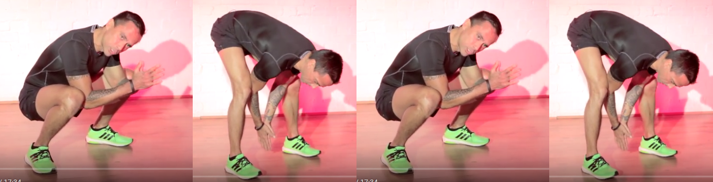

((Rock press)):: A Quattro zampe, con il sedere alto sulla verticale dei piedi, eseguire flessioni con le mani, mantenendo la testa allineata al corpo. 

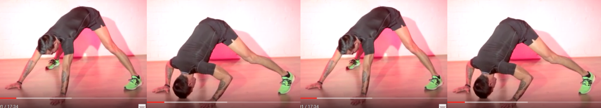

==== Recuperi

Posizioni od eserizi che si fanno per recuperare quando si sono fatti altri esercizi

((Frog position)):: Come Frog Squat ma ferma

((Sumo Double Scissors)):: Divaricare le game, accosciarsi, rialzarsi con un saltello e fare uno <<switch, switch>>

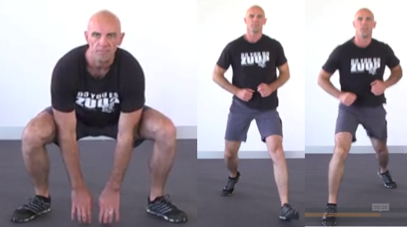

==== Weapons

Esercizi veri e propri

===== Bear crawl

Camminata stile orso, da fare sia avanti che indietro. Nell'andare
indietro focalizzarsi sulla spinta delle braccia, le gambe accopagnano
solo.

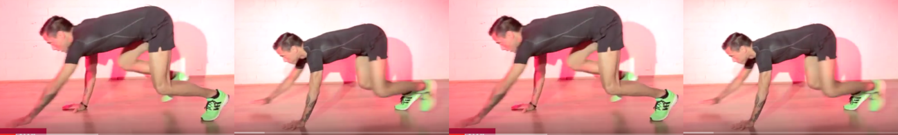

===== Chameleons

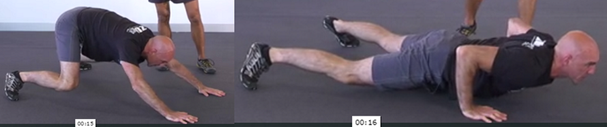

===== Coils

Low push up position and rotate with the upper part

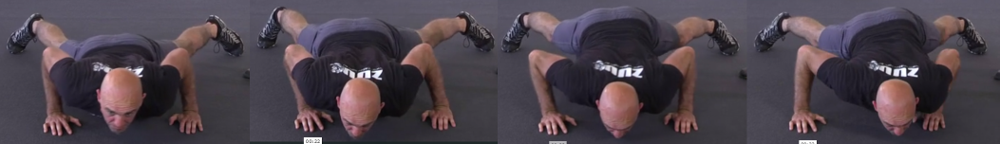

===== Donkey kick

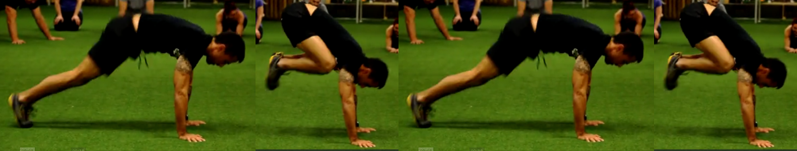

===== Gorilla

image::figures/exercises/gorilla_zuu.png[width='80%']

===== Half hindu

Tratto dallo yoga

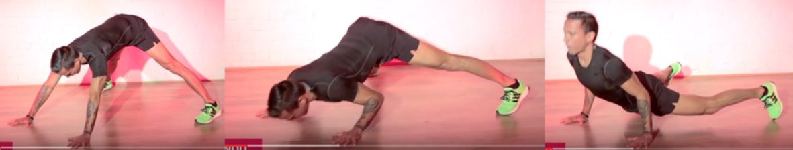

Variazioni:

.Half half hindu
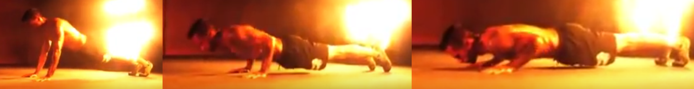

.Reverse hindu
Come Half hindu ma al contrario

===== Iguana

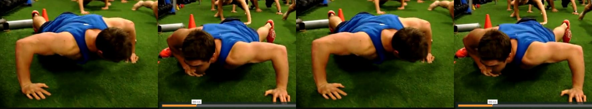

===== Kick sit

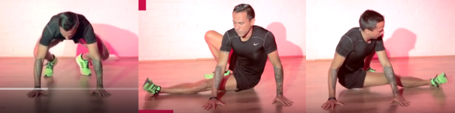

===== Reverse walk

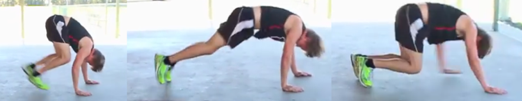

===== Russian

Squad basso e camminare avanti ed indietro (5 passi avanti e 5 indietro)

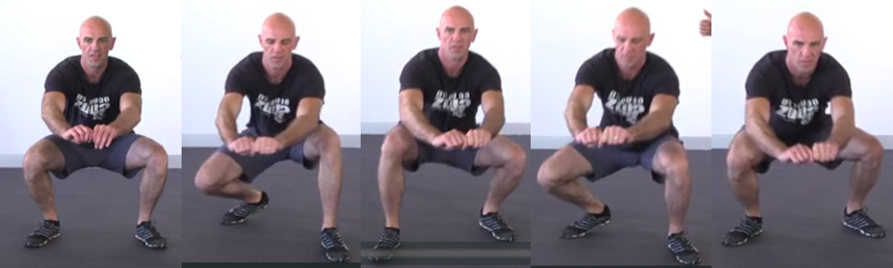

===== Stepouts

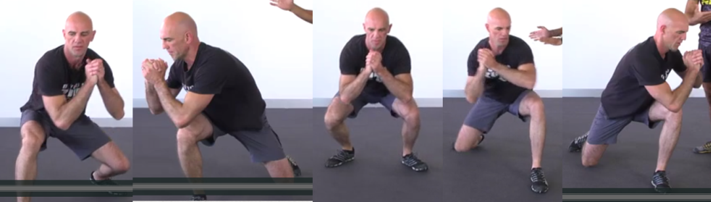

===== Straddle

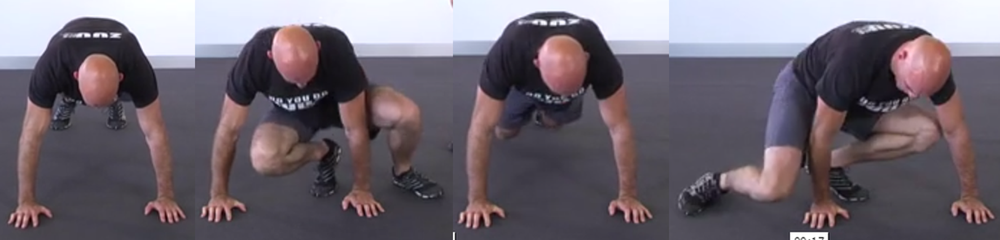

===== Walk Throughs

image::figures/exzuu/walk_throughs.png[width='80%']

===== XPlodes

Da sumo squat saltare toccandosi i tacchi in volo

==== TBD

===== Body drops

E' un burpee senza salto.

===== Caterpillar

il bruco. si parte da posizione eretta.Siflette il bustpoggiando le mani abita

===== Cheeta jump

Squat salto a gambe alternate aperte e chiuse

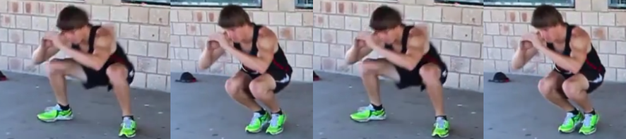

===== Cobra

Push up  + Lateral push up

===== Frog jump

Dalla posizione di squat si eseguono uno o più salti. Importante l'atterraggio morbido.

===== Push up

Ce ne sono variazioni:

* *asimmetrici*: Eseguire un push up asimmetrico [^1] e con balzelli
    delle braccia alternarle.
* *cobra*cobra: Push up + Lateral push up
* *iguana*: eseguire uno Spiderman push up anzando
* *miniiguana*: come il precedente ma avanzando con le punte dei piedi. Sempre balelli con le braccia
* *zum zum*: mettersi in posizione bassa del push up e nuoversi in
    avanti ed indietro con il busto
* *zum zum gamba all'alto*: come zum zum ma tengo una delle gambe in
    alto
* Rock press
* Half hindu

===== Snake

POsizione bassa del push up e oscillare avanti ed indietro

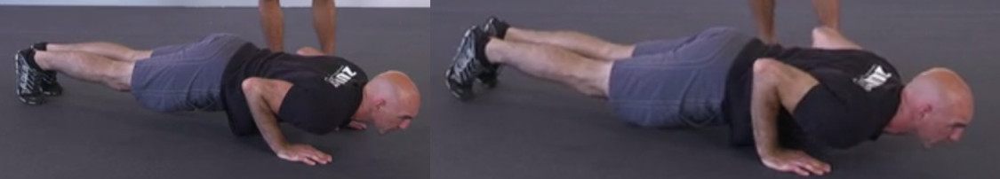

===== Da Pulire

* Walk and gorilla jump: 4 passi a chinino e jump
* special push up
    ** Mi abbasso
    ** Sposto il peso a destra
    ** Sposto il peso a sinistra
    ** Push up con braccia asimmetriche che si alternano veocemente
    ** power cobra
    ** seq
        ** switch jump
        ** mi abbasso in push up (basso)
            ** muovo avanti ed indietro con il busto
            ** come sopra ma alzo anche una gamba posteriore
            ** poi in power cobra
                ** mi fermo in squat statico
                ** oppure switch squat

==== Drills

===== Virgin Personal

* 2 x 30 secondi ognuna:
	** Frog Squat
	** Bear Crawl
	** Rock Press
* Riposo
* 2 x 30 secondi ognuna:
	** kick sit
	** gorilla
	** half hindu
* Riposo
* 2 x 30 secondi ognuna:
	** Snake
	** Caterpillar
	** XPlodes

===== warmup

3 minuti

* frog
* half hindu
* squat basso immobile
* push up solo basso
* cerchi e cambio rotazione con push basso
* burpees
* bear crawl
* side kicks
* squat basso immobile
* rock press
* half hindu
* burpees

===== Virgin 150920

* Riscaldamento tabata (20-10) 4X:
  ** frog squat
  ** rock press

* Workout 40 sec each 2X:
	** Frog squat
	** Bear crawl
	** Half indu
	** Rock press
	** Donkey
	** Gorilla

===== Virgin 150923

Warmup
* Tabata 
 ** Frog Squat
 ** Rock Press

* Workout 40/20
    ** Esercizi
		*** Half Hindu
		*** Xplodes
		*** Gorilla
		*** Iguana
		*** Russian
		*** Bear Crawl
    ** Pause
		*** Sumo double scissors
		*** Frog rest position
		*** Rock Press rest position
		*** Gnu

===== Virgin 150929

Warmup

* Tabata 
 ** Frog Squat
 ** Rock Press

* Workout 40/20
    ** Esercizi
    *** Frog Squat
    *** Bear Crawl
    *** Straddle
    *** Gorilla
    *** Kick Sit 
    *** Donkey
    ** Pause
    *** Sumo double scissors
    *** Frog rest position
    *** Rock Press rest position
    *** Gnu

===== Virgin 151016

* Workout ((3*30') * 3)
	** 1st block
		*** Crab squat 
		*** Stella Marina
		*** Bear crawl
	** 2nd block 
		*** Gorilla
		*** half hindu
		*** Cobra
	** 3rd block
		*** Kit sit
		*** Millepiedi
		*** Caterpillar

===== Virgin 151016

AMRAP 12'::

* 4 snake
* 8 Donkey hand stand
* 12 Kick sit front
* 16 explodes
* 20m gorilla

Tabata, "Cash out"::
* Frog Squat
* Rock Press

	
==== Drill n.1

3 volte :

-   5 Rock press
-   5 Frog squat
-   5 Gorilla

==== Drill n.2

Front squaws

3 volte :

-   5 X Frog squat
-   5 X Gorilla
-   5 X Bear Crawls

==== Drill n.10

3 minute EMOM:

-   10 body drops
-   30 kick sit

rest making gorilla

==== Drill workout 1

5 times

- Half hindu X 10
- Frog squat X 10
- Rock press X 10
- Bear crawl X 10

==== Drill Firenze

3 volte, 6 ripetizioni ognuno:

- Half hindu
- Reverse hindu
- Cobra
- Frog jump
- Frog squat
- Kick sit
- Gorilla
- Reverse walk

==== Drill ((Walkwall))

* 3X 30 sec
	** Gorilla
	** Walkwallz
	** Cobraz

