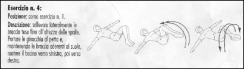
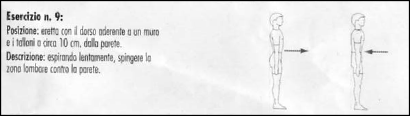

=== Esercizi posturali

Sezione dedicata alla postura.

==== Postural test

Easy balance test. Find a mirror, take off your shoes, stand in front of it in your bare feet and observe: footnote:[http://www.huffingtonpost.com/sonimacom/how-important-is-perfect-_b_7926662.html]

===== How are you carrying your body weight?

Close your eyes and take note of how your feet feel. Egoscue suggests
you should feel that the weight is divided evenly between the left and
right foot with most of it carried by the balls of the feet. "If you
have range-of-motion design capability, that is where your weight is
because we are symmetrical bipeds by design," he says.

===== Which direction are your feet pointing?

Your toes should point straight ahead, Egoscue says. While that may be
ideal, DiNubile notes that the direction of your toes depends greatly on
the alignment of your femur (the large bone in your upper leg), which he
says usually is set by about age 10. For now, simply notice the
direction of your feet, and if necessary, adjust them inward as much as
is comfortable.

===== Where are your hands?

Egoscue says your hands should be at your sides, not in front of you,
and you should be looking at the back of your thumb. You shouldn't be
looking at the back of your hand.

===== Where are your shoulders?

They should be level and more or less parallel to the mirror.

==== Per l'ufficio

Fonti link:[https://vimeo.com/71441709]

-   Standing desk
-   Normal desk
    -   Sedie posturali consigliate
    -   Ogni 30 minuti ginnastica footnote:[ToDo trovare una ginnastica migliore]
        -   Affondi
        -   Alzarsi 20 volte in punta di piedi
        -   Spalle
    -   Non
        -   Appoggiarsi allo schienale
        -   Appoggiare i gomiti

==== Esercizi quotidiani

4 Moves to Build Balance and Improve Posture

Regularly practicing the sequence below will help improve your posture
and balance -- attributes that will help you greatly when you hit the
gym. "It will cause a tremendous change in your posture," Egoscue says.
"And your form will get better." Egoscue's daily warm-up takes about 10
minutes, and is comprised of four exercises. footnote:[http://www.huffingtonpost.com/sonimacom/how-important-is-perfect-_b_7926662.html]

From the 5th on, they are added from other resources

===== 1. Wall-Assisted Body Re-Balance

In your bare feet, stand with your feet parallel beneath your hips and
shoulders, and your heels pressed against the wall. Set your feet so
that they point straight ahead -- doing so may make you feel as if
you're pigeon-toed -- and just stand there for five minutes. Notice how
far your head is away from the wall; it shouldn't be. See if you can
work the back of your head to the wall. You'll notice where your butt,
heels, and shoulders touch, and whether any of them hit the wall
differently on your left side compared to your right. What should
happen, is that as you stand against the wall, your muscles will begin
to adapt and re-recruit to support proper posture (which is head,
shoulders, butt and toes all touching the wall, and doing so evenly from
side-to-side). You'll feel better and way more balanced.

===== 2. Janda's "Shortfoot"

To perform the move, you stand with one foot about two foot-lengths in
front of the other. In this position, you simply raise and lower the
toes of the front foot 20 to 30 times. Doing this counteracts some of
the negative effects of wearing shoes all day, which can weaken the
muscles of the ankle and arch.

===== 3. Forward Fold

Most yogis are familiar with this move from all of those Sun
Salutations. A forward fold is simply that: You bend forward at the hips
until your hands touch the ground (or as close as you can get to it),
and feel the elongation throughout your hamstrings and glutes. If the
sensation throughout your backside is intense, don't hesitate to grab a
chair and place your hands on it in front of you. Hold for as long as
you like up to three minutes.

===== 4. Cat-Cow

Yoga practitioners will know this one, too. In your final warm-up move,
you'll drop onto your hands and knees and alternate between Cat Pose
(lower and upper back rolled toward the ceiling) and Cow Pose (belly
pointed toward the floor). Perform as many times as you'd like, or until
you feel that you're moving more freely throughout your torso.

===== 5. Toracic Bridge

Ottimo esercizio per movimentare la schiena per la postura da scrivania prolungata. footnote:[<https://www.youtube.com/watch?v=rm9L0RIhR3s>]

Da ripetere almeno 5 volte per parte

image::figures/postural/thoracic_bridge_01.png

image::figures/postural/thoracic_bridge_03.png

Esercizi per il rachide
-----------------------

image::figures/postural/rachide_01.png[]

image::figures/postural/rachide_05.png[]

image::figures/postural/rachide_06.png[]

image::figures/postural/rachide_07.png[]

image::figures/postural/rachide_08.png[]

