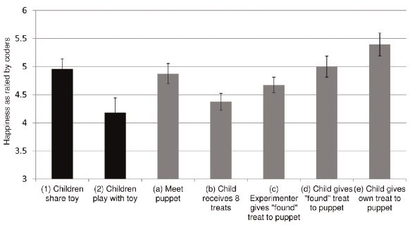

:icons:

=== Happiness Week 3

==== Empathy, end of week 2

Why empathy?

. First, like every mammal, we need to be sensitive to the needs of our offspring.
. Second, our species depends on cooperation, which means that we do better if we are surrounded by healthy, capable group mates. 

Taking care of them is just a matter of enlightened self-interest.

But instead of trying to place empathy in the upper regions of human cognition, it is probably best to start out examining the simplest possible processes, some perhaps even at the cellular level. 

In fact, recent neuroscience research suggests that very basic processes do underlie empathy. Researchers at the University of *Parma*, in Italy, were the first to report that monkeys have special brain cells that become active not only if the monkey grasps an object with its hand but also if it merely watches another do the same. Since these cells are activated as much by doing as by seeing someone else do, they are known as mirror neurons, or “monkey see, monkey do” neurons.

* Empathy is the one weapon in the human repertoire that can rid us of the curse of xenophobia.
* Empathy is fragile, though.

.Sad but not too much
____

Often, the filters prevent expressions of empathy because no ape can afford feeling pity for all living things all the time. This applies equally to humans. Our evolutionary background makes it hard to identify with outsiders. We’ve evolved to hate our enemies, to ignore people we barely know, and to distrust anybody who doesn’t look like us.

This is the challenge of our time: globalization by a tribal species.

We recognize them in our primate relatives, with empathy being most conspicuous in the bonobo ape and reciprocity in the chimpanzee. 
____

==== Honing Your Own Empathy

But what is empathy? It’s the ability to step into the shoes of another person, aiming to understand their feelings and perspectives, and to use that understanding to guide our actions. That makes it different from kindness or pity.

.Game
“Do unto others as you would have them do unto you.” 

As George Bernard Shaw pointed out, “Do not do unto others as you would have them do unto you—they might have different tastes.” Empathy is about discovering those tastes. 

psychologists have revealed that we are primed for empathy by strong attachment relationships in the first two years of life.

* Six Habits of Highly Empathic People (HEPs)
    .. Cultivate curiosity about strangers
        *** They will talk to the person sitting next to them
        *** They find other people more interesting than themselves but are not out to interrogate them
* Challenge prejudices and discover commonalities
* Try another person’s life - “Walk a mile in another man’s moccasins before you criticize him.”
* Listen hard—and open up - Removing our masks and revealing our feelings to someone is vital for creating a strong empathic bond.
* Inspire mass action and social change - social networks must learn to spread not just information, but empathic connection.
* Develop an ambitious imagination - The 20th century was the Age of Introspection. The 21st century should become the Age of Empathy

link:http://greatergood.berkeley.edu/quizzes/take_quiz/14[test sull'empatia]

==== Wait, But What Is Compassion?

* empathy
* social status
* feelings of gratitude
* social science has really zeroed in on compassion

.Compassion
the feeling that you have when you witness someone else who is suffering or who is in need,
and then you have this motivation to help them, to ameliorate their condition or to
enhance
their welfare

Is different from:
* empathy: feel or understand how someone feels but donesn't feel moved to help
* mimicry: mimic feelings and behaviour
* Pity: (pena) concern for someone inferior

Jonathan Glover, who is a historian who wrote this wonderful book I’d recommend called "Humanity."

===== why are we compassionate?

Charles Darwin made the case that sympathy, or compassion, is our strongest instinct. And I’ll quote,
because “sympathy will have been increased through natural selection for those communities
which included the greatest number of the most sympathetic members would flourish the
best and raise the greatest number of offspring.”

a simple training exercise where you practice loving kindness, where you’re just thinking compassionate thoughts towards others and towards yourself over time, actually pretty dramatically increases your own personal happiness, suggesting that the Dalai Lama was on to something when he said
that "compassion is the pathway to happiness".

===== Definitions

Kindness:: is a general, everyday term describing behaviors that involve being friendly, generous, or considerate. Pro-social is the term favored by scientists to refer to kind, helpful behaviors or states, but it is also quite broad.

Compassion:: Literally means “to suffer together.” Among emotion researchers, it is defined as the feeling that arises when you witness another’s suffering and feel motivated to help relieve that suffering.
Compassion is not the same as empathy or altruism, though the concepts are related. While empathy refers more generally to our ability to sense the emotions--and/or take the perspective--of another person, compassion is when those feelings and thoughts include the desire to help. While altruism is often prompted by compassion, one can feel compassion without acting on it, and altruism isn’t always motivated by compassion.

Altruism:: Altruism is when we act to promote someone else’s welfare, even at a risk or cost to ourselves. Many debate whether and why true (or "pure") altruism actually exists. Evolutionary scientists speculate that altruism has deep roots in human nature because helping and cooperation promote the survival of our species. Indeed, Darwin himself argued that altruism, which he called “sympathy” or “benevolence,” is “an essential part of the social instincts.” Some evolutionary biologists argue that organisms may sometimes put themselves at risk in order to help another because they expect that the other organism will return the favor down the line, a concept known as reciprocal altruism.

Empathy:: As Emiliana explained last week, the term “empathy” is used to describe a wide range of experiences. Emotion researchers generally define empathy as the ability to sense other people’s emotions (affective empathy), coupled with the ability to imagine what someone else might be thinking or feeling (cognitive empathy).

Sympathy:: (partecipazione) Sympathy, which means "to feel together," is sometimes used synonymously with compassion. However, while sympathy does refer to feelings of sorrow or sadness about another person's suffering, it does not typically involve the urge or motivation to help, or do anything about the situation. In other words, a person may feel sympathetic towards another person's difficulties, but not feel inclined to help. 

Pity:: (Pena) Feeling sorry for the suffering or misfortune of someone else. Pity is similar to compassion, but it suggests a power imbalance, whereby the observer occupies a place of superiority and looks down upon the person who is suffering.

===== Why Does Compassion Matter?

Stages of compassion

. Empathy
. Feelings
. Judgements about the self, the others and the situation

How compassion makes us happier?

. Empathy make you more social adept
. Reduced distress, heightened caregiving is good for health and well being 
. Judgind yoursef as capable (self-eficacy)

People who are feeling compassion engage their vagus system.

* inducing compassion makes people say that they feel more similar to others, and in particular, vulnerable
others, 
* inducing pride makes people feel different from vulnerable others.

Tibetan Buddhist: the people the subjects in this case
who were the contemplative experts, showed a higher engagement
of empathic systems in the brain.

the midbrain periaqueductal gray, these areas seem to spontaneously emerge of
activate when people are feeling compassion. 

when people finished compassion training, their response to that stressful test at a biological level,
and at a self-reported mood level, was much more subdued.

reported compassion training leading to changes in the relationship between the prefrontal cortex and the amygdala.

Compassion training, and in particular a variant of it called loving kindness training, leads to an increased ability to recruit reward circuitry in a moment where there’s sort
of a feeling of anticipation of being able to help.

===== Measuring compassion in the body

The Vagus nerve applies this heart-rate brake in a dynamic cyclic manner, slowing things down while we exhale, allowing it to beat faster when we inhale.

warm, sensitive parenting for three year olds predicts greater focused concentration in the children one year later
 
 warm, sensitive, authoritative parenting may support skills like managing emotions and focusing attention, and that children with higher Vagal tone are more likely to have these skills, which in turn paves the way for sympathy for other peoples’ suffering.
 
 This more visceral method showed that indeed, feelings of compassion were associated with increased Vagal tone.
 
 .Articoli interessanti
 http://greatergood.berkeley.edu/article/item/feeling_like_partners/
 
 http://greatergood.berkeley.edu/article/item/to_know_you_is_to_love_you/
 
 http://greatergood.berkeley.edu/article/item/when_empathy_hurts_compassion_can_heal
 
 http://greatergood.berkeley.edu/article/item/compassionate_mind_healthy_body
 
 
==== How Kindness Boosts Happiness

31% of Americans in recent surveys were reported to be volunteering.

the more I practice kindness, the more I'm:

* enhancing the welfare of others,
* I tend to be less lonely on a regular basis
* I show stronger immune profiles, I have better health symptoms, sort of less pain and the like, 
* I have fewer bodily aches
* I report lower levels of depression.
* There's studies that show that volunteerism and helping others is twice as protective for your cardiovascular profile as taking aspirin.

20$ experiment

practice loving kindness meditations over an eight or nine week study -> rises in daily experiences of positive emotions

===== Happiness for a Lifetime

.Chinese Proverb 
* If you want happiness for an hour, take a
nap. 
* If you want happiness for a day, go fishing. 
* If you want happiness for a month, get married. footnote:[they had not read that study that showed it is actually two years that marriage gives you happiness.]
* If you want happiness for a year, inherit a
fortune. 
* if you want happiness for a lifetime, help somebody else.

Experiment of make 5 act of kindness

===== Evolved to Be Kind

* kind individual is less likely to cheat on you, perhaps devote more resources to raising offspring and the like. 
* quite significantly. It would appear that we’re more generous at the intuitive level.

.Question
Bello è buono ma buono è bello?

===== It Feels Good to be Kind

* Mouse rewards
* Win win TAC
* TAC and shock

===== Altruism Quiz - 5 Ways Giving Is Good for You

. Giving makes us feel happy.
. Giving is good for our health. 
  elderly people who volunteered for two or more organizations were 44 percent less likely to die over a five-year period than were non-volunteers, even after controlling for their age, exercise habits, general health, and negative health habits like smoking.
. Giving promotes cooperation and social connection. 
  What’s more, when we give to others, we don’t only make them feel closer to us; we also feel closer to them. “Being kind and generous leads you to perceive others more positively and more charitably,” writes Lyubomirsky in her book The How of Happiness, and this “fosters a heightened sense of interdependence and cooperation in your social community.”
. Giving evokes gratitude.
   And research has found that gratitude is integral to happiness, health, and social bonds.
. Giving is contagious.
  when one person behaves generously, it inspires observers to behave generously later, toward different people. In fact, the researchers found that altruism could spread by three degrees
  has found that a dose of oxytocin will cause people to give more generously and to feel more empathy towards others, with “symptoms” lasting up to two hours.

Suggested lecture *Why Good Things Happen to Good People* Stephen Post

<<<

==== Random Acts of Kindness

This practice involves performing five acts of kindness in one day. Is there a day in the next week when you have free time and might be able to do this practice? If so, write it in the space below.

.Giorno in cui ipotizzi la pratica
____
.
____

 
.Idee per atti di gentilezza, cose che hai ricevuto e che ti hanno fatto piacere
____
.

.

.

.
____

.Atti di gentilezza fatti da te in passato.
____
.

.

.

.
____

 
.5 Atti da fare nel *Random Acts of Kindness day*
____
1.	

2.	

3.	

4. 

5.	
____

.Metti in calendario il tuo *Random Acts of Kindness day* e prepara eventuale materiale/supporto per quel giorno.

Anche se puoi pianificarli, permettiti di agire spontaneamente se le opportunità avanzano. 

.Non dimenticarti di scrivere come ti hanno fatto sentire!

Ricorda! Scrivi!

NOTE: One day this week, perform five acts of kindness—all five in one day. It doesn’t matter if the acts are big or small, but it is more effective if you perform a variety of acts.
The acts do not need to be for the same person—the person doesn’t even have to be aware of them. Examples include feeding a stranger's parking meter, donating blood, helping a friend with a chore, or providing a meal to a person in need.
After each act, write down what you did in at least one or two sentences; for more of a happiness boost, also write down how it made you feel.

Kindness boosts happiness as it encourages people to bring happiness to others. But even knowing this, it can be hard to get started and stick with a happiness practice like Random Acts of Kindness.

==== SKEPTICAL VIEWS ON COMPASSION AND KINDNESS

That's why we're encouraging Science of Happiness students to sign up for the http://www.kindspring.org/challenge/join/723/[GG101x: Super Size Your Kindness Challenge] hosted by our friends at *KindSpring*, an entirely volunteer-run global nonprofit.

=== Atri link utili

link:http://greatergood.berkeley.edu/ei_quiz/[test sull'intelligenza emotiva]
