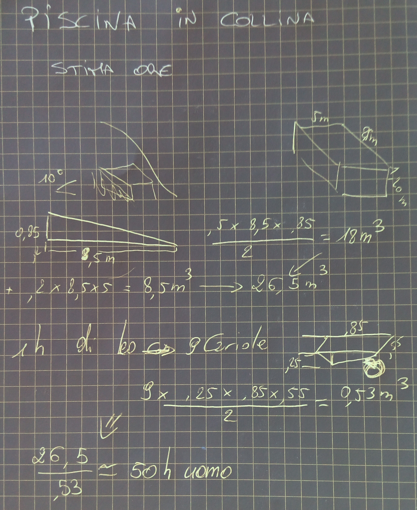

== Ciappini

=== ((Antizanzare))

- Lemon Eucalyptus oil 30 gocce https://en.wikipedia.org/wiki/P-Menthane-3,8-diol[mentoglicolo]
- Vanilla Extract 30ml (pleasant 
- Eccipiente, scegliere tra:
    - Rubbing alcool
    - Olio da cucina
    - Vodka
    - Witch hazel
    
    

=== Impianto Culligan

[width='80%', cols = "e,^,^", options='header']
|=============
| Data Variazione | Filtri | Gruppo Osmosi
| 19/10/2015	| X	| - 
| 30/5/2016	| X	| - 
|=============

=== Piscina interrata

=== Scuri

image::figures/ciappini/scuri_01.jpg[]

image::figures/ciappini/scuri_02.jpg[]

image::figures/ciappini/scuri_03.jpg[width='80%']

image::figures/ciappini/scuri_04.jpg[width='80%']

image::figures/ciappini/scuri_05.jpg[width='80%']
